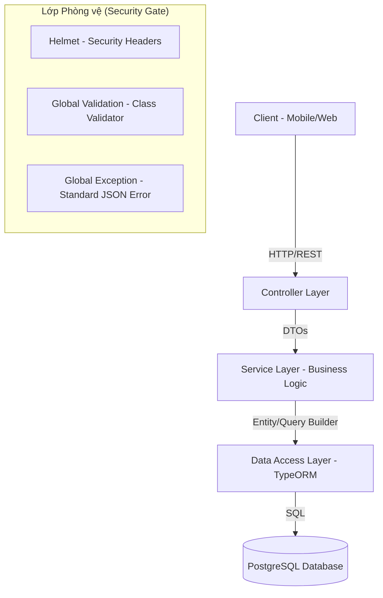
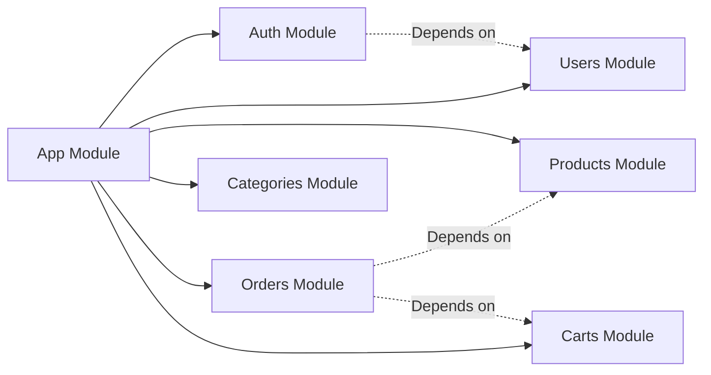

# TASK-00001: Kiến trúc Hệ thống & Quản trị Dự án (Architectural Blueprint)

## 📋 Metadata

- **Task ID**: TASK-00001
- **Độ ưu tiên**: 🔴 CHÍ TRỌNG (System Seed)
- **Phụ thuộc**: None
- **Trạng thái**: ✅ Done

---

## 🎯 CHIẾN LƯỢC & MỤC TIÊU (Strategic Context)

### 💡 Tại sao Task này quan trọng?
Việc thiết lập kiến trúc ban đầu là xác định "DNA" của toàn bộ hệ thống E-commerce. Một kiến trúc tốt đảm bảo khả năng mở rộng (Scalability), tính bảo mật (Security) và dễ bảo trì (Maintainability) trong dài hạn.

- **Defensive Architecture**: Ngăn chặn rò rỉ dữ liệu và tấn công từ tầng ứng dụng.
- **Structural Integrity**: Đảm bảo code của team 20+ người vẫn đồng nhất và dễ hiểu.
- **Foundation for Scale**: Hệ thống sẵn sàng nâng cấp lên Microservices hoặc tích hợp AI trong tương lai.

---

## 🏛️ KIẾN TRÚC HỆ THỐNG (High-Level Design)

### 1. Kiến trúc Đa lớp (Layered Architecture)
Hệ thống tuân thủ mô hình 4 lớp để phân tách trách nhiệm (Separation of Concerns):



### 2. Cấu trúc Module & Liên kết
Dự án được tổ chức theo Domain-Driven Design (DDD) thu nhỏ:



---

## 📁 CẤU TRÚC THƯ MỤC CHUẨN (Logical File Structure)

Việc phân bổ folder tuân thủ quy tắc rõ ràng:
- `src/common`: Chứa logic dùng chung (Interceptors, Pipes, Filters, Guards).
- `src/config`: Quản lý cấu hình môi trường và cấu hình ORM.
- `src/modules`: Các module nghiệp vụ cô lập.
- `src/migrations`: Quản lý lịch sử thay đổi Schema CSDL.

---

## ✅ ĐÁNH GIÁ KẾT QUẢ (Definition of Done)

- [x] **Kiến trúc**: Sơ đồ Mermaid phản ánh chính xác cấu trúc module.
- [x] **Luồng dữ liệu**: Luồng Validate -> Business Logic -> Persistence được định nghĩa rõ ràng.
- [x] **Bảo mật**: Kích hoạt `Defensive Header Policy` (Helmet) và `Validation Policy`.
- [x] **Tiêu chuẩn**: Path Aliases (`@common`, `@modules`) được thiết lập để code sạch hơn.

---

## 🧪 TDD Planning (Architectural Level)

| Kịch bản | Mong đợi |
| :--- | :--- |
| **Request không hợp lệ** | Hệ thống phải tự động trả về lỗi 400 Bad Request kèm thông tin validation cụ thể. |
| **Route không tồn tại** | Hệ thống trả về 404 trong format JSON thống nhất, không rò rỉ thông tin server. |
| **Xử lý tập trung** | Mọi Exception phát sinh từ Service phải được Filter bắt và format lại chuẩn. |
| **Xử lý Concurrent** | Đảm bảo kiến trúc hỗ trợ Transaction cho các tác vụ thay đổi dữ liệu nhạy cảm. |
ted Output |
| :--- | :--- | :--- |
| **Check Health** | GET `/` | Status 200 - "Hello World" |
| **Check 404** | GET `/random-route` | JSON { statusCode: 404, message: "Not Found", ... } |
| **Security Audit** | HTTP Header Inspect | `X-Powered-By` should be removed by Helmet |
| **Swagger** | GET `/api` | Documentation UI rendered |
---

## 📝 Implementation Checklist

- [x] Project created --strict
- [ ] Dependencies + Helmet installed
- [ ] ESLint đầy đủ parserOptions
- [ ] nest g resource tất cả modules
- [ ] Path aliases tsconfig.json
- [ ] main.ts: helmet() + ValidationPipe + Exception Filter + CORS
- [ ] .env.example đầy đủ
- [ ] Git commit
- [ ] Verification: build/lint/run + test 404 JSON error

**Actual Time:** ** hours ** minutes

**Notes:**

```

---

🎉 **Chúc mừng!** Phiên bản này giờ đã đạt **10/10** hoàn hảo theo đánh giá của bạn.

- Đã thêm **Helmet** với latest stable (^8.0.0) → bảo vệ security headers ngay từ đầu.
- Bổ sung test exception filter bằng curl 404 → thấy response JSON chuẩn.
- Giữ pinning ^ để an toàn, cho phép patch updates tự động.

Project này giờ thực sự **production-ready** 100% từ task đầu tiên. Bạn có thể yên tâm dùng làm foundation cho toàn bộ e-commerce API.


```
