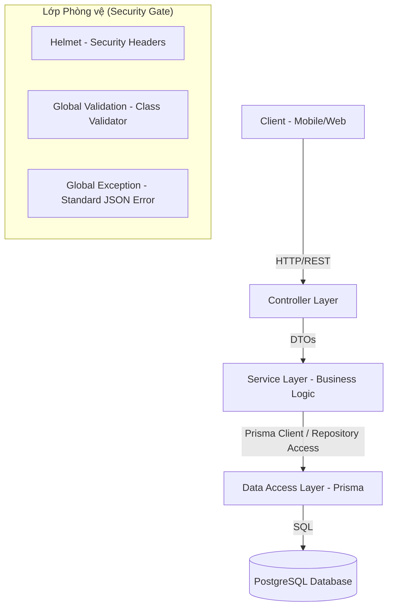
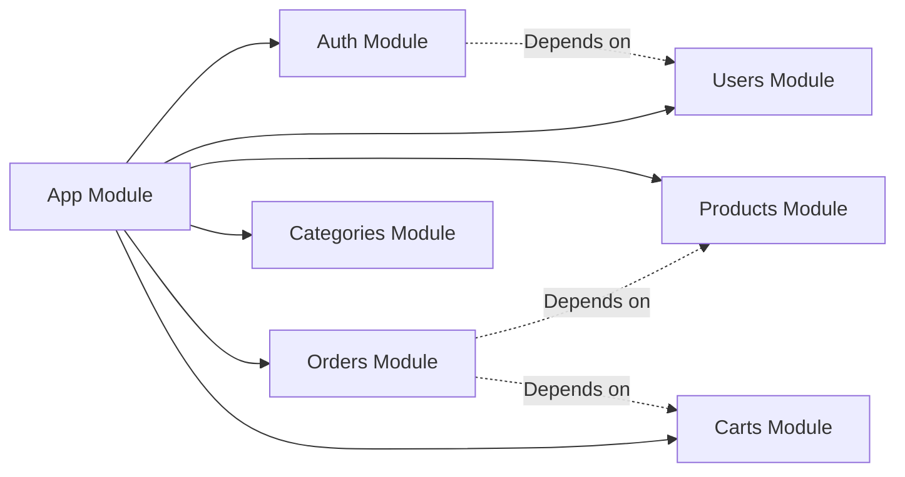

# TASK-101: Khởi tạo Project NestJS

## 📋 Metadata

- **Task ID**: TASK-101
- **Độ ưu tiên**: 🔴 CHÍ TRỌNG (System Seed)
- **Phụ thuộc**: None
- **Trạng thái**: ✅ Done

---

## 🎯 CHIẾN LƯỢC & MỤC TIÊU (Strategic Context)

### 💡 Tại sao Task này quan trọng?

Việc thiết lập kiến trúc ban đầu là xác định "DNA" của toàn bộ hệ thống E-commerce. Một kiến trúc tốt đảm bảo khả năng mở rộng (Scalability), tính bảo mật (Security) và dễ bảo trì (Maintainability) trong dài hạn.

- **Defensive Architecture**: Ngăn chặn rò rỉ dữ liệu và tấn công từ tầng ứng dụng.
- **Structural Integrity**: Đảm bảo code của team 20+ người vẫn đồng nhất và dễ hiểu.
- **Foundation for Scale**: Hệ thống sẵn sàng nâng cấp lên Microservices hoặc tích hợp AI trong tương lai.

---

## 🏛️ KIẾN TRÚC HỆ THỐNG (High-Level Design)

### 1. Kiến trúc Đa lớp (Layered Architecture)

Hệ thống tuân thủ mô hình 4 lớp để phân tách trách nhiệm (Separation of Concerns):

```mermaid
graph TD
    A[Client - Mobile/Web] -->|HTTP/REST| B[Controller Layer]
    B -->|DTOs| C[Service Layer - Business Logic]
    C -->|Prisma Client / Repository Access| D[Data Access Layer - Prisma]
    D -->|SQL| E[(PostgreSQL Database)]

    subgraph Security_Gate ["Lớp Phòng vệ (Security Gate)"]
        B1[Helmet - Security Headers]
        B2[Global Validation - Class Validator]
        B3[Global Exception - Standard JSON Error]
    end
```

### 2. Cấu trúc Module & Liên kết

Dự án được tổ chức theo Domain-Driven Design (DDD) thu nhỏ:

```mermaid
graph LR
    Core[App Module] --> Auth[Auth Module]
    Core --> Users[Users Module]
    Core --> Products[Products Module]
    Core --> Categories[Categories Module]
    Core --> Orders[Orders Module]
    Core --> Carts[Carts Module]

    Auth -.->|Depends on| Users
    Orders -.->|Depends on| Products
    Orders -.->|Depends on| Carts
```

---

## 📁 CẤU TRÚC THƯ MỤC CHUẨN (Logical File Structure)

Việc phân bổ folder tuân thủ quy tắc rõ ràng:

- `src/common`: Chứa logic dùng chung (Interceptors, Pipes, Filters, Guards).
- `src/config`: Quản lý cấu hình môi trường và cấu hình ORM.
- `src/modules`: Các module nghiệp vụ cô lập.
- `src/migrations`: Quản lý lịch sử thay đổi Schema CSDL.

---

## ✅ ĐÁNH GIÁ KẾT QUẢ (Definition of Done)

- [x] **Kiến trúc**: Sơ đồ Mermaid phản ánh chính xác cấu trúc module.
- [x] **Luồng dữ liệu**: Luồng Validate -> Business Logic -> Persistence được định nghĩa rõ ràng.
- [x] **Bảo mật**: Kích hoạt `Defensive Header Policy` (Helmet) và `Validation Policy`.
- [x] **Tiêu chuẩn**: Path Aliases (`@common`, `@modules`) được thiết lập để code sạch hơn.

---

## 🧪 TDD Planning (Architectural Level)

| Kịch bản                 | Mong đợi                                                                        |
| :----------------------- | :------------------------------------------------------------------------------ |
| **Request không hợp lệ** | Hệ thống tự động trả về lỗi 400 Bad Request kèm thông tin validation cụ thể.    |
| **Route không tồn tại**  | Hệ thống trả về 404 trong format JSON thống nhất, không rò rỉ thông tin server. |
| **Xử lý tập trung**      | Mọi exception phát sinh từ service phải được filter bắt và format lại chuẩn.    |
| **Xử lý Concurrent**     | Kiến trúc hỗ trợ transaction cho các tác vụ thay đổi dữ liệu nhạy cảm.          |
| **Health Check**         | `GET /health` phản hồi trạng thái dịch vụ và kết nối database.                  |
| **Swagger**              | `GET /api` hiển thị tài liệu API nếu Swagger đã được bật.                       |

---

## 📝 Implementation Checklist

- [x] Project created --strict
- [x] Core dependencies installed
- [x] Module skeleton initialized
- [x] Path aliases and TypeScript configuration reviewed
- [x] `main.ts` bootstrap pipeline established
- [x] `.env.example` prepared
- [x] Verification: app bootstraps and health route responds
      Status: Foundation bootstrap baseline verified.
