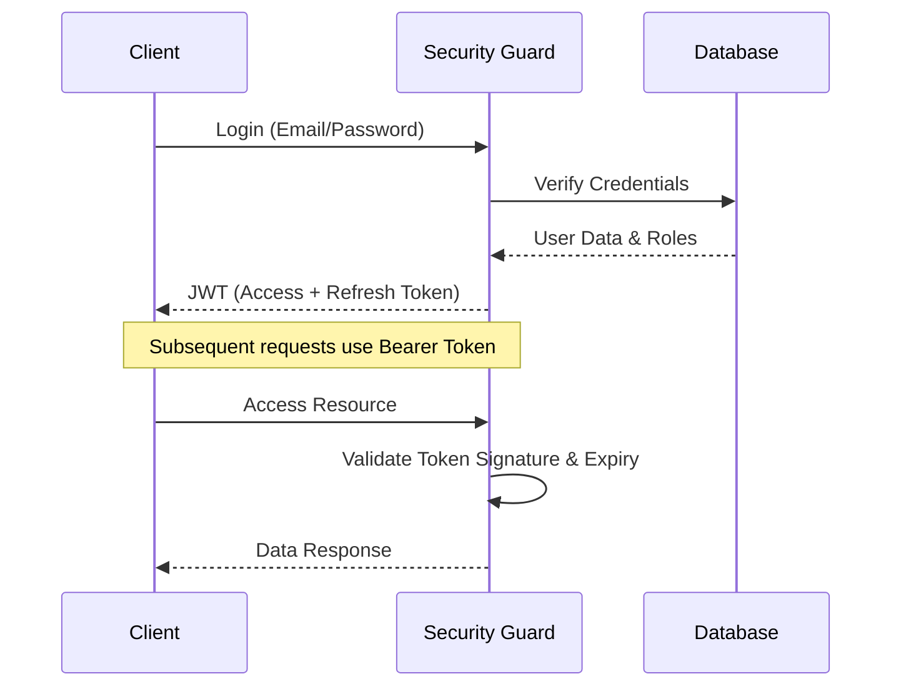

# TASK-00002: Khung An ninh & Quản trị Hệ thống (Security & Governance Framework)

## 📋 Metadata

- **Task ID**: TASK-00002
- **Độ ưu tiên**: 🔴 CHÍ TRỌNG (Governance)
- **Phụ thuộc**: TASK-00001
- **Trạng thái**: ✅ Done

---

## 🎯 TẦM NHÌN CHIẾN LƯỢC (Strategic Governance)

### 💡 Tại sao Task này quan trọng?
Quản lý cấu hình và an ninh là ranh giới giữa một code script và một **Enterprise System**. 
- **Fail-Fast Defense**: Nguyên tắc ứng dụng phải dừng lại ngay lập tức nếu thiếu các cấu hình trọng yếu (Database, JWT Secret).
- **Environment Parity**: Đảm bảo tính nhất quán giữa các môi trường Development, Staging và Production.
- **Identity Integrity**: Ép buộc các chuẩn bảo mật cho Token và mật khẩu ngay từ tầng cấu hình.

---

## 🔒 KHUNG AN NINH (Security Framework)

### 1. Luồng Xác thực (Authentication Flow)

Hệ thống sử dụng JWT (JSON Web Token) với cơ chế Access & Refresh Token để tối ưu giữa bảo mật và trải nghiệm người dùng.

### 2. Ma trận Phân quyền (RBAC Policy)

Định nghĩa rõ ràng quyền hạn của các nhóm người dùng:

| Role | Permissions | Description |
| :--- | :--- | :--- |
| **Guest** | View Products, View Categories | Người dùng chưa đăng nhập. |
| **User** | Manage Profile, Checkout, Manage Cart | Khách hàng đã có tài khoản. |
| **Staff** | Manage Products, Update Order Status | Nhân viên vận hành cửa hàng. |
| **Admin** | Full Access, System Config, Admin User | Quản trị viên tối cao. |

---

## 📋 CHÍNH SÁCH CẤU HÌNH (Configuration Policy)

### 1. Nguyên tắc Biến môi trường (.env)
- **Security Check**: `JWT_SECRET` bắt buộc >= 32 ký tự.
- **Strict Validation**: Toàn bộ biến môi trường phải được validate kiểu dữ liệu (String, Number, Enum) trước khi hệ thống khởi động.
- **Fail-Safe**: Các giá trị mặc định phải an toàn nhất (e.g., `Synchronize: false` cho Production).

### 2. Quy trình Xử lý Sự cố (Defensive Tactics)
- **Abort Early**: Nếu cấu hình sai, app không được phép khởi chạy để tránh rò rỉ dữ liệu.
- **Health Check Boundary**: Định nghĩa các endpoint giám sát sức khỏe hệ thống (Database connection status, Memory usage).

---

## ✅ ĐÁNH GIÁ KẾT QUẢ (Definition of Done)

- [x] **Governance**: Quy tắc validate biến môi trường được định nghĩa và áp dụng.
- [x] **Security**: Luồng xác thực JWT được chuẩn hóa và vẽ sơ đồ.
- [x] **RBAC**: Các vai trò người dùng được định nghĩa rõ ràng trong ma trận.
- [x] **Health Check**: Có cơ chế giám sát kết nối database tự động.

---

## 🧪 TDD Planning (Configuration Layer)

| Kịch bản | Mong đợi |
| :--- | :--- |
| **Thiếu biến Trọng yếu** | Hệ thống báo lỗi rõ ràng tên biến thiếu và dừng khởi động. |
| **Security Breach** | Nếu `JWT_SECRET` yếu, hệ thống từ chối start để bảo vệ user. |
| **CORS Policy** | Chỉ cho phép các domain được định nghĩa trong config truy cập API. |
| **Rate Limit** | Hệ thống phải có cấu hình chặn Brute-force/DDoS ở mức ngưỡng an toàn. |
nh công với valid .env  
✅ Application crash với clear error khi thiếu env vars

---

## 🔗 **Related Tasks**

- **Task 01**: Khởi tạo Project (prerequisite)
- **Task 03**: Setup Database PostgreSQL (next)
- **Task 04**: Kết nối NestJS với PostgreSQL (depends on this)
- **Task 11**: Generate & Run Migrations (uses migration scripts from this task)
