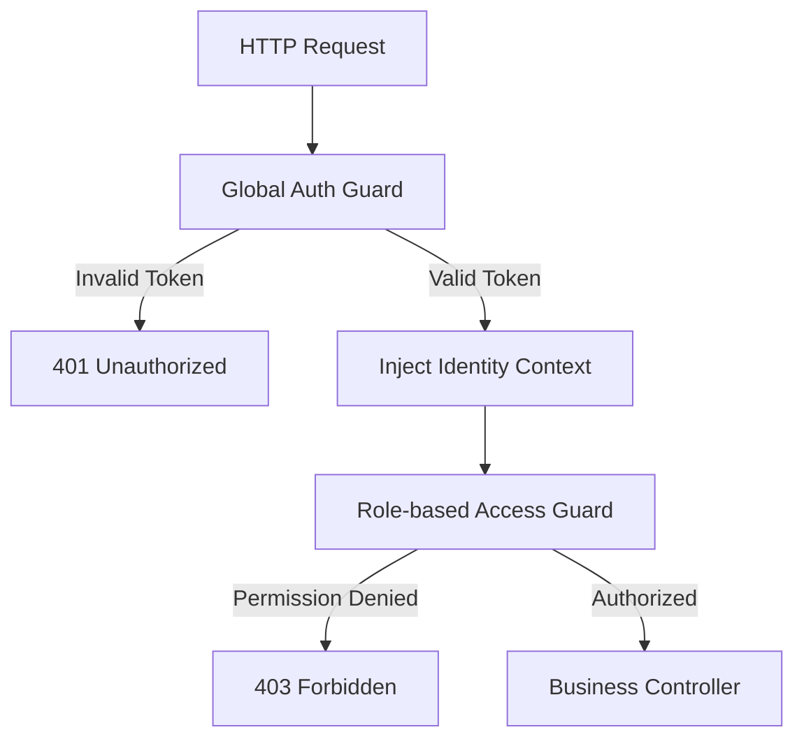

# TASK-00015: Rào chắn Kiểm soát Truy cập & Chiến lược Middleware (Access Control Guardrails & Middleware Strategy)

## 📋 Metadata

- **Task ID**: TASK-00015
- **Độ ưu tiên**: 🔴 CHÍ TRỌNG (Security Architecture)
- **Phụ thuộc**: TASK-00012 (JWT Architecture)
- **Trạng thái**: ✅ Done

---

## 🎯 CHIẾN LƯỢC PHÒNG THỦ ĐA LỚP (Layered Defense)

### 💡 Tại sao Guardrails quan trọng?
Hệ thống không được phép tin cậy bất kỳ Request nào từ bên ngoài mà chưa qua kiểm duyệt. Các rào chắn (Guards) đóng vai trò là "Người gác cổng" tự động, đảm bảo mọi tài nguyên đều được bảo vệ đúng mức.
- **Fail-by-Default**: Theo mặc định, mọi API đều bị khóa. Chỉ những API được đánh dấu tường minh (Public) mới có thể truy cập mà không cần Token.
- **Granular Authorization**: Không chỉ kiểm tra "Bạn là ai" (Authentication), hệ thống còn kiểm tra "Bạn có quyền làm gì" (Authorization) dựa trên vai trò (Roles) và quyền hạn cụ thể.
- **Context Injection**: Tự động trích xuất thông tin định danh từ Token và gắn vào ngữ cảnh xử lý (Request Context) để các Business Service có thể sử dụng an toàn.

---

## 🏗️ KIẾN TRÚC MIDDLWARE STACK

---

## 📄 QUY TẮC VẬN HÀNH (Enforcement Patterns)

### 1. Phân tách Trách nhiệm (Separation of Concerns)
- **Authentication Guard**: Chịu trách nhiệm Verify tính hợp lệ của Token (Signature, Expiration).
- **Authorization Guard**: Chịu trách nhiệm so khớp Metadata của API (ví dụ: yêu cầu quyền `ADMIN`) với Metadata của User.

### 2. Thuộc tính Truy cập (Access Decorators)
Hệ thống sử dụng các bộ "Nhãn" (Decorators) để khai báo quyền hạn ngay tại tầng Controller, giúp code minh bạch và dễ bảo trì:
- `@Public()`: Gỡ bỏ rào chắn bảo mật cho API.
- `@Roles(ADMIN)`: Giới hạn truy cập cho nhóm người quản trị.
- `@CurrentUser()`: Trình trích xuất thông tin người dùng an toàn.

---

## ✅ TIÊU CHUẨN AN TOÀN (Definition of Success)

- [x] **Zero-Trust**: Mọi API nhạy cảm đều yêu cầu Token hợp lệ.
- [x] **RBAC Enforced**: Admin không được truy cập vào dữ liệu cá nhân của User khác trừ khi có quyền đặc biệt.
- [x] **Audit Ready**: Mỗi yêu cầu bị từ chối đều được log lại để phục vụ điều tra bảo mật.

---

## 🧪 TDD PLANNING (Security Scenarios)

| Kịch bản | Mong đợi |
| :--- | :--- |
| **Bypass Attempt** | Truy cập `/admin/users` mà không gửi Token -> Trả lỗi 401. |
| **Insufficient Privileges** | Tài khoản `USER` cố truy cập API dành cho `ADMIN` -> Trả lỗi 403. |
| **Context Extraction** | Sử dụng `@CurrentUser()` trong Service -> Phải nhận được đúng Object User tương ứng với Token. |
