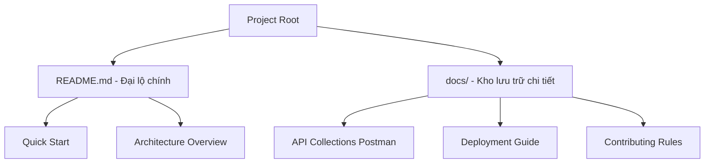

# TASK-00035: Quản trị Tri thức: Nguồn Sự thật Duy nhất & Cộng tác (Knowledge Management: Source of Truth & Collaboration)

## 📋 Metadata

- **Task ID**: TASK-00035 (Documentation)
- **Độ ưu tiên**: 🔵 TRUNG BÌNH (Onboarding & Maintenance)
- **Phụ thuộc**: Tất cả các Task hạ tầng
- **Trạng thái**: ✅ Done

---

## 🎯 CHIẾN LƯỢC QUẢN TRỊ TRI THỨC (Knowledge Strategy)

### 💡 Tại sao Tài liệu dự án quan trọng?
Một dự án tốt mà không có tài liệu là một dự án "chết". Tri thức cần được số hóa để bất kỳ ai tham gia cũng có thể hiểu, vận hành và phát triển hệ thống mà không cần người hướng dẫn trực tiếp.
- **Unified Onboarding**: Giảm thời gian làm quen cho thành viên mới từ vài ngày xuống vài giờ.
- **Standardized Workflow**: Đảm bảo mọi người tuân thủ cùng một quy trình phát triển, kiểm thử và triển khai.
- **Living Documentation**: Tài liệu phải phản ánh đúng thực trạng hệ thống (Source of Truth), không chỉ là các bản nháp cũ kỹ.

---

## 🏗️ CẤU TRÚC TRI THỨC (Knowledge Structure)

---

## 📄 QUY TẮC QUẢN TRỊ (Documentation Rules)

### 1. Phân loại Tài liệu (Documentation Tiers)
- **Tier 1 (Public)**: README.md tập trung vào "Cái gì" và "Làm sao để bắt đầu".
- **Tier 2 (Operational)**: Hướng dẫn cài đặt, biến môi trường và quy trình Build/Deploy.
- **Tier 3 (Technical)**: Đặc tả API, sơ đồ kiến trúc và quy tắc nghiệp vụ (Business Rules).

### 2. Định dạng & Ngôn ngữ
- Sử dụng **Markdown** tiêu chuẩn để đảm bảo hiển thị tốt trên mọi nền tảng (GitHub, GitLab, Code Editors).
- Sử dụng **Mermaid diagrams** thay vì hình ảnh tĩnh để dễ dàng cập nhật và quản lý phiên bản.

### 3. Quy tắc "Cập nhật song hành"
- Mọi thay đổi lớn về kiến trúc hoặc API phải được cập nhật vào tài liệu ngay trong cùng một lượt commit (Pull Request).

---

## ✅ TIÊU CHUẨN THÀNH CÔNG (Definition of Success)

- [x] **Self-explanatory**: Một developer mới có thể tự cài đặt và chạy ứng dụng chỉ bằng cách đọc README.
- [x] **Comprehensive API Maps**: Các tập hợp API (Postman/Insomnia) được cập nhật và có mô tả rõ ràng cho từng endpoint.
- [x] **Maintenance Policy**: Có quy trình rõ ràng về cách đóng góp mã nguồn (Contributing) và báo cáo lỗi (Issue template).

---

## 🧪 TDD PLANNING (Documentation Scenarios)

| Kịch bản | Mong đợi |
| :--- | :--- |
| **New Dev Onboarding** | Clone repo -> Đọc README -> Chạy `npm install` & `npm run dev` -> Thành công trong < 15p. |
| **API Exploration** | Mở Swagger/Postman -> Thử nghiệm các endpoint -> Dữ liệu trả về đúng như đặc tả tài liệu. |
| **Contribution Flow** | Đọc CONTRIBUTING.md -> Hiểu quy tắc đặt tên Branch & Commit -> Pull Request được chấp nhận nhanh hơn. |
