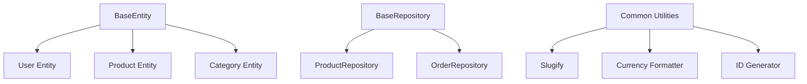

# TASK-00042: Nền tảng Chia sẻ: Chuẩn hóa Base Classes & Tiện ích (Foundation: Shared Base Classes & Utility Standardization)

## 📋 Metadata

- **Task ID**: TASK-00042
- **Độ ưu tiên**: 🔵 TRUNG BÌNH (Development Efficiency)
- **Phụ thuộc**: TASK-00005 (Database Schema)
- **Trạng thái**: ✅ Done

---

## 🎯 CHIẾN LƯỢC TÁI SỬ DỤNG (Reuse Strategy)

### 💡 Tại sao Chuẩn hóa Base Classes quan trọng?
Việc lặp lại các đoạn mã cấu trúc cơ bản cho mỗi Entity hay DTO không chỉ gây lãng phí thời gian mà còn tạo ra sự không nhất quán. Chuẩn hóa giúp mọi thành phần trong hệ thống nói cùng một "ngôn ngữ" kỹ thuật.
- **DRY (Don't Repeat Yourself)**: Tập trung các thuộc tính chung vào một nơi duy nhất.
- **Structural Integrity**: Đảm bảo mọi bản ghi đều có vết thời gian (Timestamp) và định danh (UUID) chuẩn.
- **Development Speed**: Giúp lập trình viên tập trung vào logic nghiệp vụ thay vì các boilerplate code.

---

## 🏗️ CẤU TRÚC KẾ THỪA (Inheritance Map)

---

## 📄 QUY TẮC QUẢN TRỊ (Standardization Rules)

### 1. Thực thể Cơ bản (Base Entity)
- Mọi thực thể trong hệ thống phải kế thừa từ `BaseEntity` để sở hữu các trường: `id` (Primary Key), `createdAt`, `updatedAt`, và `deletedAt` (cho Soft Delete).

### 2. Tiêu chuẩn Phân trang (Pagination Standard)
- Áp dụng một cấu trúc chung cho mọi yêu cầu và phản hồi có phân trang (`PaginationDto` & `PaginatedResponseDto`) để đảm bảo Frontend không cần viết lại logic xử lý danh sách.

### 3. Thư viện Tiện ích (Utility Governance)
- Các tác vụ lặp đi lặp lại như: Tạo mã đơn hàng (Order Number), Định dạng tiền tệ, hoặc Tạo SEO Slugs phải được tập trung vào thư viện `common/utils`. Tuyệt đối không viết ad-hoc nội bộ trong từng module.

---

## ✅ TIÊU CHUẨN THÀNH CÔNG (Definition of Success)

- [x] **Zero Redundancy**: Không có thực thể nào phải tự khai báo `id` hay `timestamp` thủ công.
- [x] **Global Consistency**: Mọi API trả về danh sách đều có định dạng meta-data (total, page, limit) giống hệt nhau.
- [x] **Centralized Logic**: Các thay đổi về định dạng tiền tệ hoặc quy tắc tạo slug chỉ cần sửa ở 1 file duy nhất.

---

## 🧪 TDD PLANNING (Standardization Scenarios)

| Kịch bản | Mong đợi |
| :--- | :--- |
| **New Entity Creation** | Tạo `ReviewEntity` kế thừa `BaseEntity` -> Tự động có cột `id`, `createdAt`, `updatedAt` -> Thành công. |
| **Consistent Pagination** | Gọi API Product & API User -> Cả hai đều trả về metadata `{ total: X, limit: Y }` -> Frontend tái sử dụng được UI component. |
| **Utility Update** | Thay đổi quy tắc tạo Slug -> Tất cả các module Product, Category, Post đều áp dụng quy tắc mới ngay lập tức. |
