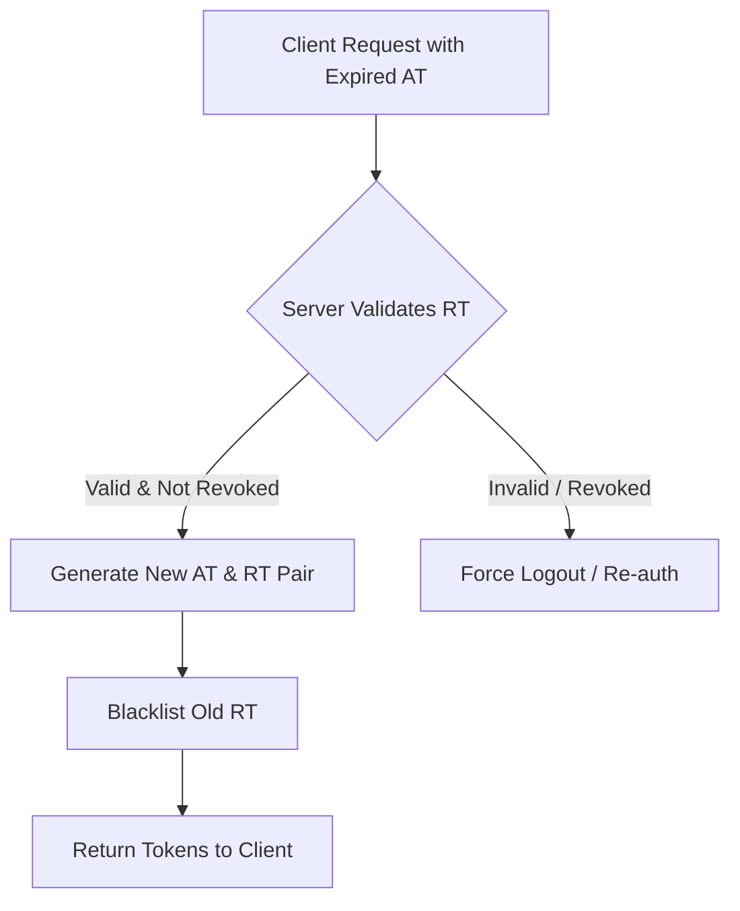

# TASK-00043: Quản trị Phiên làm việc: Bảo mật Bền vững & Xoay vòng Token (Session Mastery: Persistent Security & Token Rotation)

## 📋 Metadata

- **Task ID**: TASK-00043
- **Độ ưu tiên**: 🔴 CAO (Security & Experience)
- **Phụ thuộc**: TASK-00012 (JWT Authentication)
- **Trạng thái**: ✅ Done

---

## 🎯 CHIẾN LƯỢC QUẢN TRỊ PHIÊN (Session Strategy)

### 💡 Tại sao Refresh Token quan trọng?
Để cân bằng giữa bảo mật và trải nghiệm người dùng, chúng ta không thể bắt khách hàng đăng nhập lại mỗi 15 phút. Hệ thống sử dụng cặp Access Token (ngắn hạn) và Refresh Token (dài hạn) để duy trì sự hiện diện của người dùng một cách an toàn.
- **Improved UX**: Người dùng không bị gián đoạn khi đang sử dụng ứng dụng.
- **Enhanced Security**: Access Token hết hạn nhanh giúp giảm rủi ro nếu bị mất. Refresh Token có thể được thu hồi (Revoke) bất cứ lúc nào.
- **Stateless Efficiency**: Giữ cho hệ thống có khả năng mở rộng (Scale) mà không cần lưu trữ trạng thái phiên phức tạp trên Server chính.

---

## 🏗️ CƠ CHẾ XOAY VÒNG TOKEN (Token Rotation Flow)

---

## 📄 QUY TẮC QUẢN TRỊ (Session Rules)

### 1. Thời hạn & Vòng đời (Lifespan Policy)
- **Access Token (AT)**: Hết hạn sau 15-30 phút. Dùng để xác thực yêu cầu API.
- **Refresh Token (RT)**: Hết hạn sau 7-30 ngày. Dùng duy nhất để lấy AT mới.

### 2. Xoay vòng Token (Token Rotation)
- Mỗi khi Refresh Token được sử dụng để lấy Access Token mới, một Refresh Token mới cũng sẽ được cấp. Token cũ sẽ bị đánh dấu là không còn hiệu lực (Invalidated) để ngăn chặn các cuộc tấn công phát lại (Replay attacks).

### 3. Kiểm soát Thu hồi (Revocation)
- Hệ thống duy trì một danh sách đen (Blacklist) hoặc bảng trạng thái Refresh Token trong Database. Điều này cho phép Admin hoặc Người dùng thực hiện "Đăng xuất khỏi tất cả thiết bị" bằng cách hủy toàn bộ Refresh Tokens hiện có.

---

## ✅ TIÊU CHUẨN THÀNH CÔNG (Definition of Success)

- [x] **Secure Persistence**: Phiên làm việc kéo dài nhưng luôn đảm bảo Access Token được làm mới liên tục.
- [x] **Instant Revocation**: Lệnh Đăng xuất có hiệu lực ngay lập tức bằng cách vô hiệu hóa Refresh Token.
- [x] **Rotation Defense**: Nếu một Refresh Token cũ bị kẻ xấu sử dụng lại, toàn bộ "Cây token" của phiên đó sẽ bị khóa để bảo vệ tài khoản.

---

## 🧪 TDD PLANNING (Session Scenarios)

| Kịch bản | Mong đợi |
| :--- | :--- |
| **Token Refresh** | Gửi RT hợp lệ -> Nhận bộ AT & RT mới -> AT cũ không còn sử dụng được. |
| **Silent Logout** | User nhấn Logout -> Server thu hồi RT -> Thử Refresh tiếp theo sẽ thất bại. |
| **Security Breach** | Kẻ xấu lấy trộm RT cũ và thử dùng -> Hệ thống phát hiện RT đã được dùng rồi -> Khóa toàn bộ các phiên hiện có của User đó. |
