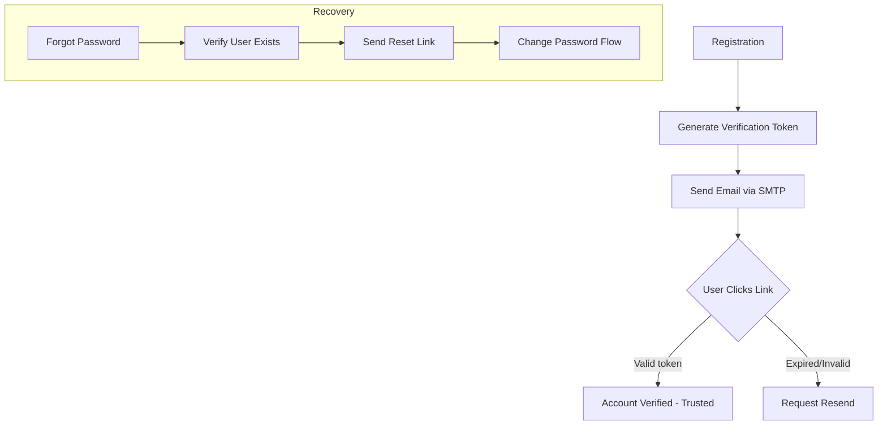

# TASK-00044: Phục hồi Danh tính: Xác thực Tự động & Vòng đời Niềm tin (Identity Recovery: Automated Verification & Trust Lifecycle)

## 📋 Metadata

- **Task ID**: TASK-00044
- **Độ ưu tiên**: 🔴 CAO (Security & Integrity)
- **Phụ thuộc**: TASK-00012 (JWT), TASK-00035 (README/Mail Config)
- **Trạng thái**: ✅ Done

---

## 🎯 CHIẾN LƯỢC XÁC THỰC DANH TÍNH (Identity Strategy)

### 💡 Tại sao Xác thực Tài khoản & Phục hồi mật khẩu quan trọng?
Tài khoản người dùng là tài sản quý giá nhất. Quy trình tự động hóa xác thực email không chỉ giúp giảm thiểu tài khoản rác (Bot/Spam) mà còn đảm bảo người dùng luôn có quyền kiểm soát tài khoản của mình một cách an toàn và chủ động.
- **Trust Verification**: Đảm bảo email người dùng cung cấp là chính xác và có thật.
- **Self-Service Recovery**: Cho phép người dùng tự lấy lại mật khẩu mà không cần hỗ trợ từ Admin (Rút ngắn thời gian, giảm chi phí vận hành).
- **Automated Communication**: Thiết lập kênh thông báo tự động (Auto-notification) giữa hệ thống và người dùng qua Email.

---

## 🏗️ LUỒNG XÁC THỰC & PHỤC HỒI (Verification Flows)

---

## 📄 QUY TẮC QUẢN TRỊ (Trust Rules)

### 1. Quản trị Token (Short-lived Tokens)
- Các mã xác thực và phục hồi (Verification/Reset Tokens) phải có thời hạn ngắn (ví dụ: 24h) để giảm thiểu rủi ro bị lạm dụng. Mỗi token chỉ được sử dụng duy nhất 1 lần (One-time use).

### 2. Chính sách Bảo mật Email
- Tuyệt đối không gửi mật khẩu cũ trong email. Chỉ gửi liên kết chứa Token định danh duy nhất đến trang đặt lại mật khẩu của ứng dụng.

### 3. Trạng thái Tài khoản (Account States)
- Hệ thống phân biệt rõ ràng giữa tài khoản "Đã đăng ký" (Registered) và "Đã xác thực" (Verified). Một số tính năng nhạy cảm (như đặt hàng giá trị lớn hoặc đánh giá sản phẩm) có thể yêu cầu trạng thái `Verified`.

---

## ✅ TIÊU CHUẨN THÀNH CÔNG (Definition of Success)

- [x] **Zero Manual Support**: Người dùng có thể tự đăng ký, xác thực và lấy lại mật khẩu mà không cần can thiệp từ đội ngũ Support.
- [x] **Secure Delivery**: Email được định dạng chuyên nghiệp (HTML Template) và gửi qua các nhà cung cấp tin cậy (SMTP/Transactional Mail).
- [x] **Bot Resilience**: Ngăn chặn được việc đăng ký hàng loạt bằng các công cụ xác thực token tự động.

---

## 🧪 TDD PLANNING (Trust Scenarios)

| Kịch bản | Mong đợi |
| :--- | :--- |
| **New Registration** | Đăng ký thành công -> Email xác thực được gửi ngay lập tức -> User nhấn link -> Tài khoản chuyển sang `Verified`. |
| **Recovery Attempt** | Nhấn "Quên mật khẩu" -> Nhận được link reset -> Link hết hạn sau 24h -> Không thể dùng lại link cũ. |
| **Expired Token** | Dùng token đã quá hạn để xác thực -> Hệ thống trả về lỗi "Token expired" -> Cho phép yêu cầu gửi lại email mới. |
