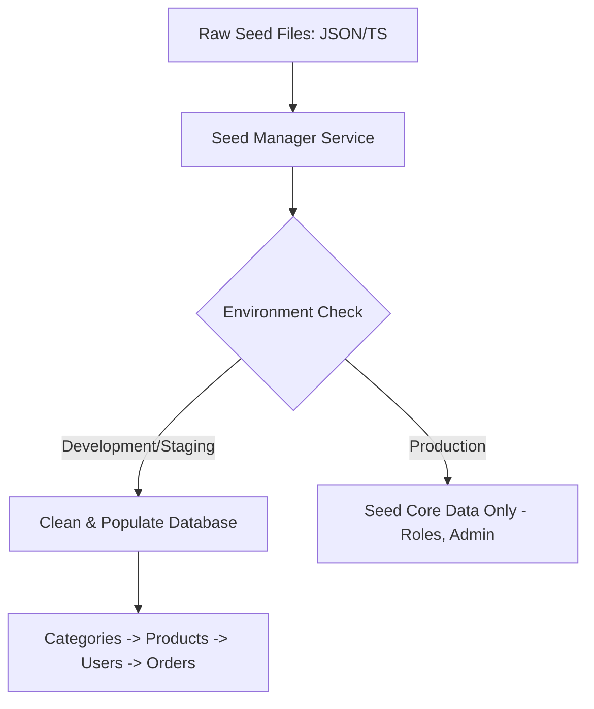

# TASK-00055: Sẵn sàng Dữ liệu: Seed Data & Chế độ Demo (Data Readiness: Seed Data & Demo Environment)

## 📋 Metadata

- **Task ID**: TASK-00055
- **Độ ưu tiên**: 🔵 TRUNG BÌNH (Development & QA)
- **Phụ thuộc**: TASK-00003 (PostgreSQL), TASK-00005 (Database Schema)
- **Trạng thái**: ✅ Done

---

## 🎯 CHIẾN LƯỢC DỮ LIỆU MẪU (Data Seeding Strategy)

### 💡 Tại sao Dữ liệu mẫu quan trọng?
Một dự án mới hoặc một môi trường kiểm thử (Staging) trống rỗng sẽ gây khó khăn cho việc phát triển và trình diễn tính năng. Seed Data giúp thiết lập một "trạng thái ban đầu chuẩn" cho hệ thống, đảm bảo mọi thành viên trong team đều làm việc trên cùng một tập dữ liệu cơ sở.
- **Instant Onboarding**: Lập trình viên mới chỉ cần chạy 1 lệnh để có toàn bộ dữ liệu mẫu (Sản phẩm, Danh mục, Tài khoản Admin).
- **Consistent Testing**: Đảm bảo các bài kiểm thử (Integration/E2E) luôn chạy trên một tập dữ liệu đã biết trước kết quả.
- **Sales-Ready Demos**: Luôn có sẵn một môi trường đẹp mắt, đầy đủ dữ liệu để trình diễn cho khách hàng hoặc đối tác bất cứ lúc nào.

---

## 🏗️ QUY TRÌNH NẠP DỮ LIỆU (Seeding Workflow)

---

## 📄 QUY TẮC QUẢN TRỊ (Data Rules)

### 1. Phân loại Dữ liệu (Seed Tiers)
- **Core Seeds**: Dữ liệu bắt buộc phải có để ứng dụng hoạt động (Ví dụ: Danh sách các Quyền, Role Admin mặc định).
- **Mock Seeds**: Dữ liệu giả định dùng cho test (Ví dụ: 100 sản phẩm mẫu, 10 user giả). Tuyệt đối không nạp vào môi trường Production.
- **Demo Seeds**: Dữ liệu chất lượng cao (Hình ảnh thật, mô tả thật) dùng cho các buổi trình diễn.

### 2. Tính lũy tiến (Idempotent Seeding)
- Lệnh Seed phải được thiết kế để có thể chạy nhiều lần mà không gây trùng lặp dữ liệu (ví dụ: Sử dụng lệnh `Upsert` - Nếu bản ghi đã tồn tại thì cập nhật, nếu chưa có thì tạo mới).

### 3. Chế độ Demo (Read-only Mode)
- Ở chế độ Demo công khai, hệ thống có thể được cấu hình để tự động reset dữ liệu về trạng thái chuẩn sau mỗi 24 giờ và chặn các hành động thay đổi dữ liệu nhạy cảm của hệ thống.

---

## ✅ TIÊU CHUẨN THÀNH CÔNG (Definition of Success)

- [x] **Single Command Setup**: Khởi tạo toàn bộ dữ liệu dự án chỉ với lệnh `npm run seed`.
- [x] **Environment Awareness**: Hệ thống đủ thông minh để không bao giờ xóa dữ liệu thật trên Production khi chạy lệnh seed.
- [x] **Data Integrity**: Dữ liệu mẫu tuân thủ nghiêm ngặt các ràng buộc khóa ngoại (Foreign Keys) của Database.

---

## 🧪 TDD PLANNING (Data Scenarios)

| Kịch bản | Mong đợi |
| :--- | :--- |
| **Fresh Setup** | Database trống -> Chạy Seed -> Tài khoản Admin và Danh mục cấp 1 xuất hiện đầy đủ. |
| **Run Twice** | Chạy Seed 2 lần liên tiếp -> Số lượng sản phẩm không bị nhân đôi -> Thành công. |
| **Production Shield** | Chạy lệnh Seed trên môi trường Production -> Hệ thống báo lỗi và dừng lại để bảo vệ dữ liệu thật. |
