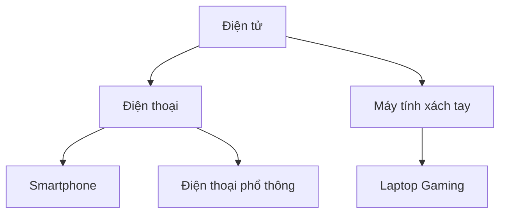

# TASK-00019: Vòng đời Danh mục: Quản trị Phân loại & Vận hành (Catalog Lifecycle: Category Governance & Operations)

## 📋 Metadata

- **Task ID**: TASK-00019
- **Độ ưu tiên**: 🔵 TRUNG BÌNH (Catalog Management)
- **Phụ thuộc**: TASK-00007 (Category Entity)
- **Trạng thái**: ✅ Done

---

## 🎯 QUẢN TRỊ PHÂN LOẠI ĐA CẤP (Hierarchical Governance)

### 💡 Tại sao Danh mục quan trọng?
Danh mục là "Xương sống" của trải nghiệm mua sắm. Một hệ thống danh mục được tổ chức tốt giúp khách hàng tìm thấy sản phẩm nhanh hơn và tăng tỷ lệ chuyển đổi.
- **Hierarchical Integrity**: Hỗ trợ cấu trúc cây (Tree structure) không giới hạn cấp độ, cho phép phân loại từ tổng quát đến chi tiết.
- **Recursive Logic**: Đảm bảo các thuộc tính và quyền hạn có thể được kế thừa từ danh mục cha xuống danh mục con.
- **Slug Governance**: Tự động hóa việc tạo định danh thân thiện (SEO-friendly slugs) để tối ưu hóa tìm kiếm.

---

## 🏗️ MÔ HÌNH PHÂN CẤP (Structural Model)

---

## 📄 QUY TẮC NHÂN VĂN & TOÀN VẸN (Integrity Rules)

### 1. Ràng buộc Xóa (Deletion Constraints)
Để bảo vệ dữ liệu, hệ thống áp dụng các quy tắc nghiêm ngặt khi gỡ bỏ danh mục:
- **Product Safety**: Không cho phép xóa danh mục nếu đang có sản phẩm gán trực tiếp vào nó.
- **Child Safety**: Không cho phép xóa danh mục cha nếu còn các danh mục con đang hoạt động (Active children).

### 2. Tự động hóa Định danh (Identity Automation)
- Khi một danh mục được tạo/cập nhật tên, hệ thống tự động tính toán lại `slug` dựa trên tên tiếng Việt (loại bỏ dấu và khoảng trắng).
- Đảm bảo `slug` là duy nhất trên toàn hệ thống để tránh xung đột URL.

---

## ✅ TIÊU CHUẨN VẬN HÀNH (Definition of Success)

- [x] **SEO Optimized**: Slugs luôn ở dạng lowercase và ngăn cách bằng dấu gạch ngang.
- [x] **Recursive Fetch**: Có khả năng truy xuất toàn bộ cây danh mục chỉ trong một yêu cầu (One-call tree).
- [x] **Administrative Control**: Chỉ có tài khoản Staff/Admin mới có quyền thay đổi cấu trúc danh mục.

---

## 🧪 TDD PLANNING (Structural Scenarios)

| Kịch bản | Mong đợi |
| :--- | :--- |
| **Circular Reference** | Cố gắng gán Category A làm con của chính nó -> Trả lỗi logic 400. |
| **Category with Products** | Xóa category đang chứa 10 sản phẩm -> Trả lỗi 400/409 kèm thông báo yêu cầu di dời sản phẩm trước. |
| **Slug Duplicate** | Tạo 2 category cùng tên ở 2 cấp khác nhau -> Slugs phải được phân biệt (ví dụ: `ao-thun` và `ao-thun-1`). |
