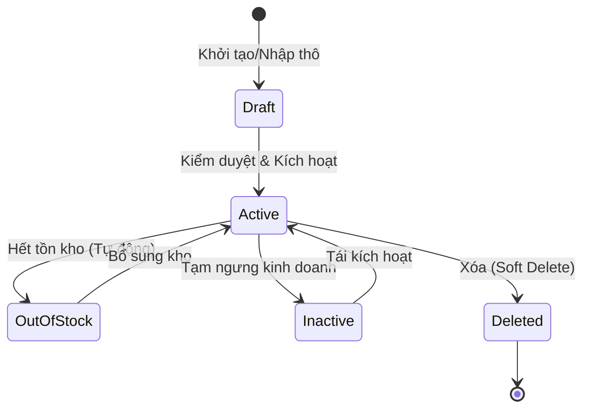

 # TASK-00021: Vòng đời Catalog: Quản trị Sản phẩm & Vận hành (Catalog Lifecycle: Product Governance & Operations)

## 📋 Metadata

- **Task ID**: TASK-00021
- **Độ ưu tiên**: 🔴 CHÍ TRỌNG (Inventory Foundation)
- **Phụ thuộc**: TASK-00019 (Category Governance)
- **Trạng thái**: ✅ Done

---

## 🎯 QUẢN TRỊ ĐỊNH DANH SẢN PHẨM (Product Identity Governance)

### 💡 Tại sao Quản trị Sản phẩm phức tạp?
Sản phẩm không chỉ là một hàng dữ liệu; nó là sự kết hợp giữa thông tin thương mại, trạng thái tồn kho và liên kết phân loại.
- **SKU Mapping**: Mỗi sản phẩm phải được định danh bằng mã SKU (Stock Keeping Unit) duy nhất để đồng bộ với hệ thống kho vận.
- **URL SEO Stability**: Slugs phải được duy trì ổn định ngay cả khi tên sản phẩm thay đổi nhẹ để tránh làm hỏng các liên kết (Broken links) trên công cụ tìm kiếm.
- **Relational Integrity**: Sản phẩm phải luôn thuộc về ít nhất một danh mục hợp lệ (TASK-00019).

---

## 🏗️ MÁY TRẠNG THÁI SẢN PHẨM (Product State Machine)

---

## 📄 QUY TẮC VẬN HÀNH (Operational Rules)

### 1. Quản trị Nội dung (Asset Association)
- Sản phẩm phải có ít nhất một hình ảnh đại diện (Thumbnail) trước khi được chuyển sang trạng thái `ACTIVE`.
- Giá niêm yết (`price`) phải là số dương và luôn được theo dõi lịch sử thay đổi để phục vụ báo cáo.

### 2. Quy tắc Gỡ bỏ (Soft-Delete Policy)
- Không bao giờ xóa cứng (Hard delete) sản phẩm đã từng phát sinh đơn hàng (Orders).
- Sử dụng cơ chế `deleted_at` để ẩn sản phẩm khỏi Marketplace trong khi vẫn giữ lại dữ liệu cho thống kê tài chính.

---

## ✅ TIÊU CHUẨN THÀNH CÔNG (Definition of Success)

- [x] **Audit Trail**: Hệ thống ghi nhận ID người tạo/người cập nhật cuối cùng cho mỗi sản phẩm.
- [x] **SEO Compliance**: Mỗi sản phẩm có một Slug duy nhất, tối ưu cho tìm kiếm.
- [x] **Strict Validation**: Ngăn chặn việc tạo sản phẩm không có danh mục hoặc giá âm.

---

## 🧪 TDD PLANNING (Operational Scenarios)

| Kịch bản | Mong đợi |
| :--- | :--- |
| **Price Anomaly** | Cập nhật giá sản phẩm bằng 0 hoặc âm -> Trả lỗi logic 400. |
| **Integrity Check** | Xóa danh mục cha trong khi sản phẩm vẫn đang gán vào danh mục con của nó -> Đảm bảo sản phẩm không bị "mồ côi". |
| **Search Relevancy** | Cập nhật thông tin sản phẩm -> Hệ thống phải phản hồi kết quả tìm kiếm mới trong thời gian thực (Real-time update). |
