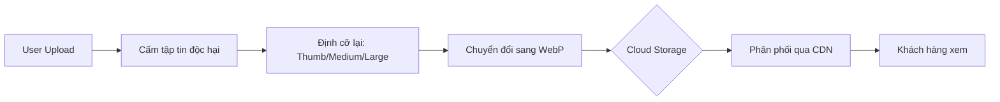

# TASK-00023.5: Quản trị Tài sản: Hạ tầng Truyền thông & Tối ưu hóa (Asset Management: Media Infrastructure & Optimization)

## 📋 Metadata

- **Task ID**: TASK-00023.5
- **Độ ưu tiên**: 🔴 CHÍ TRỌNG (Visual Experience)
- **Phụ thuộc**: TASK-00021 (Product Governance)
- **Trạng thái**: ✅ Done

---

## 🎯 CHIẾN LƯỢC QUẢN TRỊ TÀI SẢN (Asset Strategy)

### 💡 Tại sao Hạ tầng Hình ảnh quan trọng?
Hình ảnh là yếu tố quyết định hành vi mua hàng, nhưng cũng là nguyên nhân chính gây chậm ứng dụng nếu không được tối ưu.
- **Hybrid Storage Architecture**: Linh hoạt chuyển đổi giữa lưu trữ cục bộ (Local) cho môi trường Dev và lưu trữ đám mây (Cloud S3/Cloudinary) cho môi trường Prod.
- **Media Pipeline**: Tự động hóa việc xử lý hình ảnh (Resize, Compress, WebP) ngay khi Upload.
- **Content Delivery (CDN)**: Tối ưu truyền tải hình ảnh đến người dùng dựa trên vị trí địa lý.

---

## 🏗️ QUY TRÌNH XỬ LÝ HÌNH ẢNH (Media Processing Pipeline)

---

## 📄 QUY TẮC AN TOÀN & VẬN HÀNH (Security & Hygiene)

### 1. Tiêu chuẩn Đầu vào (Ingestion Standards)
- **Format Control**: Chỉ chấp nhận `JPEG`, `PNG`, `WEBP`.
- **Size Limit**: Giới hạn tối đa 5MB mỗi hình ảnh để bảo vệ băng thông.
- **Sanitization**: Tự động loại bỏ dữ liệu nhạy cảm (EXIF Data) từ hình ảnh trước khi lưu trữ.

### 2. Định danh Tài sản (Asset Identity)
- Hệ thống tự động phát sinh tên file duy nhất (UUID) để tránh ghi đè dữ liệu.
- Tổ chức thư mục theo cấu trúc: `products/{yyyy}/{mm}/{uuid}.webp`.

---

## ✅ TIÊU CHUẨN THÀNH CÔNG (Definition of Success)

- [x] **Optimized Loading**: 100% hình ảnh sản phẩm được hỗ trợ định dạng WebP.
- [x] **CDN Ready**: URL tài sản luôn sẵn sàng để phục vụ qua các mạng phân phối nội dung.
- [x] **Administrative Hygiene**: Xóa sản phẩm sẽ tự động kích hoạt tiến trình dọn dẹp (Cleanup) tài sản trên Cloud.

---

## 🧪 TDD PLANNING (Media Scenarios)

| Kịch bản | Mong đợi |
| :--- | :--- |
| **Malicious File** | Upload file .zip giả dạng .jpg -> Trả lỗi 415 Unsupported Media Type. |
| **Large Batch** | Upload cùng lúc 15 hình ảnh (Vượt giới hạn 10) -> Chỉ xử lý 10 hình đầu tiên hoặc trả lỗi 400. |
| **Storage Failure** | Cloud S3 tạm thời không khả dụng -> Hệ thống phải có cơ chế Retry hoặc lưu tạm (Temporary buffering). |
