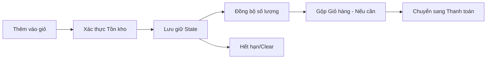

# TASK-00024: Lưu giữ Mua sắm: Quản trị Giỏ hàng & Vật phẩm (Shopping Persistence: Personal Cart & Items Governance)

## 📋 Metadata

- **Task ID**: TASK-00024
- **Độ ưu tiên**: 🔴 CHÍ TRỌNG (Conversion Rate)
- **Phụ thuộc**: TASK-00021 (Product Governance)
- **Trạng thái**: ✅ Done

---

## 🎯 CHIẾN LƯỢC LƯU GIỮ MUA SẮM (Persistence Strategy)

### 💡 Tại sao Giỏ hàng quan trọng?
Giỏ hàng không chỉ là nơi chứa hàng; nó là bằng chứng của ý định mua hàng. Một giỏ hàng không ổn định hoặc hay gặp lỗi sẽ làm mất khách hàng ngay lập tức.
- **Identity-based Persistence**: Giỏ hàng phải được gắn chặt với danh tính người dùng (TASK-00006), cho phép họ tiếp tục mua sắm trên nhiều thiết bị.
- **Item Aging Policy**: Định nghĩa thời gian tồn tại của vật phẩm trong giỏ hàng nếu không phát sinh đơn hàng (ví dụ: Tự động xóa sau 30 ngày).
- **Stock Pre-validation**: Kiểm tra tính sẵn có của sản phẩm ngay khi thêm vào giỏ để cung cấp phản hồi tức thì.

---

## 🏗️ VÒNG ĐỜI VẬT PHẨM GIỎ HÀNG (Item Lifecycle)

---

## 📄 QUY TẮC VẬN HÀNH (Operational Rules)

### 1. Quản trị Số lượng (Quantity Governance)
- Số lượng mua tối thiểu là 1 và tối đa không vượt quá tồn kho khả dụng (TASK-00023).
- Nếu giá sản phẩm thay đổi trong khi nằm trong giỏ, hệ thống phải cập nhật giá mới nhất và thông báo cho người dùng trước khi thanh toán.

### 2. Chính sách Gộp giỏ (Merging Policy)
- Khi người dùng đăng nhập, nếu có giỏ hàng khách (Guest cart) hiện hữu, hệ thống hỗ trợ gộp các vật phẩm vào giỏ hàng chính thức.

---

## ✅ TIÊU CHUẨN THÀNH CÔNG (Definition of Success)

- [x] **Zero Data Loss**: Vật phẩm giỏ hàng không bị mất khi người dùng Refresh hoặc chuyển trình duyệt.
- [x] **Ownership Guard**: Chỉ chủ sở hữu giỏ hàng mới có quyền xem và sửa đổi các vật phẩm bên trong.
- [x] **Relational Sync**: Xóa sản phẩm khỏi hệ thống (Soft-delete) phải tự động vô hiệu hóa vật phẩm đó trong mọi giỏ hàng.

---

## 🧪 TDD PLANNING (Shopping Scenarios)

| Kịch bản | Mong đợi |
| :--- | :--- |
| **Out of Stock Sync** | Thêm 5 sản phẩm vào giỏ nhưng kho chỉ còn 2 -> Chỉ thêm 2 hoặc trả lỗi thông báo số lượng tối đa. |
| **Unauthorized Access** | Cố gắng truy cập giỏ hàng của User khác qua ID -> Trả lỗi 403 Forbidden. |
| **Price volatility** | Sản phẩm giảm giá khi đang trong giỏ -> Tổng tiền phải được tính toán lại theo giá mới nhất. |
