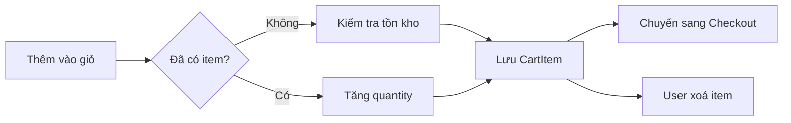

# TASK-207: Lưu giữ Mua sắm — Quản trị Giỏ hàng & Vật phẩm

## 📋 Metadata

- **Task ID**: TASK-207
- **Độ ưu tiên**: 🔴 CHÍ TRỌNG (Conversion Rate)
- **Phụ thuộc**: TASK-203 (Product CRUD)
- **Trạng thái**: ⏳ Not started

---

## 🎯 CHIẾN LƯỢC GIỎ HÀNG

Giỏ hàng không chỉ là nơi chứa hàng — nó là bằng chứng của ý định mua hàng. Một giỏ hàng không ổn định sẽ làm mất khách hàng ngay lập tức.

- **Identity-based Persistence**: Cart gắn với User đã đăng nhập. Guest User có Cart riêng được định danh bằng session cookie.
- **Merge on Login**: Khi Guest đăng nhập, guest cart được merge vào user cart bằng cách cộng dồn quantity.
- **Stock Pre-validation**: Kiểm tra tồn kho ngay khi thêm item để trả phản hồi tức thì.

---

## 🏗️ VÒNG ĐỜI VẬT PHẨM GIỎ HÀNG

```mermaid
graph LR
    Add[Thêm vào giỏ] --> Exists{Đã có item?}
    Exists -- Có --> Merge[Tăng quantity]
    Exists -- Không --> Validate[Kiểm tra tồn kho]
    Validate --> Persist[Lưu CartItem]
    Merge --> Persist
    Persist --> Checkout[Chuyển sang Checkout]
    Persist --> Remove[User xoá item]
```

---

## 📄 QUY TẮC VẬN HÀNH

### 1. Guest Cart & Session
- Guest User được cấp một anonymous session token (cookie) khi lần đầu thêm item vào giỏ.
- Cart của guest được lưu trong DB gắn với session token đó, không gắn với userId.
- Khi guest đăng nhập, backend tìm guest cart theo session token và merge vào user cart.

### 2. Merge Logic khi Đăng nhập
- Với mỗi CartItem trong guest cart: nếu User cart đã có cùng `productId`, **cộng dồn quantity**. Nếu chưa có, chuyển item sang user cart.
- Guest cart bị xoá sau khi merge thành công.

### 3. Quản trị Quantity
- Thêm cùng một Product đã có trong Cart → **tăng quantity** (không tạo dòng mới).
- Quantity tối thiểu: 1. Tối đa: không vượt quá tồn kho khả dụng.
- Nếu giá Product thay đổi trong khi nằm trong Cart, hệ thống dùng giá mới nhất khi tính tổng — thông báo cho User trước khi checkout.

### 4. Soft-deleted Product
- Khi Product bị soft-delete, CartItem vẫn được giữ trong DB.
- Khi User fetch Cart, item đó được đánh dấu `unavailable: true` kèm thông báo "Sản phẩm này hiện không còn bán".
- Item `unavailable` không được tính vào tổng tiền và không thể checkout.

### 5. Cart Expiry
- Không có auto-expiry cho MVP. Cart tồn tại cho đến khi checkout hoặc User tự xoá.

---

## 🔌 API ENDPOINTS

| Method | Route | Auth | Mô tả |
|--------|-------|------|--------|
| `GET` | `/cart` | User hoặc Guest session | Lấy cart hiện tại kèm trạng thái từng item |
| `POST` | `/cart/items` | User hoặc Guest session | Thêm item; merge nếu productId đã tồn tại |
| `PATCH` | `/cart/items/:productId` | Owner only | Cập nhật quantity |
| `DELETE` | `/cart/items/:productId` | Owner only | Xoá 1 item |
| `DELETE` | `/cart` | Owner only | Xoá toàn bộ cart |

**GET /cart response** phải bao gồm:
- Danh sách items, mỗi item kèm `unavailable: boolean`
- Tổng tiền (chỉ tính items available)
- Số lượng items

---

## ✅ TIÊU CHUẨN THÀNH CÔNG

- [ ] User đăng nhập trên 2 thiết bị khác nhau thấy cùng Cart
- [ ] Thêm cùng Product 2 lần → quantity tăng, không tạo dòng mới
- [ ] Guest đăng nhập → guest cart merge vào user cart (quantity cộng dồn)
- [ ] Product bị ẩn → Cart vẫn hiển thị item đó với `unavailable: true`
- [ ] Truy cập Cart của User khác → 403 Forbidden
- [ ] Checkout với item `unavailable` → blocked, trả lỗi rõ ràng

---

## 🧪 TDD SCENARIOS

| Kịch bản | Mong đợi |
|----------|----------|
| Thêm Product đã có trong Cart | Quantity tăng lên, không tạo CartItem mới |
| Thêm Product vượt quá tồn kho | Trả lỗi với số lượng tối đa có thể thêm |
| Guest đăng nhập, cả 2 cart có Áo thun (guest: ×2, user: ×3) | Cart sau merge: Áo thun ×5 |
| Fetch Cart sau khi Product bị soft-delete | Item xuất hiện với `unavailable: true`, không tính vào tổng tiền |
| PATCH quantity về 0 | Xoá CartItem khỏi Cart |
| Truy cập Cart của User khác | 403 Forbidden |
