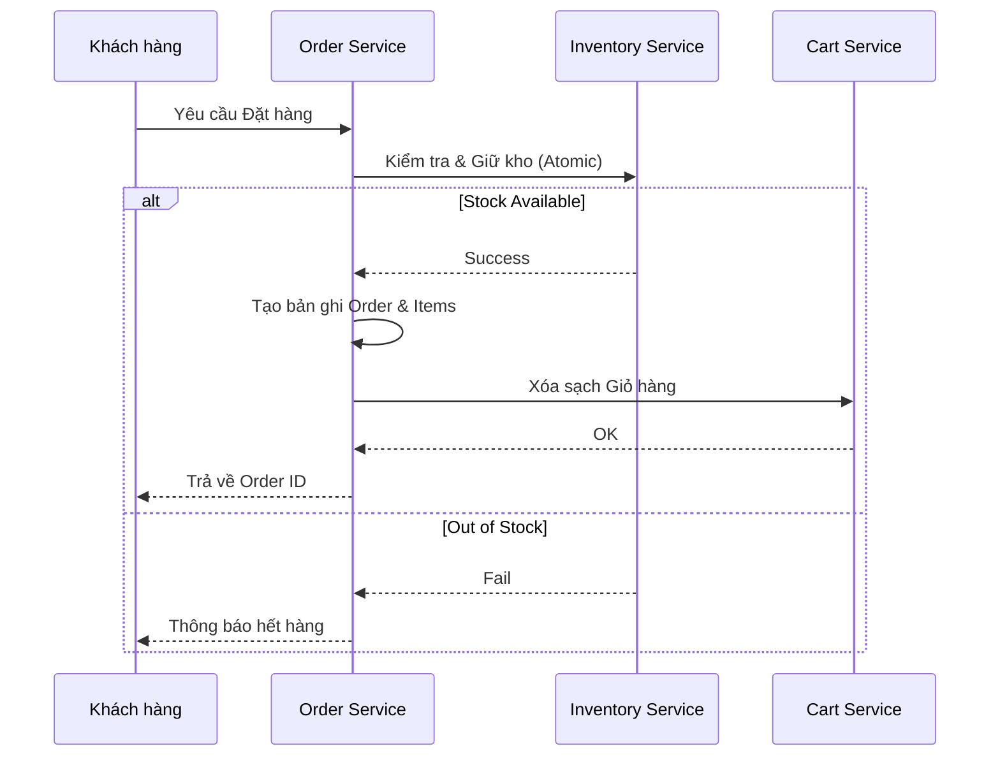

# TASK-00026: Thương mại Giao dịch: Đặt hàng & Giữ chỗ Tồn kho (Transactional Commerce: Order Placement & Reservation)

## 📋 Metadata

- **Task ID**: TASK-00026
- **Độ ưu tiên**: 🔴 CHÍ TRỌNG (Revenue Path)
- **Phụ thuộc**: TASK-00025 (Calculation Logic), TASK-00023 (Inventory)
- **Trạng thái**: ✅ Done

---

## 🎯 CHIẾN LƯỢC ĐẶT HÀNG (Placement Strategy)

### 💡 Tại sao Quy trình Đặt hàng quan trọng?
Đây là khoảnh khắc chuyển đổi từ "người xem" thành "người mua". Mọi sự cố tại bước này đều trực tiếp làm mất doanh thu.
- **ACID Transaction**: Toàn bộ quá trình (Tạo đơn -> Giữ kho -> Xóa giỏ hàng) phải diễn ra nguyên tử. Nếu một bước lỗi, tất cả phải hoàn tác.
- **Stock Commitment**: Chuyển trạng thái tồn kho từ `Available` sang `Committed` (TASK-00023).
- **Idempotency**: Ngăn chặn việc tạo đơn hàng trùng lặp nếu người dùng bấm nút "Đặt hàng" nhiều lần do mạng chậm.

---

## 🏗️ LUỒNG GIAO DỊCH ĐẶT HÀNG (Order Sequence)

---

## 📄 QUY TẮC ĐỊNH DANH & VẬN HÀNH (Operational Rules)

### 1. Định danh Đơn hàng (Order Identity)
- Mã đơn hàng phải có định dạng dễ đọc và mang tính thời điểm: `ORD-{YYYYMMDD}-{SERIAL_NUMBER}` (ví dụ: `ORD-20240111-A8Z9`).
- Sử dụng UUID làm khóa chính kỹ thuật (Internal) và Order Number cho giao tiếp với khách hàng (External).

### 2. Dữ liệu Snapshot (Data Immutability)
- Không tham chiếu trực tiếp đến bảng Sản phẩm cho tên và giá. Phải lưu bản sao tại thời điểm mua (Snapshot) để lưu giữ lịch sử chính xác ngay cả khi sản phẩm bị thay đổi hoặc xóa sau này.

---

## ✅ TIÊU CHUẨN THÀNH CÔNG (Definition of Success)

- [x] **Race Condition Guard**: Hệ thống xử lý đúng khi số lượng hàng cuối cùng được đặt bởi nhiều người cùng lúc.
- [x] **Zero Orphaned Orders**: Không bao giờ có tình trạng đơn hàng được tạo nhưng kho không giảm hoặc ngược lại.
- [x] **Transaction Integrity**: Đảm bảo Rollback 100% nếu có bất kỳ lỗi hệ thống nào xảy ra trong quá trình đặt hàng.

---

## 🧪 TDD PLANNING (Placement Scenarios)

| Kịch bản | Mong đợi |
| :--- | :--- |
| **Payment Timeout** | Đơn hàng đã tạo nhưng không nhận được tín hiệu thanh toán -> Trả lại kho sau X phút. |
| **Simultaneous Orders** | 2 đơn hàng cho cùng 1 sản phẩm cuối cùng -> Chỉ 1 mã đơn hàng hợp lệ được phát sinh. |
| **Inventory Desync** | Kho thực tế < Số lượng trong giỏ -> Hệ thống báo lỗi và yêu cầu cập nhật lại giỏ hàng. |
