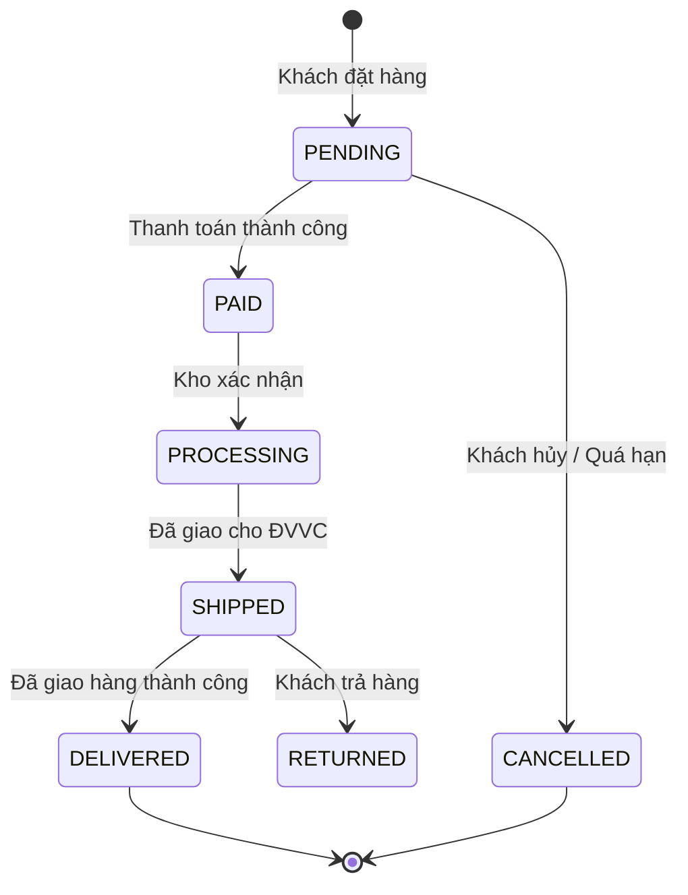

# TASK-00027: Vòng đời Đơn hàng: Vận hành & Theo dõi Sau mua (Order Lifecycle: Post-Purchase Operations & Tracking)

## 📋 Metadata

- **Task ID**: TASK-00027
- **Độ ưu tiên**: 🔵 TRUNG BÌNH (Operations)
- **Phụ thuộc**: TASK-00026 (Order Placement)
- **Trạng thái**: ✅ Done

---

## 🎯 CHIẾN LƯỢC QUẢN TRỊ VÒNG ĐỜI (Lifecycle Strategy)

### 💡 Tại sao Quản trị Vòng đời quan trọng?
Một đơn hàng không kết thúc khi khách bấm đặt. Nó là một hành trình qua nhiều trạng thái và nhiều bên (Kho, Đơn vị vận chuyển, Khách hàng).
- **State Machine Integrity**: Đảm bảo đơn hàng chỉ có thể chuyển đổi giữa các trạng thái hợp lệ (ví dụ: Không thể chuyển từ `CANCELLED` sang `SHIPPED`).
- **Audit Trail**: Ghi lại lịch sử thay đổi trạng thái kèm theo người thực hiện và thời gian (Timestamp).
- **Privacy by Design**: Đảm bảo khách hàng chỉ thấy đơn của họ, và nhân viên chỉ thấy dữ liệu cần thiết để xử lý.

---

## 🏗️ MÁY TRẠNG THÁI ĐƠN HÀNG (Order State Machine)

---

## 📄 QUY TẮC VẬN HÀNH (Operational Rules)

### 1. Kiểm soát Truy cập (Access Control)
- **Customer View**: Xem danh sách đơn hàng của chính mình, chi tiết đơn hàng, và được quyền hủy nếu trạng thái là `PENDING`.
- **Admin/Staff View**: Quản trị toàn bộ hệ thống đơn hàng, cập nhật trạng thái vận chuyển, xử lý hoàn hàng.

### 2. Logic Bù trừ (Compensation Logic)
- Khi đơn hàng bị `CANCELLED` hoặc `RETURNED`, hệ thống phải tự động kích hoạt tiến trình hoàn trả tồn kho (TASK-00023) để đảm bảo số liệu thực tế luôn khớp.

---

## ✅ TIÊU CHUẨN THÀNH CÔNG (Definition of Success)

- [x] **Immutable History**: Trạng thái đơn hàng một khi đã lưu không thể bị xóa, chỉ có thể ghi đè trạng thái mới.
- [x] **Ownership Guard**: Ngăn chặn tuyệt đối việc User A xem được đơn hàng của User B qua ID.
- [x] **Event Notification**: Mỗi lần chuyển trạng thái quan trọng phải sẵn sàng để gửi thông báo (Email/Push) cho khách hàng.

---

## 🧪 TDD PLANNING (Lifecycle Scenarios)

| Kịch bản | Mong đợi |
| :--- | :--- |
| **Invalid Transition** | Cố gắng chuyển đơn hàng từ `DELIVERED` về `PENDING` -> Trả lỗi 400 Bad Request. |
| **Unauthorized Cancel** | User cố gắng hủy đơn hàng của người khác -> Trả lỗi 403 Forbidden. |
| **Auto-Cancel** | Đơn hàng `PENDING` sau 24h không thanh toán -> Hệ thống tự động chuyển sang `CANCELLED`. |
