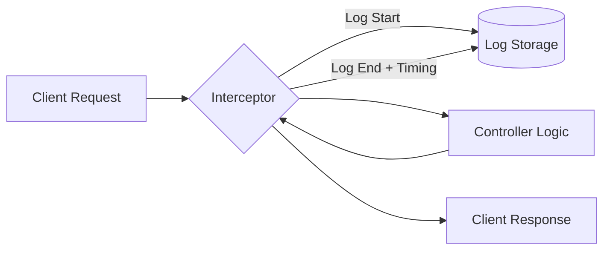

# TASK-00030: Khả năng Quan sát: Ghi log Yêu cầu & Truy vết Kiểm toán (Observability: Request Logging & Audit Trails)

## 📋 Metadata

- **Task ID**: TASK-00030
- **Độ ưu tiên**: 🔵 TRUNG BÌNH (Operations)
- **Phụ thuộc**: TASK-00029 (Error Handling)
- **Trạng thái**: ✅ Done

---

## 🎯 CHIẾN LƯỢC QUAN SÁT (Observability Strategy)

### 💡 Tại sao Khả năng Quan sát quan trọng?
Trong một hệ thống phân tán, khi có lỗi xảy ra, Log là "nhân chứng" duy nhất giúp tái hiện lại sự việc.
- **Operational Transparency**: Khả năng nhìn thấy luồng dữ liệu đi vào và đi ra khỏi hệ thống theo thời gian thực.
- **Performance Baseline**: Ghi lại thời gian xử lý (Execution time) của mỗi Request để phát hiện các "nút thắt cổ chai" (Bottlenecks).
- **Log Correlation**: Gắn kết Header, Body, và Response vào một đơn vị truy vết duy nhất thông qua `Request-ID`.

---

## 🏗️ LUỒNG DỮ LIỆU LOG (Logging Flow)

---

## 📄 QUY TẮC QUẢN TRỊ LOG (Logging Rules)

### 1. Bảo mật & Quyền riêng tư (Security Masking)
Hệ thống **TUYỆT ĐỐI KHÔNG** được ghi log các thông tin nhạy cảm sau đây:
- Mật khẩu (`password`, `oldPassword`, `newPassword`).
- Mã PIN hoặc OTP.
- Mã số thẻ tín dụng (CVV, Card Number).
- Token nhạy cảm trong Body.

### 2. Vòng đời Log (Log Lifecycle)
- **Standard Output (stdout)**: Sử dụng cho môi trường phát triển.
- **File Rotation**: Log phải được phân tách theo ngày và tự động xóa sau X ngày để tránh đầy ổ cứng.
- **Structured JSON**: Mọi log phải ở định dạng JSON để các hệ thống bên thứ ba (ELK Stack, Grafana Loki) có thể dễ dàng phân tích.

---

## ✅ TIÊU CHUẨN THÀNH CÔNG (Definition of Success)

- [x] **Request-Response Pair**: Mỗi Request đi vào hệ thống đều phải có một Log entry tương ứng ghi nhận kết quả trả về.
- [x] **Execution Timing**: 100% Request được ghi lại thời gian xử lý (ms).
- [x] **Sensitive Filter**: Kiểm tra xác nhận dữ liệu nhạy cảm đã được lọc sạch trước khi ghi vào log storage.

---

## 🧪 TDD PLANNING (Observability Scenarios)

| Kịch bản | Mong đợi |
| :--- | :--- |
| **Normal Request** | Ghi nhận Method: POST, URL: /auth/login, Status: 200, Time: 45ms. |
| **Masking Check** | Request chứa field `password` -> Log record phải hiển thị `[MASKED]` thay vì giá trị thực. |
| **Slow Request** | Request xử lý > 1000ms -> Log phải gắn tag `[WARNING]` hoặc `[SLOW]` để cảnh báo. |
