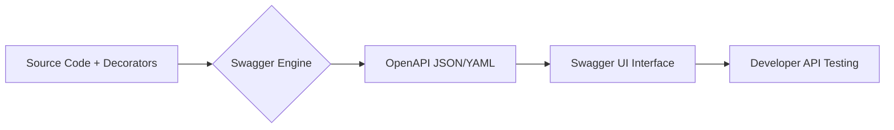

# TASK-00032: Đặc tả Giao diện: Tài liệu Sống & Khám phá API (Interface Specification: Living Documentation & API Exploration)

## 📋 Metadata

- **Task ID**: TASK-00032
- **Độ ưu tiên**: 🔵 TRUNG BÌNH (Developer Experience)
- **Phụ thuộc**: TASK-00031 (Response Contract), TASK-00012 (Authentication)
- **Trạng thái**: ✅ Done

---

## 🎯 CHIẾN LƯỢC ĐẶC TẢ GIAO DIỆN (Specification Strategy)

### 💡 Tại sao Tài liệu Sống quan trọng?
Một hệ thống API không có tài liệu hoặc tài liệu sai lệch là nỗi ám ảnh của mọi lập trình viên. Tài liệu phải "sống" cùng với code.
- **Self-Documenting Architecture**: Giao diện tài liệu phải được sinh ra tự động từ mã nguồn (Metadata-driven), đảm bảo code thay đổi đến đâu, tài liệu cập nhật đến đó.
- **Exploratory Interface**: Cung cấp môi trường để thử nghiệm trực tiếp (Try it out) các API mà không cần cài đặt thêm công cụ bên ngoài (như Postman).
- **Contract as a Source of Truth**: Tài liệu là thỏa thuận duy nhất giữa đội ngũ Backend và các bên tiêu thụ API (Frontend, Mobile, 3rd party).

---

## 🏗️ LUỒNG SINH TÀI LIỆU (Documentation Pipeline)

---

## 📄 QUY TẮC QUẢN TRỊ GIAO DIỆN (Interface Rules)

### 1. Phân nhóm Logic (Logical Grouping)
- Các Endpoint không được để rời rạc mà phải được nhóm theo Module hoặc Feature Area (Ví dụ: `Authentication`, `Marketplace`, `Order System`).

### 2. Định nghĩa Bảo mật (Security Scheme Definition)
- 100% các API yêu cầu bảo mật phải được gắn nhãn `Bearer Auth`.
- Giao diện phải cung cấp nút "Authorize" tập trung để dán JWT Token cho toàn bộ phiên làm việc.

### 3. Ví dụ Mô phỏng (Modeling for Exploration)
- Mỗi mô hình dữ liệu (DTO) phải đi kèm với các ví dụ thực tế (Examples) để người dùng hiểu rõ kiểu dữ liệu mong đợi (Ví dụ: Định dạng UUID, Email, Ngày tháng).

---

## ✅ TIÊU CHUẨN THÀNH CÔNG (Definition of Success)

- [x] **Always Sync**: Tài liệu Swagger luôn truy cập được tại `/api/docs` và khớp hoàn toàn với các Controller thực tế.
- [x] **Complete Model Mapping**: Tất cả các trường trong Request Body và Response Body đều được mô tả rõ ràng kiểu dữ liệu và ràng buộc (Constraints).
- [x] **Status Code Transparency**: Mỗi Endpoint phải liệt kê đủ các mã trạng thái có thể xảy ra (200, 201, 400, 401, 403, 500).

---

## 🧪 TDD PLANNING (Specification Scenarios)

| Kịch bản | Mong đợi |
| :--- | :--- |
| **New Field Added** | Thêm 1 field vào Product DTO -> Swagger UI tự động hiển thị field đó sau khi Reload. |
| **Auth Missing** | Gọi API yêu cầu Token mà không Authorize trên Swagger -> Phải hiển thị lỗi 401 rõ ràng. |
| **Validation Constraint** | DTO đánh dấu `@Min(1)` -> Swagger phải hiển thị "Minimum: 1" trong Schema. |
