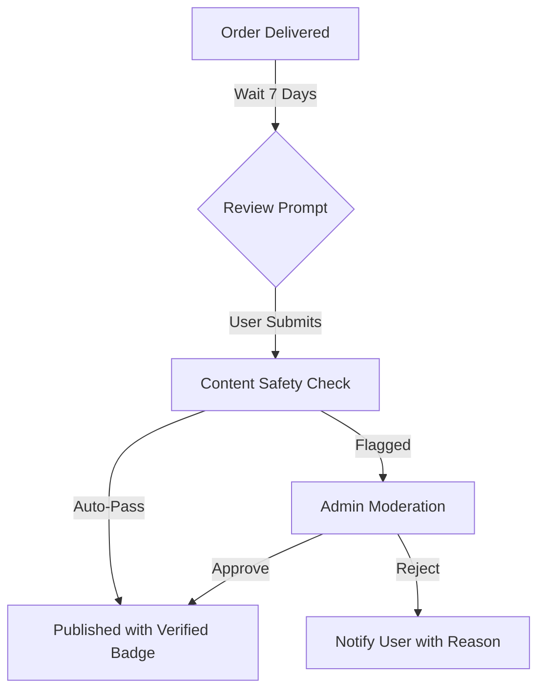

# TASK-00034: Niềm tin Cộng đồng: Quản trị Đánh giá & Xếp hạng (Community Trust: Review & Rating Governance)

## 📋 Metadata

- **Task ID**: TASK-00034 (Review System)
- **Độ ưu tiên**: 🟡 TRUNG BÌNH (Growth & Conversion)
- **Phụ thuộc**: TASK-00027 (Order Management), TASK-00021 (Product CRUD)
- **Trạng thái**: ✅ Done

---

## 🎯 CHIẾN LƯỢC XÂY DỰNG NIỀM TIN (Trust Strategy)

### 💡 Tại sao Đánh giá Cộng đồng quan trọng?
Trong thương mại điện tử, niềm tin là đơn vị tiền tệ quan trọng nhất. Một hệ thống đánh giá minh bạch giúp tăng tỷ lệ chuyển đổi (Conversion Rate) và giảm tỷ lệ hoàn hàng.
- **Verified Purchase Integrity**: Đảm bảo 100% đánh giá đến từ người dùng thực sự đã mua và nhận hàng. Loại bỏ hoàn toàn đánh giá ảo (Spam).
- **Social Proof Lifecycle**: Tạo ra một vòng lặp phản hồi tích cực từ lúc mua hàng đến khi chia sẻ trải nghiệm.
- **Dynamic Moderation**: Cơ chế lọc nội dung thông minh để vừa giữ được tính trung thực, vừa bảo vệ môi trường cộng đồng văn minh.

---

## 🏗️ VÒNG ĐỜI ĐÁNH GIÁ (Review Lifecycle)

---

## 📄 QUY TẮC QUẢN TRỊ (Trust Rules)

### 1. Huy hiệu "Đã mua hàng" (Verified Badge)
- Chỉ hiển thị huy hiệu Verified cho các Review có liên kết với `OrderID` hợp lệ ở trạng thái `DELIVERED`.

### 2. Thuật toán Xếp hạng (Rating Algorithm)
- Phải tính toán trung bình cộng (Average) và phân rã (Distribution) từ 1 đến 5 sao một cách trực quan.
- Ưu tiên hiển thị các đánh giá "Hữu ích" (Helpful) được cộng đồng bình chọn lên đầu trang.

### 3. Đa phương tiện (Multimedia Support)
- Khuyến khích người dùng đăng kèm hình ảnh thực tế của sản phẩm (tối đa 5 ảnh). Điều này làm tăng độ tin cậy của đánh giá lên gấp 4 lần.

---

## ✅ TIÊU CHUẨN THÀNH CÔNG (Definition of Success)

- [x] **Verified-Only submissions**: Không ai có thể đánh giá bừa bãi nều chưa mua hàng.
- [x] **Visual Trust**: Trang sản phẩm hiển thị đầy đủ tổng quan xếp hạng (Stats) và danh sách chi tiết.
- [x] **Feedback Loop**: Hệ thống tự động nhắc nhở khách hàng để lại đánh giá sau khi giao hàng thành công.

---

## 🧪 TDD PLANNING (Trust Scenarios)

| Kịch bản | Mong đợi |
| :--- | :--- |
| **Fake Review Attempt** | Người dùng chưa mua hàng cố gắng POST Review -> Hệ thống chặn với lỗi `Forbidden`. |
| **Helpful Voting** | Người dùng A bấm "Hữu ích" cho Review B -> Count tăng lên 1, không cho phép bấm 2 lần. |
| **Profanity Filter** | Nhận xét chứa từ ngữ không phù hợp -> Trạng thái tự động chuyển thành `PENDING_MODERATION`. |
