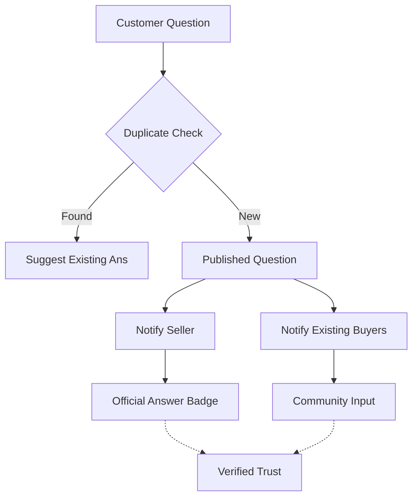

# TASK-00035: Trao đổi Kiến thức: Nền tảng Hỏi đáp Khách hàng (Knowledge Exchange: Customer Q&A Platform)

## 📋 Metadata

- **Task ID**: TASK-00035
- **Độ ưu tiên**: 🔵 TRUNG BÌNH (Growth & Support Reduction)
- **Phụ thuộc**: TASK-00021 (Product CRUD), TASK-00006 (User Entity)
- **Trạng thái**: ✅ Done

---

## 🎯 CHIẾN LƯỢC TRAO ĐỔI KIẾN THỨC (Knowledge Strategy)

### 💡 Tại sao Hệ thống Hỏi đáp quan trọng?
Một khách hàng có thắc mắc không được giải đáp là một khách hàng sắp rời bỏ giỏ hàng. Q&A không chỉ là công cụ hỗ trợ mà còn là kho kiến thức cộng đồng.
- **Trust through Transparency**: Công khai các thắc mắc và lời giải đáp giúp khách hàng tiềm năng tự tin hơn khi mua sắm.
- **Official & Community Synergy**: Kết hợp sức mạnh từ sự chuyên nghiệp của Người bán (Official Answers) và sự thực tế từ cộng đồng người dùng khác.
- **Smart Information Discovery**: Tự động gợi ý các câu hỏi tương tự để giải đáp tức thì, giảm tải cho đội ngũ hỗ trợ khách hàng.

---

## 🏗️ LUỒNG KIẾN THỨC (Knowledge Flow)

---

## 📄 QUY TẮC QUẢN TRỊ (Governance Rules)

### 1. Phân biệt Phản hồi (Answer Priority)
- Các phản hồi từ Người bán hoặc Quản trị viên phải được gắn nhãn **"Official Answer"** và luôn được ghim (Pin) lên vị trí đầu tiên.

### 2. Bình chọn Hữu ích (Quality Control)
- Cộng đồng có quyền bình chọn cho các câu trả lời chất lượng. Các câu trả lời có số lượng "Hữu ích" cao sẽ được ưu tiên hiển thị.

### 3. Chủ động Nhắc nhở (Proactive Engagement)
- Hệ thống tự động gửi thông báo cho Người bán nếu có câu hỏi chưa được trả lời sau 24-48 giờ.

---

## ✅ TIÊU CHUẨN THÀNH CÔNG (Definition of Success)

- [x] **Zero Silent Questions**: 100% câu hỏi hợp lệ nhận được phản hồi (từ cộng đồng hoặc người bán).
- [x] **Verified Badging**: Hiển thị rõ ràng ai là người trả lời (Admin, Seller, or Buyer).
- [x] **Reduced Support Tickets**: Tăng số lượng câu hỏi được giải quyết trực tiếp trên trang sản phẩm thay vì qua kênh Chat/Email.

---

## 🧪 TDD PLANNING (Knowledge Scenarios)

| Kịch bản | Mong đợi |
| :--- | :--- |
| **Duplicate Question** | Người dùng gõ câu hỏi trùng lặp -> Hệ thống gợi ý câu trả lời có sẵn trước khi Submit. |
| **Seller Response** | Người bán trả lời -> Question được cập nhật trạng thái `hasOfficialAnswer: true`. |
| **Email Notification** | Có câu trả lời mới -> Người đặt câu hỏi nhận được Email thông báo tức thì. |
