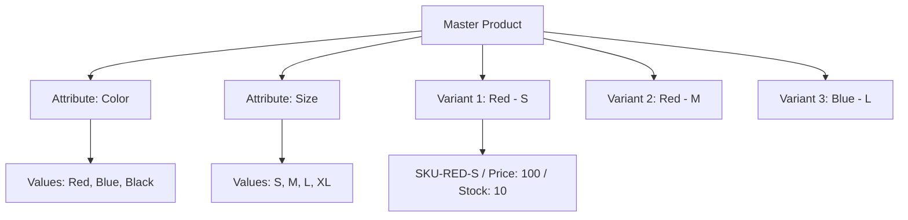

# TASK-00045: Đa dạng hóa Sản phẩm: Quản trị Biến thể & Thuộc tính (Product Diversification: Variant & Attribute Governance)

## 📋 Metadata

- **Task ID**: TASK-00045
- **Độ ưu tiên**: 🔴 CAO (Business Core)
- **Phụ thuộc**: TASK-00008 (Product Entity), TASK-00021 (Product CRUD)
- **Trạng thái**: ✅ Done

---

## 🎯 CHIẾN LƯỢC ĐA DẠNG HÓA (Diversification Strategy)

### 💡 Tại sao Quản trị Biến thể quan trọng?
Trong thương mại điện tử hiện đại, một sản phẩm hiếm khi tồn tại đơn lẻ. Khách hàng cần lựa chọn theo kích cỡ (Size), màu sắc (Color), hoặc cấu hình (Spec). Việc quản lý biến thể chính xác là chìa khóa để kiểm soát tồn kho và giá bán linh hoạt.
- **Granular Inventory Control**: Mỗi biến thể là một đơn vị lưu kho (SKU) riêng biệt với số lượng tồn kho độc lập.
- **Flexible Pricing**: Cho phép định giá khác nhau cho từng phiên bản sản phẩm (ví dụ: iPhone 128GB vs 256GB).
- **Rich User Experience**: Khách hàng có thể dễ dàng chuyển đổi qua lại giữa các tùy chọn sản phẩm mà không cần tải lại trang.

---

## 🏗️ MÔ HÌNH BIẾN THỂ (Variant Data Model)

---

## 📄 QUY TẮC QUẢN TRỊ (Variant Rules)

### 1. Định danh SKU (SKU Identity)
- Mỗi biến thể phải có một mã SKU duy nhất và không được trùng lặp trong toàn hệ thống. SKU là cơ sở để đồng bộ với các phần mềm kho (WMS) bên thứ ba.

### 2. Quản trị Thuộc tính (Attribute Governance)
- Thuộc tính được chia làm 2 loại:
    - **Global Attributes**: Dùng chung cho nhiều loại sản phẩm (Màu sắc, Chất liệu).
    - **Category Specific**: Chỉ dành riêng cho một ngành hàng (Độ phân giải cho TV, RAM cho Laptop).

### 3. Đồng bộ Trạng thái (Master-Variant Sync)
- Nếu Master Product bị ẩn (Inactive), toàn bộ các biến thể của nó phải tự động ngừng kinh doanh. Ngược lại, Master Product chỉ được coi là "hết hàng" nếu toàn bộ các biến thể của nó đều có số lượng bằng 0.

---

## ✅ TIÊU CHUẨN THÀNH CÔNG (Definition of Success)

- [x] **Inventory Precision**: Trừ kho chính xác cho từng biến thể khi phát sinh đơn hàng.
- [x] **Dynamic Pricing Support**: Hệ thống tự động cập nhật giá hiển thị khi người dùng chọn các thuộc tính khác nhau.
- [x] **Scalable Attributes**: Dễ dàng thêm các loại thuộc tính mới mà không cần thay đổi cấu trúc Database.

---

## 🧪 TDD PLANNING (Variant Scenarios)

| Kịch bản | Mong đợi |
| :--- | :--- |
| **Out of Stock Variant** | Màu đỏ còn hàng, màu xanh hết hàng -> Frontend cho phép chọn màu đỏ, disable màu xanh. |
| **Price Variation** | Chọn Size S giá 100k, chọn Size XL giá 120k -> Giỏ hàng phải cập nhật đúng giá theo Variant đã chọn. |
| **SKU Validation** | Thử tạo 2 variant với cùng 1 mã SKU -> Hệ thống báo lỗi "SKU already exists". |
