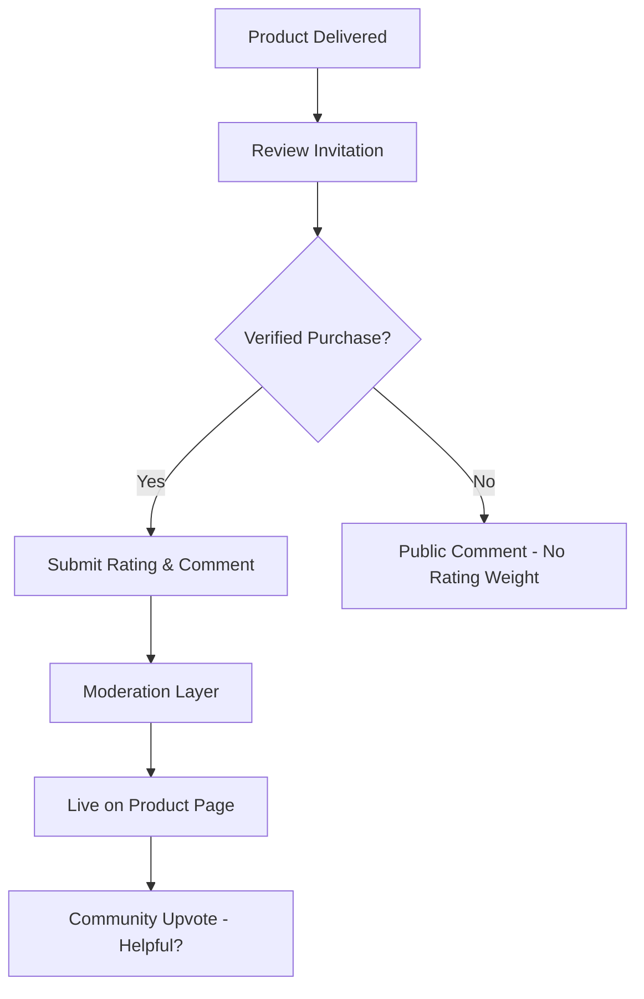

# TASK-00046: Minh chứng Cộng đồng: Quản trị Đánh giá & Xếp hạng (Community Proof: Reviews & Ratings Governance)

## 📋 Metadata

- **Task ID**: TASK-00046
- **Độ ưu tiên**: 🔴 CAO (Trust & Conversion)
- **Phụ thuộc**: TASK-00021 (Product CRUD), TASK-00027 (Order Management)
- **Trạng thái**: ✅ Done

---

## 🎯 CHIẾN LƯỢC XÂY DỰNG NIỀM TIN (Trust Strategy)

### 💡 Tại sao Đánh giá & Xếp hạng quan trọng?
Trong thương mại điện tử, niềm tin được xây dựng từ trải nghiệm của người dùng đi trước. 90% khách hàng đọc đánh giá trước khi mua hàng. Hệ thống đánh giá minh bạch là công cụ mạnh mẽ nhất để tăng tỷ lệ chuyển đổi.
- **Social Proof**: Khẳng định chất lượng sản phẩm qua lăng kính khách quan của cộng đồng.
- **Feedback Loop**: Cung cấp dữ liệu quý giá cho người bán để cải thiện chất lượng sản phẩm và dịch vụ.
- **Customer Engagement**: Tạo không gian trao đổi, giúp khách hàng cảm thấy mình là một phần của cộng đồng mua sắm.

---

## 🏗️ VÒNG ĐỜI PHẢN HỒI (Review Lifecycle)

---

## 📄 QUY TẮC QUẢN TRỊ (Review Rules)

### 1. Chính sách "Verified Purchase" (Mua hàng thực tế)
- Chỉ những khách hàng đã có đơn hàng ở trạng thái `DELIVERED` mới được phép để lại đánh giá có trọng số (Rating). Các đánh giá khác chỉ được coi là "Bình luận công khai".

### 2. Quản trị Nội dung (Moderation)
- Tự động lọc các từ ngữ vi phạm, spam, hoặc thông tin cá nhân. Admin có quyền ẩn các đánh giá không phù hợp hoặc mang tính chất phá hoại nhưng vẫn đảm bảo tính khách quan (không xóa các đánh giá thấp nhưng trung thực).

### 3. Trọng số Xếp hạng (Rating Weighting)
- Điểm trung bình sản phẩm (Average Rating) được tính toán theo thời gian thực hoặc định kỳ mỗi giờ, ưu tiên các đánh giá gần đây và các đánh giá được cộng đồng bình chọn là "Hữu ích" (Helpful).

---

## ✅ TIÊU CHUẨN THÀNH CÔNG (Definition of Success)

- [x] **Organic Trust**: Loại bỏ hoàn toàn tình trạng "đánh giá ảo" nhờ cơ chế Verified Purchase.
- [x] **High Transparency**: Hiển thị rõ ràng các tiêu chí đánh giá (Chất lượng, Giao hàng, Thái độ phục vụ).
- [x] **Conversion Impact**: Tăng tỷ lệ thêm vào giỏ đối với các sản phẩm có xếp hạng tốt (> 4 sao).

---

## 🧪 TDD PLANNING (Trust Scenarios)

| Kịch bản | Mong đợi |
| :--- | :--- |
| **Review without Purchase** | User chưa mua hàng thử gửi đánh giá -> Hệ thống báo lỗi "Purchase required to rate". |
| **Duplicate Review** | User cố gắng đánh giá 2 lần cho cùng 1 sản phẩm -> Hệ thống chặn và yêu cầu sửa đánh giá cũ. |
| **Helpful Vote** | Khách hàng khác nhấn "Hữu ích" -> `helpfulCount` tăng -> Đánh giá này được ưu tiên hiện lên đầu danh sách. |
