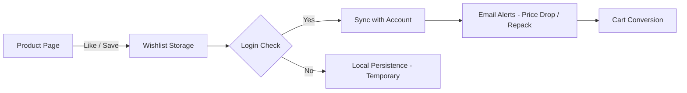

# TASK-00047: Điểm chạm Gắn kết: Quản trị Danh sách Yêu thích & Quan tâm (Engagement Hooks: Wishlist & Interest Management)

## 📋 Metadata

- **Task ID**: TASK-00047
- **Độ ưu tiên**: 🔵 TRUNG BÌNH (Retention & Conversion)
- **Phụ thuộc**: TASK-00016 (User CRUD), TASK-00021 (Product CRUD)
- **Trạng thái**: ✅ Done

---

## 🎯 CHIẾN LƯỢC GIỮ CHÂN KHÁCH HÀNG (Retention Strategy)

### 💡 Tại sao Danh sách Yêu thích quan trọng?
Khách hàng không phải lúc nào cũng sẵn sàng mua hàng ngay lập tức. Danh sách yêu thích (Wishlist) đóng vai trò là một "kho lưu trữ tạm thời" các ý định mua sắm, giúp người dùng dễ dàng quay lại và hoàn tất giao dịch sau này.
- **Conversion Funnel**: Là một bước đệm quan trọng chuyển đổi từ "người xem" (Browser) sang "người mua" (Buyer).
- **Personalized Insights**: Cung cấp dữ liệu về xu hướng quan tâm của người dùng, làm cơ sở cho các chiến dịch marketing mục tiêu.
- **Improved Experience**: Giúp khách hàng không bị mất dấu những sản phẩm họ tâm đắc trong hàng ngàn sản phẩm khác.

---

## 🏗️ LUỒNG TƯƠNG TÁC (Interaction Flow)

---

## 📄 QUY TẮC QUẢN TRỊ (Engagement Rules)

### 1. Quản trị Bền vững (Persistence)
- Danh sách yêu thích phải được duy trì vĩnh viễn (cho đến khi người dùng xóa) và được đồng bộ hóa trên mọi thiết bị khi người dùng đăng nhập.

### 2. Tương tác Chéo (Cross-feature Synergy)
- Khi một sản phẩm trong danh sách yêu thích có sự thay đổi lớn (Giảm giá mạnh, Sắp hết hàng, Có mẫu mới), hệ thống sẽ kích hoạt các thông báo gợi nhắc (Reminder) để thúc đẩy hành vi mua hàng.

### 3. Ưu tiên Trải nghiệm (UI/UX Rules)
- Thao tác Thêm/Xóa khỏi danh sách yêu thích phải diễn ra mượt mà (Optimistic UI) mà không cần tải lại trang.

---

## ✅ TIÊU CHUẨN THÀNH CÔNG (Definition of Success)

- [x] **User Interest Tracking**: Hệ thống ghi nhận chính xác danh sách các sản phẩm đang được khách hàng "săn đón".
- [x] **Seamless Sync**: Người dùng có thể xem danh sách yêu thích thống nhất trên cả Web và Mobile.
- [x] **Notification Trigger**: Tăng tỷ lệ mở ứng dụng thông qua các thông báo liên quan đến sản phẩm yêu thích.

---

## 🧪 TDD PLANNING (Engagement Scenarios)

| Kịch bản | Mong đợi |
| :--- | :--- |
| **Add to Wishlist** | Nhấn icon trái tim -> Sản phẩm xuất hiện trong Wishlist -> Icon chuyển sang trạng thái "Đã thích". |
| **Move to Cart** | User quyết định mua -> Tính năng "Chuyển vào giỏ hàng" -> Sản phẩm được thêm vào giỏ và xóa khỏi Wishlist (tùy cấu hình). |
| **Price Alert Trigger** | Sản phẩm yêu thích giảm giá 20% -> Hệ thống tự động đẩy thông báo cho User. |
