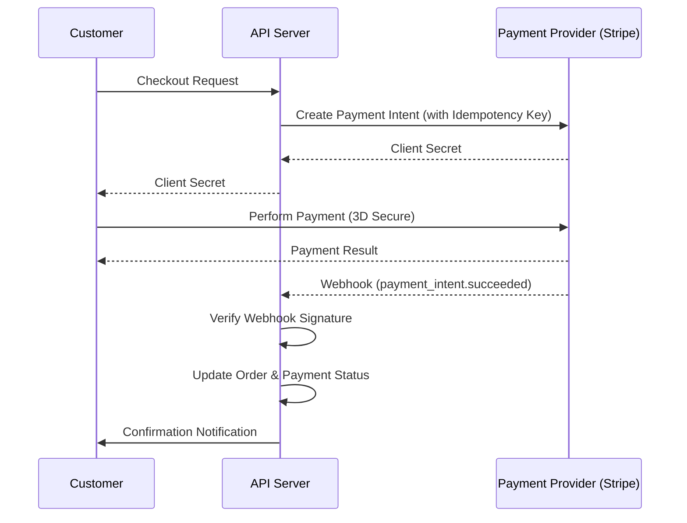

# TASK-00048: Chính trực Tài chính: Cổng Thanh toán Nâng cao (Financial Integrity: Advanced Payment Gateway)

## 📋 Metadata

- **Task ID**: TASK-00048
- **Độ ưu tiên**: 🔴 KHẨN CẤP (Financial Integrity)
- **Phụ thuộc**: TASK-00026 (Order Creation)
- **Trạng thái**: ✅ Done

---

## 🎯 CHIẾN LƯỢC XỬ LÝ THANH TOÁN (Payment Strategy)

### 💡 Tại sao Cổng thanh toán nâng cao quan trọng?
Thanh toán là điểm cuối cùng và quan trọng nhất trong hành trình mua hàng. Một hệ thống thanh toán kém tin cậy không chỉ gây mất doanh thu mà còn hủy hoại uy tín của thương hiệu. Chúng ta cần một giải pháp vừa bảo mật tuyệt đối, vừa có khả năng xử lý các kịch bản lỗi phức tạp một cách tự động.
- **Security First**: Tuân thủ tiêu chuẩn PCI DSS, tuyệt đối không lưu trữ dữ liệu thẻ nhạy cảm.
- **Atomic Reliability**: Đảm bảo tính nhất quán giữa trạng thái thanh toán và trạng thái đơn hàng (Không có chuyện khách đã trả tiền mà đơn hàng vẫn ở trạng thái "Chờ thanh toán").
- **Error Resilience**: Tự động xử lý các tình huống mạng chập chờn hoặc Webhook đến chậm/sai thứ tự.

---

## 🏗️ LUỒNG THANH TOÁN & WEBHOOK (Payment & Webhook Flow)

---

## 📄 QUY TẮC QUẢN TRỊ (Financial Rules)

### 1. Chính sách Bất biến & Chống trùng lắp (Idempotency)
- Mọi yêu cầu thanh toán phải đính kèm một `Idempotency-Key` duy nhất. Điều này ngăn chặn việc khách hàng bị trừ tiền 2 lần nếu họ vô tình nhấn nút "Thanh toán" nhiều lần hoặc do lỗi mạng.

### 2. Bảo mật Webhook (Webhook Security)
- Hệ thống **tuyệt đối không tin tưởng** vào dữ liệu gửi đến endpoint Webhook trừ khi chữ ký (Signature) của nó được xác thực thành công bằng Secret Key từ nhà cung cấp.

### 3. Đối soát & Hoàn tiền (Reconciliation & Refunds)
- Hệ thống hỗ trợ hoàn tiền toàn phần hoặc một phần (Partial Refund) gắn liền với lý do cụ thể. Mọi giao dịch hoàn tiền phải được ghi log chi tiết và tự động cập nhật lại kho hàng nếu cần thiết.

---

## ✅ TIÊU CHUẨN THÀNH CÔNG (Definition of Success)

- [x] **PCI Compliance**: Dữ liệu thẻ được xử lý qua iFrame/SDK của nhà cung cấp, Server không "chạm" vào thông tin nhạy cảm.
- [x] **Atomic Transactions**: Một giao dịch thành công đồng nghĩa với việc Đơn hàng, Kho hàng và Ví điểm (nếu có) được cập nhật đồng bộ.
- [x] **Zero-Drop Webhooks**: Hệ thống có khả năng xử lý lại các Webhook bị lỗi (Retry logic) để đảm bảo không bỏ sót giao dịch nào.

---

## 🧪 TDD PLANNING (Financial Scenarios)

| Kịch bản | Mong đợi |
| :--- | :--- |
| **Successful Payment** | Webhook trả về `succeeded` -> Trạng thái đơn hàng chuyển sang `PAID` -> Gửi email xác nhận. |
| **Tampered Webhook** | Hacker giả mạo Webhook gửi đến -> Xác thực chữ ký thất bại -> Hệ thống từ chối và ghi log cảnh báo. |
| **Network Timeout** | Trình duyệt đóng trước khi nhận kết quả -> Webhook vẫn chạy ngầm -> Khi khách quay lại, đơn hàng đã được cập nhật thành công. |
