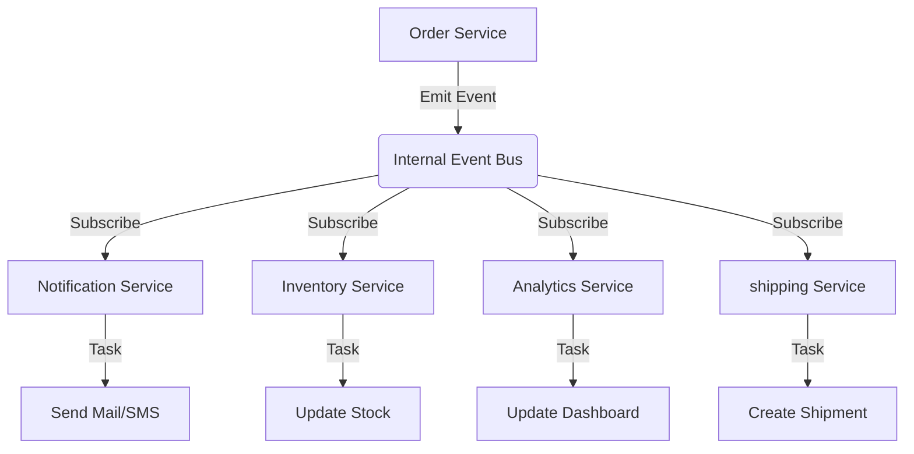

# TASK-00049: Điều phối Bất đồng bộ: Vòng đời Đơn hàng & Sự kiện (Asynchronous Coordination: Order Lifecycle & Event Orchestration)

## 📋 Metadata

- **Task ID**: TASK-00049
- **Độ ưu tiên**: 🔴 CAO (Architecture & Scalability)
- **Phụ thuộc**: TASK-00026 (Order Creation), TASK-00048 (Payments)
- **Trạng thái**: ✅ Done

---

## 🎯 CHIẾN LƯỢC SỰ KIỆN (Event-Driven Strategy)

### 💡 Tại sao Điều phối bằng Sự kiện quan trọng?
Một đơn hàng từ lúc được tạo đến khi giao thành công phải trải qua rất nhiều bước: Thanh toán, Trừ kho, Email thông báo, Điều phối vận chuyển. Nếu gộp tất cả code này vào 1 hàm duy nhất, hệ thống sẽ trở nên chậm chạp và cực kỳ khó bảo trì. Kiến trúc hướng sự kiện (Event-Driven) giúp tách biệt các trách nhiệm này.
- **Decoupling**: Module Order không cần biết module Email hay module Logistics làm gì. Nó chỉ cần "phát loa" thông báo sự kiện.
- **System Scalability**: Dễ dàng thêm các tính năng mới (ví dụ: Tặng điểm thưởng khi mua hàng) mà không cần sửa code cũ của module Order.
- **Reliability**: Các tác vụ nặng (như gửi email) được xử lý bất đồng bộ, giúp API phản hồi khách hàng nhanh nhất có thể.

---

## 🏗️ LUỒNG ĐIỀU PHỐI SỰ KIỆN (Event Delivery Flow)

---

## 📄 QUY TẮC QUẢN TRỊ (Event Rules)

### 1. Tính Toàn vẹn (Event Integrity)
- Sự kiện chỉ được phép phát đi (Emit) sau khi dữ liệu gốc đã được lưu thành công vào Database (Atomicity).

### 2. Xử lý "At-least-once" (Idempotent Listeners)
- Các lớp lắng nghe (Listeners) phải được thiết kế để có thể xử lý cùng một sự kiện nhiều lần mà không gây sai lệch dữ liệu (ví dụ: Tránh việc gửi 2 email cho cùng 1 đơn hàng).

### 3. Ưu tiên Bất đồng bộ (Async First)
- Mọi tác vụ không trực tiếp ảnh hưởng đến phản hồi của khách hàng (như Logging, Marketing tracking, Notification) phải được đưa vào hàng đợi xử lý ngầm (Background Jobs).

---

## ✅ TIÊU CHUẨN THÀNH CÔNG (Definition of Success)

- [x] **Fast Response Time**: API đặt hàng phản hồi trong < 200ms vì không phải đợi gửi email hay xử lý kho.
- [x] **Modular Extensibility**: Thêm listener mới cho sự kiện `Order.Paid` không làm thay đổi 1 dòng code nào trong `OrdersService`.
- [x] **Visibility**: Dễ dàng theo dõi vết của một đơn hàng qua dòng thời gian sự kiện (Event Timeline).

---

## 🧪 TDD PLANNING (Event Scenarios)

| Kịch bản | Mong đợi |
| :--- | :--- |
| **Order Paid** | Phát sự kiện `order.paid` -> Email nhận được trong 3s -> Kho hàng giảm tương ứng -> Hệ thống vận chuyển nhận lệnh. |
| **Listener Fail** | Listener Email bị lỗi -> Các listener khác (Kho, Vận chuyển) vẫn hoạt động bình thường (Isolating failures). |
| **Retry Logic** | Một Listener quan trọng bị tạm dừng -> Khi hoạt động lại, nó xử lý nốt các sự kiện còn tồn đọng trong queue. |
