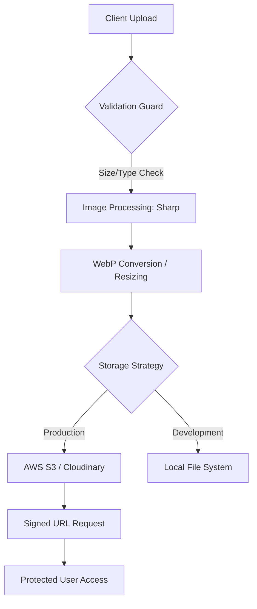

# TASK-00056: Hạ tầng Nội dung: Quản trị Tài sản & Lưu trữ Đám mây (Content Infrastructure: Asset Management & Cloud Storage)

## 📋 Metadata

- **Task ID**: TASK-00056
- **Độ ưu tiên**: 🔴 CAO (Infrastructure)
- **Phụ thuộc**: TASK-00021 (Product CRUD)
- **Trạng thái**: ✅ Done

---

## 🎯 CHIẾN LƯỢC QUẢN TRỊ TÀI SẢN (Asset Strategy)

### 💡 Tại sao Quản lý tệp tin quan trọng?
Một website thương mại điện tử chứa hàng ngàn hình ảnh sản phẩm chất lượng cao. Việc lưu trữ trực tiếp trên server ứng dụng sẽ nhanh chóng làm đầy bộ nhớ và làm chậm hệ thống. Một hạ tầng quản lý tệp tin chuyên nghiệp giúp đảm bảo tốc độ tải trang nhanh nhất và bảo mật tuyệt đối cho dữ liệu người dùng.
- **Offload Processing**: Đẩy việc lưu trữ và xử lý hình ảnh sang các dịch vụ chuyên dụng (Storage Cloud), giúp Server tập trung vào logic nghiệp vụ.
- **Global Delivery**: Kết hợp với CDN để khách hàng ở bất cứ đâu cũng có thể xem hình ảnh sản phẩm với tốc độ cao nhất (Low Latency).
- **Security & Integrity**: Kiểm soát chặt chẽ loại tệp tin và dung lượng để ngăn chặn việc tải lên các mã độc (Shell/Malware).

---

## 🏗️ LUỒNG XỬ LÝ TÀI SẢN (Asset Pipeline Flow)

---

## 📄 QUY TẮC QUẢN TRỊ (Asset Rules)

### 1. Chính sách Lưu trữ (Storage Policy)
- Toàn bộ tài sản môi trường Production phải được lưu trữ trên Cloud Storage. File Key (định danh) được lưu trong Database, tuyệt đối không lưu đường dẫn tuyệt đối (Absolute URL) để linh hoạt khi đổi tên miền hoặc nhà cung cấp.

### 2. Tiêu chuẩn Tối ưu hóa (Optimization Standard)
- Hình ảnh tải lên phải được tự động chuyển đổi sang định dạng **WebP** để giảm dung lượng (nhưng vẫn giữ chất lượng). Hệ thống tự động tạo 3 kích thước: `Thumbnail`, `Medium`, và `Large` để phục vụ các mục đích hiển thị khác nhau.

### 3. Rào chắn Bảo mật (Security Guardrails)
- **Whitelisting**: Chỉ cho phép các MIME types an toàn (`image/jpeg`, `image/png`, `image/webp`).
- **Size Limit**: Giới hạn 5MB cho hình ảnh sản phẩm và 1MB cho ảnh đại diện người dùng.
- **Anti-Sniffing**: Đổi tên tệp tin sang định dạng UUID ngẫu nhiên để tránh việc kẻ xấu đoán tên tệp tin để khai thác thông tin.

---

## ✅ TIÊU CHUẨN THÀNH CÔNG (Definition of Success)

- [x] **Blazing Fast Load**: Hình ảnh được tối ưu hóa giúp điểm Google PageSpeed đạt mức xanh (> 90).
- [x] **Infrastructure Independence**: Có thể chuyển đổi từ nhà cung cấp Cloud này sang Cloud khác chỉ bằng cách thay đổi cấu hình (Adapter Pattern).
- [x] **Safe Uploads**: Không có tệp tin thực thi (Binary/Script) nào có thể lọt qua lớp kiểm tra bảo mật.

---

## 🧪 TDD PLANNING (Asset Scenarios)

| Kịch bản | Mong đợi |
| :--- | :--- |
| **High-Res Upload** | Upload ảnh 4K -> Hệ thống tự động resize về Full HD và nén sang WebP -> Dung lượng giảm 80%. |
| **Invalid Type** | Cố tình upload file `.exe` hoặc `.php` -> Hệ thống từ chối ngay lập tức với lỗi 400. |
| **Signed Access** | Request ảnh Profile của người dùng khác -> Hệ thống yêu cầu Signed URL hoặc chặn truy cập trực tiếp. |
