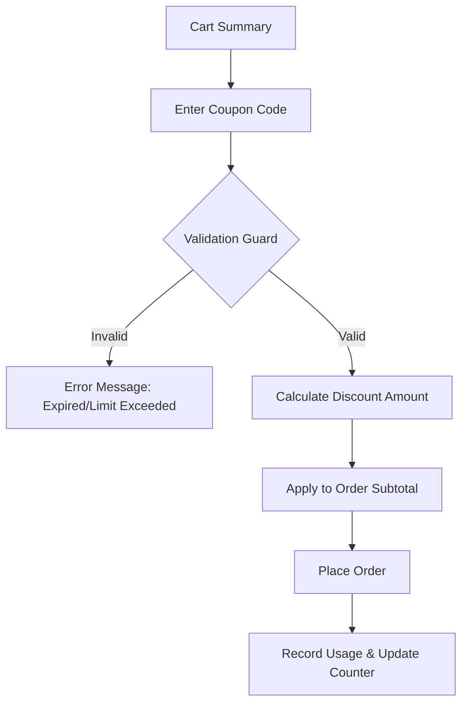

# TASK-00057: Động lực Tăng trưởng: Quản trị Giảm giá & Mã khuyến mãi (Growth Engine: Discount & Coupon Governance)

## 📋 Metadata

- **Task ID**: TASK-00057
- **Độ ưu tiên**: 🔴 CAO (Marketing & Sales)
- **Phụ thuộc**: TASK-00025 (Cart Calculations), TASK-00026 (Order Creation)
- **Trạng thái**: ✅ Done

---

## 🎯 CHIẾN LƯỢC KHUYẾN MÃI (Promotion Strategy)

### 💡 Tại sao Hệ thống Mã giảm giá quan trọng?
Trong thế giới thương mại điện tử cạnh tranh, các chương trình khuyến mãi là công cụ then chốt để thu hút khách hàng mới và tri ân khách hàng cũ. Một hệ thống mã giảm giá (Coupon) linh hoạt cho phép bộ phận Marketing triển khai các chiến dịch đa dạng mà không cần thay đổi mã nguồn hệ thống.
- **Conversion Booster**: Thúc đẩy khách hàng hoàn tất giỏ hàng thông qua các ưu đãi về giá.
- **Customer Segmentation**: Thiết lập các chương trình dành riêng cho từng nhóm đối tượng (Ví dụ: Khách hàng mới, Khách VIP).
- **Financial Control**: Kiểm soát chặt chẽ ngân sách khuyến mãi thông qua các điều kiện giới hạn sử dụng.

---

## 🏗️ LUỒNG ÁP DỤNG KHUYẾN MÃI (Promotion Application Flow)

---

## 📄 QUY TẮC QUẢN TRỊ (Promotion Rules)

### 1. Phân loại Khuyến mãi (Coupon Types)
- **Percentage Discount**: Giảm theo % (Ví dụ: Giảm 10% tối đa 50k).
- **Fixed Amount**: Giảm số tiền cụ thể (Ví dụ: Giảm ngay 100k cho đơn từ 1 triệu).
- **Flat Discount**: Giảm đồng giá hoặc miễn phí vận chuyển.

### 2. Ràng buộc Hợp lệ (Validity Constraints)
- **Minimum Order Value (MOV)**: Chỉ áp dụng khi đơn hàng đạt giá trị tối thiểu.
- **Usage Limits**: Giới hạn tổng số lần sử dụng của cả hệ thống và giới hạn số lần sử dụng của mỗi cá nhân (ví dụ: Mỗi người chỉ được dùng 1 lần).
- **Temporal Rules**: Ngày bắt đầu và ngày kết thúc hiệu lực của mã.

### 3. Tính Chính xác Tài chính (Financial Integrity)
- Số tiền giảm giá phải được tính toán lại ở lớp Server ngay trước khi thanh toán để tránh việc người dùng gian lận bằng cách chỉnh sửa dữ liệu ở phía trình duyệt (Client-side).

---

## ✅ TIÊU CHUẨN THÀNH CÔNG (Definition of Success)

- [x] **Flexible Campaigns**: Admin có thể tạo mã mới (ví dụ: `SUMMER2024`) chỉ trong 30 giây qua Dashboard.
- [x] **Zero Over-usage**: Không bao giờ có chuyện một mã bị sử dụng vượt quá ngân sách đã thiết lập.
- [x] **Transparent UX**: Khách hàng thấy rõ số tiền được giảm và lý do nếu mã không áp dụng được (ví dụ: "Đơn hàng chưa đủ 200k").

---

## 🧪 TDD PLANNING (Promotion Scenarios)

| Kịch bản | Mong đợi |
| :--- | :--- |
| **Apply Valid Code** | Nhập `WELCOME10` -> Giảm 10% -> Tổng tiền cập nhật chính xác. |
| **Under MOV** | Mã yêu cầu đơn 500k, đơn hiện tại 400k -> Hệ thống báo "Chưa đủ giá trị tối thiểu". |
| **Exploit Prevention** | User đã dùng mã 1 lần, cố gắng dùng lại -> Hệ thống báo "Bạn đã sử dụng mã này rồi". |
