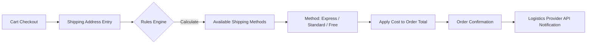

# TASK-00058: Hạ tầng Logistics: Đa phương thức Vận chuyển & Hoàn tất (Logistics Infrastructure: Multiple Shipping & Fulfillment)

## 📋 Metadata

- **Task ID**: TASK-00058
- **Độ ưu tiên**: 🔵 TRUNG BÌNH (Logistics & UX)
- **Phụ thuộc**: TASK-00026 (Order Creation)
- **Trạng thái**: ✅ Done

---

## 🎯 CHIẾN LƯỢC VẬN CHUYỂN (Shipping Strategy)

### 💡 Tại sao Đa phương thức vận chuyển quan trọng?
Tốc độ giao hàng và chi phí vận chuyển là những yếu tố quyết định hành vi mua hàng của khách hàng. Một hệ thống logistics linh hoạt cho phép khách hàng lựa chọn giữa việc tiết kiệm chi phí hoặc nhận hàng nhanh chóng (Express), từ đó tăng tỷ lệ hài lòng và hoàn tất đơn hàng.
- **Customized Options**: Cung cấp nhiều lựa chọn (Giao hàng tiêu chuẩn, Giao hàng hỏa tốc, Nhận tại cửa hàng).
- **Cost Transparency**: Tự động tính toán phí vận chuyển dựa trên khoảng cách, trọng lượng và giá trị đơn hàng.
- **Delivery Commitment**: Đưa ra ngày dự kiến giao hàng chính xác để xây dựng niềm tin với người tiêu dùng.

---

## 🏗️ LUỒNG TỔ CHỨC VẬN CHUYỂN (Shipping Logistics Flow)

---

## 📄 QUY TẮC QUẢN TRỊ (Logistics Rules)

### 1. Phân loại Phương thức (Shipping Tiers)
- **Standard**: Giá rẻ, thời gian 3-5 ngày.
- **Express**: Giá cao, giao trong 24h.
- **Free Shipping**: Miễn phí cho đơn hàng đạt ngưỡng (Threshold) nhất định (ví dụ: Đơn trên 2 triệu).

### 2. Định giá Vận chuyển (Pricing Governance)
- Phí vận chuyển được cấu hình linh hoạt:
    - **Flat Rate**: Phí cố định cho mọi đơn hàng.
    - **Weight/Dimension Based**: Tính dựa trên khối lượng cồng kềnh của sản phẩm.
    - **Zone Based**: Tính theo khoảng cách địa lý (Nội thành, Ngoại tỉnh, Quốc tế).

### 3. Ưu tiên Tự động hóa (Automation)
- Hệ thống hỗ trợ tích hợp với các đơn vị vận chuyển bên thứ ba thông qua API để tự động lấy mã vận đơn (Tracking Code) và theo dõi trạng thái đơn hàng (Tracking) theo thời gian thực.

---

## ✅ TIÊU CHUẨN THÀNH CÔNG (Definition of Success)

- [x] **Dynamic Calculation**: Phí vận chuyển được cập nhật ngay lập tức khi người dùng thay đổi địa chỉ hoặc phương thức giao hàng.
- [x] **Threshold Incentives**: Tăng giá trị trung bình đơn hàng (AOV) thông qua các chương trình Freeship cho đơn hàng lớn.
- [x] **Logistics Visibility**: Khách hàng có thể theo dõi hành trình đơn hàng trực tiếp trên hệ thống mà không cần sang website của đơn vị vận chuyển.

---

## 🧪 TDD PLANNING (Logistics Scenarios)

| Kịch bản | Mong đợi |
| :--- | :--- |
| **Apply Free Shipping** | Đơn hàng 2.5 triệu (Ngưỡng 2 triệu) -> Phí vận chuyển tự động chuyển về 0đ. |
| **Express Selection** | Chọn giao hỏa tốc -> Phí tăng thêm 50k -> Ngày dự kiến giao hàng chuyển về "Hôm nay/Ngày mai". |
| **Zone Validation** | Địa chỉ giao hàng ở vùng xa -> Hệ thống tự động ẩn phương thức "Giao hàng 2h" và chỉ hiện "Giao hàng tiêu chuẩn". |
