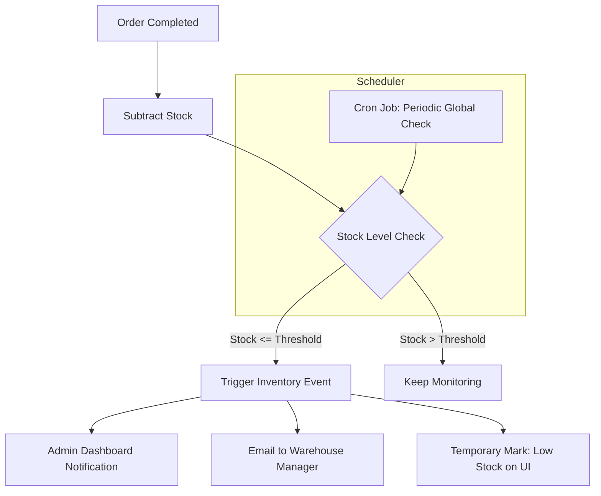

# TASK-00059: Giám sát Chủ động: Cảnh báo Kho hàng & Duy trì Vận hành (Proactive Monitoring: Inventory Alerts & Business Continuity)

## 📋 Metadata

- **Task ID**: TASK-00059
- **Độ ưu tiên**: 🔴 CAO (Operations)
- **Phụ thuộc**: TASK-00023 (Stock Management)
- **Trạng thái**: ✅ Done

---

## 🎯 CHIẾN LƯỢC QUẢN TRỊ KHO (Inventory Monitoring Strategy)

### 💡 Tại sao Cảnh báo kho hàng quan trọng?
Hết hàng (Out of stock) là kẻ thù của doanh số và uy tín thương hiệu. Một hệ thống cảnh báo chủ động giúp bộ phận vận hành luôn nắm bắt được trạng thái kho hàng, từ đó kịp thời bổ sung hàng hóa (Restocking) trước khi khách hàng gặp phải thông báo lỗi "Hết hàng" trên website.
- **Lost Sales Prevention**: Giảm thiểu rủi ro mất doanh thu do không có sẵn hàng để bán.
- **Operational Efficiency**: Tự động hóa việc theo dõi kho hàng thay vì kiểm tra thủ công nhàm chán và dễ sai sót.
- **Business Intelligence**: Thu thập dữ liệu về tốc độ bán (Velocity) của sản phẩm để có kế hoạch nhập hàng tối ưu.

---

## 🏗️ LUỒNG CẢNH BÁO TỰ ĐỘNG (Automated Alert Flow)

---

## 📄 QUY TẮC QUẢN TRỊ (Operational Rules)

### 1. Phân loại Mức độ Cảnh báo (Alert Levels)
- **THRESHOLD (Cảnh báo sớm)**: Số lượng hàng chạm mức tối thiểu cần nhập (ví dụ: Còn 10 sản phẩm).
- **CRITICAL (Sắp hết hàng)**: Số lượng hàng chỉ đủ bán trong vài giờ (ví dụ: Còn 2-3 sản phẩm).
- **OUT OF STOCK**: Hết hàng hoàn toàn, cần ẩn nút "Mua ngay" hoặc chuyển sang trạng thái "Đặt trước".

### 2. Định nghĩa Ngưỡng (Threshold Intelligence)
- Hệ thống cho phép thiết lập ngưỡng cảnh báo riêng cho từng sản phẩm:
    - **Sản phẩm bán chạy (Fast-moving)**: Ngưỡng cao (ví dụ: Cần cảnh báo khi còn 50 cái).
    - **Sản phẩm cao cấp (Luxury)**: Ngưỡng thấp (ví dụ: Cảnh báo khi còn 1 cái).

### 3. Đa kênh Thông báo (Omni-channel Alerting)
- Cảnh báo phải được gửi qua ít nhất 2 kênh:
    - **In-app Notification**: Hiển thị trên Dashboard của Admin.
    - **External Alert**: Qua Email hoặc Webhook (tới hệ thống của nhà cung cấp).

---

## ✅ TIÊU CHUẨN THÀNH CÔNG (Definition of Success)

- [x] **Zero Surprise**: Admin luôn biết trước khi một mã hàng sắp hết sạch.
- [x] **Automated Monitoring**: Hệ thống tự động quét và báo cáo trạng thái kho hàng định kỳ mà không cần can thiệp thủ công.
- [x] **Data-Driven Restocking**: Có báo cáo danh sách các mặt hàng cần nhập thêm để tối ưu hóa dòng tiền.

---

## 🧪 TDD PLANNING (Operational Scenarios)

| Kịch bản | Mong đợi |
| :--- | :--- |
| **Reach Low Stock** | User mua sản phẩm cuối cùng khiến kho còn 5 (ngưỡng 10) -> Email cảnh báo được gửi ngay lập tức. |
| **Periodic Recovery** | Cron job chạy lúc 2h sáng -> Phát hiện sản phẩm bị lỗi tồn kho -> Gửi báo cáo tổng hợp lỗi cho Admin. |
| **Threshold Update** | Admin đổi ngưỡng từ 10 thành 20 -> Hệ thống kiểm tra ngay và phát hiện kho hiện tại 15 -> Bắn cảnh báo tức thì. |
