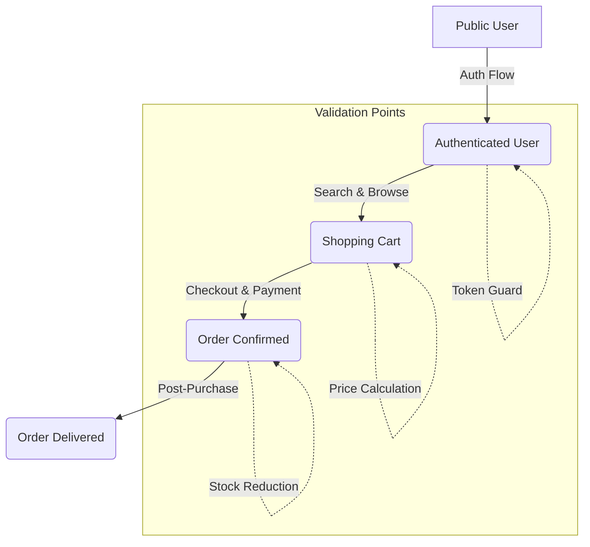

# TASK-00034: Xác thực Hệ thống: Hành trình Người dùng Cuối (System Validation: End-to-End Consumer Journeys)

## 📋 Metadata

- **Task ID**: TASK-00034 (E2E)
- **Độ ưu tiên**: 🔴 CHÍ TRỌNG (System Reliability)
- **Phụ thuộc**: TASK-00033 (Unit Tests), Core Features (Batch 1-4)
- **Trạng thái**: ✅ Done

---

## 🎯 CHIẾN LƯỢC XÁC THỰC TOÀN DIỆN (E2E Strategy)

### 💡 Tại sao Xác thực Hệ thống quan trọng?
Nếu Unit Test kiểm tra từng linh kiện, thì E2E Test kiểm tra xem toàn bộ cỗ máy có chạy mượt mà hay không.
- **Holistic Workflow Validation**: Kiểm tra các luồng đi xuyên suốt nhiều module (Ví dụ: Từ Đăng ký -> Tìm sản phẩm -> Thêm giỏ hàng -> Đặt hàng).
- **Integrated Data Integrity**: Đảm bảo dữ liệu được lưu đúng vào Database thực tế và các hiệu ứng phụ (Side-effects) như trừ kho diễn ra chính xác.
- **Environment Mirroring**: Chạy test trong môi trường gần giống với Production nhất để phát hiện các lỗi cấu hình.

---

## 🏗️ PHẠM VI KIỂM THỬ E2E (E2E Test Scope)

---

## 📄 QUY TẮC VẬN HÀNH (Operational Rules)

### 1. Quản trị Dữ liệu Test (Sandbox Governance)
- Phải sử dụng một cơ sở dữ liệu biệt lập (Test Database) để tránh làm bẩn dữ liệu thật.
- **Motto**: "Dọn dẹp sau khi dùng" - Mỗi bài test phải tự xóa hoặc Reset dữ liệu nó đã tạo ra.

### 2. Kịch bản Trọng tâm (Critical Paths)
Hệ thống ưu tiên tự động hóa các hành trình "kiếm tiền" (Happy Paths):
- Luồng Đăng nhập & Quản lý phiên.
- Luồng Mua hàng & Thanh toán.
- Luồng Quản trị (Admin) xử lý đơn hàng.

---

## ✅ TIÊU CHUẨN THÀNH CÔNG (Definition of Success)

- [x] **Full Coverage of Happy Paths**: 100% các luồng nghiệp vụ chính được bao phủ bởi mã kiểm thử tự động.
- [x] **Database Isolation**: Bài test chạy không gây ra bất kỳ tác động nào đến dữ liệu Production.
- [x] **Reliable Assertions**: Các khẳng định (Assertions) phải dựa trên kết quả cuối cùng trong DB thay vì chỉ dựa trên HTTP Response.

---

## 🧪 TDD PLANNING (E2E Scenarios)

| Hành trình (Journey) | Điểm kiểm soát quan trọng |
| :--- | :--- |
| **New Buyer Journey** | Đăng ký -> Login -> Mua món hàng đầu tiên -> Kiểm tra Order Status là `PENDING`. |
| **Stock Out Journey** | Mua sản phẩm cuối cùng -> Thử mua lại lần nữa -> Hệ thống phải chặn ngay tại API Checkout. |
| **Admin Fulfillment** | Admin login -> Xem danh sách đơn mới -> Chuyển trạng thái sang `SHIPPED` -> Kiểm tra Log. |
