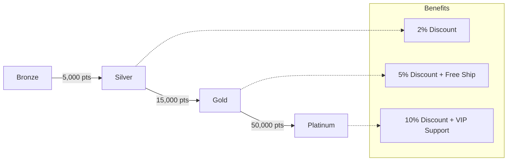

# TASK-00036: Hệ thống Khách hàng Thân thiết: Tích điểm & Hạng thành viên (Loyalty Engine: Reward Points & Membership Tiers)

## 📋 Metadata

- **Task ID**: TASK-00036
- **Độ ưu tiên**: 🔵 TRUNG BÌNH (Retention & Growth)
- **Phụ thuộc**: TASK-00027 (Order Management), TASK-00006 (User Entity)
- **Trạng thái**: ✅ Done

---

## 🎯 CHIẾN LƯỢC GIỮ CHÂN KHÁCH HÀNG (Retention Strategy)

### 💡 Tại sao Loyalty System quan trọng?
Chi phí để có được một khách hàng mới cao gấp 5-7 lần so với việc giữ chân một khách hàng cũ.
- **Repeat Purchase Incentive**: Biến mỗi giao dịch thành một phần thưởng cho giao dịch tiếp theo.
- **Tiered Benefits**: Tạo ra cảm giác đặc quyền và giá trị tăng dần thông qua các hạng thành viên (Bronze, Silver, Gold, Platinum).
- **Gamified Economy**: Xây dựng một hệ sinh thái điểm thưởng (Points Economy) minh bạch, dễ hiểu và dễ quy đổi.

---

## 🏗️ CƠ CHẾ NÂNG HẠNG (Membership Tiers)

---

## 📄 QUY TẮC QUẢN TRỊ (Loyalty Rules)

### 1. Thuật toán Tích điểm (Earning Logic)
- **Base Rate**: Mặc định $1 (hoặc tương đương) = 1 point.
- **Multipliers**: Tăng tốc tích điểm theo hạng thành viên (ví dụ: Silver x1.2, Gold x1.5, Platinum x2.0).
- **Trigger Events**: Tích điểm khi Hoàn thành đơn hàng, Viết đánh giá, hoặc Giới thiệu bạn bè.

### 2. Thuật toán Quy đổi (Spend Logic)
- **Redemption**: Điểm có thể được sử dụng để giảm trừ trực tiếp vào tổng tiền đơn hàng (ví dụ: 100 points = $1).
- **Limits**: Quy định mức điểm tối đa có thể quy đổi trên mỗi đơn hàng để bảo vệ biên lợi nhuận.

### 3. Vòng đời Điểm (Expiration)
- Điểm thưởng có thời hạn sử dụng (mặc định 12 tháng) để khuyến khích khách hàng quay lại mua sắm thường xuyên.

---

## ✅ TIÊU CHUẨN THÀNH CÔNG (Definition of Success)

- [x] **Tier Integrity**: Tự động nâng/hạ cấp thành viên dựa trên số điểm tích lũy trong kỳ.
- [x] **Transparent Ledger**: Khách hàng có thể xem lịch sử biến động điểm (Earned/Spent) chi tiết.
- [x] **Economic Balance**: Hệ thống quy đổi cân bằng giữa giá trị phần thưởng và lợi nhuận kinh doanh.

---

## 🧪 TDD PLANNING (Retention Scenarios)

| Kịch bản | Mong đợi |
| :--- | :--- |
| **Order Completion** | Đơn hàng chuyển sang `DELIVERED` -> Điểm được cộng vào tài khoản kèm Multiplier theo hạng. |
| **Tier Upgrade** | Tổng điểm chạm mốc 5,000 -> Tự động nâng cấp lên Silver & gửi Email chúc mừng. |
| **Points Expiry** | Đến ngày hết hạn -> Điểm không sử dụng bị khấu trừ & ghi nhận giao dịch `EXPIRED`. |
