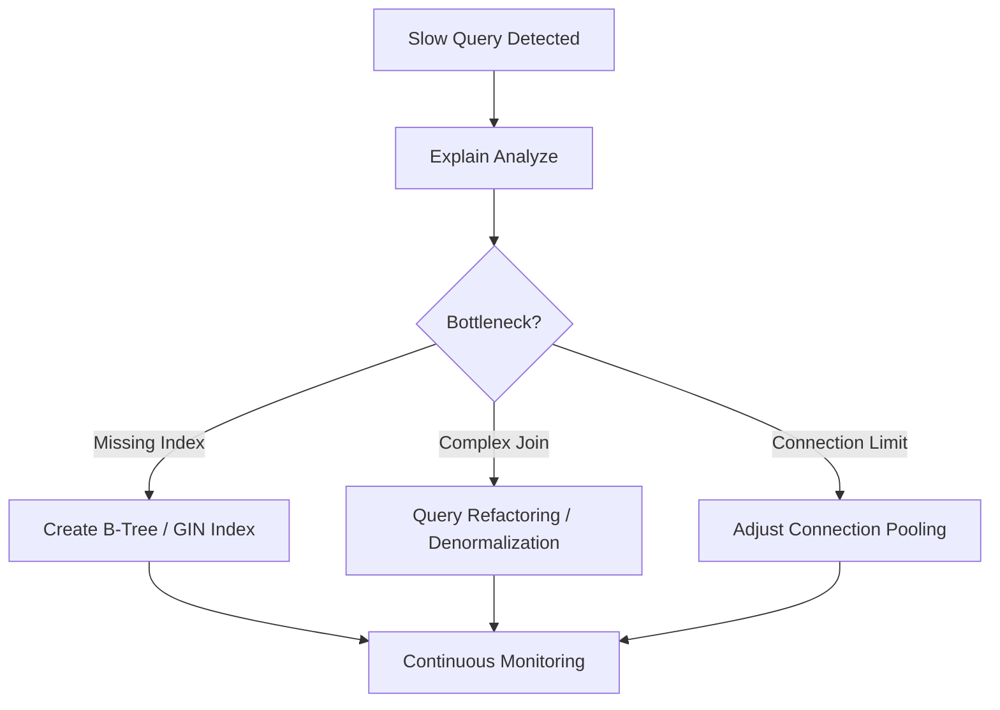

# TASK-00036: Hiệu năng Cơ sở Dữ liệu: Chiến lược Chỉ mục & Truy vấn (Database Performance: Indexing & Query Strategy)

## 📋 Metadata

- **Task ID**: TASK-00036 (Optimization)
- **Độ ưu tiên**: 🔴 CAO (System Efficiency)
- **Phụ thuộc**: TASK-00005 (Database Schema), TASK-00021 (Product CRUD)
- **Trạng thái**: ✅ Done

---

## 🎯 CHIẾN LƯỢC TỐI ƯU HIỆU NĂNG (Optimization Strategy)

### 💡 Tại sao Tối ưu Database quan trọng?
Cơ sở dữ liệu là trái tim của hệ thống. Khi dữ liệu phình to, nếu không có chiến lược tối ưu, hệ thống sẽ trở nên chậm chạp, gây treo ứng dụng và tốn kém tài nguyên hạ tầng.
- **Query Efficiency**: Giảm thời gian thực thi các truy vấn từ hàng giây xuống hàng mili giây.
- **Resource Conservation**: Tiết kiệm CPU/RAM của server Database bằng cách tránh các thao tác quét toàn bảng (Full Table Scan).
- **Proactive Scaling**: Chuẩn bị cho hệ thống sẵn sàng xử lý hàng triệu bản ghi mà không bị giảm hiệu năng.

---

## 🏗️ LỚP TỐI ƯU HÓA (Optimization Layer)

---

## 📄 QUY TẮC QUẢN TRỊ (Optimization Rules)

### 1. Chiến lược Chỉ mục (Indexing Policy)
- **Primary & Unique**: Mọi bảng phải có Primary Key (UUID) và các trường định danh duy nhất (Email, Slug, OrderNumber) phải có Unique Index.
- **Searchable Fields**: Các trường thường xuyên dùng để lọc (Filter) hoặc tìm kiếm (Search) như Name, CategoryId phải được đánh Index.
- **Composite Indexes**: Sử dụng chỉ mục tổ hợp cho các câu lệnh `WHERE` sử dụng đồng thời nhiều cột.

### 2. Quản trị Truy vấn (Query Governance)
- **Specific Selection**: Tuyệt đối không sử dụng `SELECT *`. Chỉ lấy các trường (columns) cần thiết cho nghiệp vụ.
- **Pagination enforcement**: Mọi API trả về danh sách lớn phải áp dụng phân trang (Offset hoặc Keyset pagination).

### 3. Quản trị Kết nối (Connection Management)
- Sử dụng **Connection Pooling** để tái sử dụng các kết nối, giảm tải overhead khi khởi tạo kết nối mới liên tục.

---

## ✅ TIÊU CHUẨN THÀNH CÔNG (Definition of Success)

- [x] **No Slow Queries**: Tuyệt đối không có truy vấn nào chạy quá 500ms trong điều kiện tải bình thường.
- [x] **Index Coverage**: 100% các cột tìm kiếm chính đều được bọc bởi Index phù hợp.
- [x] **Optimal Explain Plan**: Các câu lệnh phức tạp (Orders, Reports) phải có Explain Plan tối ưu (Sử dụng Index Scan thay vì Seq Scan).

---

## 🧪 TDD PLANNING (Optimization Scenarios)

| Kịch bản | Mong đợi |
| :--- | :--- |
| **Search by Product Slug** | Với 1 triệu bản ghi -> Tìm kiếm theo Slug trả về < 10ms nhờ Unique Index. |
| **Filter Orders by User** | Hệ thống sử dụng Index trên `userId` để trả về lịch sử đơn hàng mà không quét toàn bảng. |
| **Concurrent Connections** | 100 request đồng thời -> Connection pool xử lý mượt mà, không xảy ra lỗi "Too many connections". |
