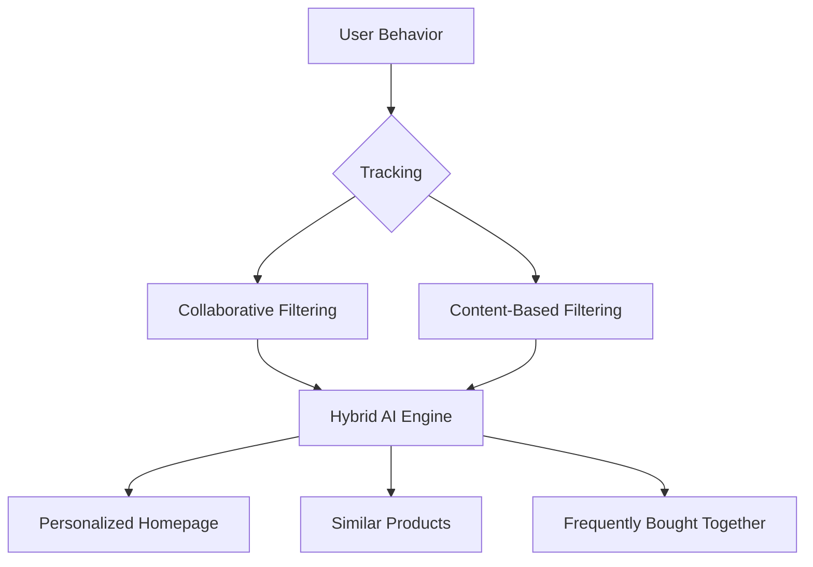

# TASK-00037: Động cơ Cá nhân hóa: Khám phá dựa trên AI (Personalization Engine: AI-Driven Discovery)

## 📋 Metadata

- **Task ID**: TASK-00037
- **Độ ưu tiên**: 🔴 CAO (Revenue Driver)
- **Phụ thuộc**: TASK-00021 (Product CRUD), TASK-00027 (Order Management)
- **Trạng thái**: ✅ Done

---

## 🎯 CHIẾN LƯỢC CÁ NHÂN HÓA (Personalization Strategy)

### 💡 Tại sao AI Recommendation quan trọng?
Trong thế giới bùng nổ thông tin, khách hàng không muốn "tìm kiếm", họ muốn "khám phá". Cá nhân hóa giúp tăng giá trị đơn hàng trung bình (AOV) và sự hài lòng của khách hàng.
- **Data-Driven Discovery**: Chuyển đổi từ hiển thị sản phẩm thụ động sang gợi ý chủ động dựa trên hành vi thực tế.
- **Cross-sell & Upsell Synergy**: Tự động nhận diện các sản phẩm thường được mua cùng nhau (Frequently Bought Together) để tối ưu doanh thu.
- **Real-time Relevancy**: Cập nhật danh sách gợi ý ngay lập tức dựa trên lịch sử xem hàng (Recently Viewed) và sở thích cá nhân.

---

## 🏗️ CƠ CHẾ GỢI Ý (Recommendation Flow)

---

## 📄 QUY TẮC QUẢN TRỊ (AI Ethics & Rules)

### 1. Thuật toán Lọc cộng tác (Collaborative Filtering)
- Ưu tiên gợi ý sản phẩm dựa trên hành vi của các khách hàng có hồ sơ tương đồng (Users who bought this also bought...).

### 2. Thuật toán Dựa trên nội dung (Content-Based)
- Gợi ý sản phẩm có cùng đặc tính kỹ thuật, màu sắc, hoặc phong cách với sản phẩm khách hàng đang xem.

### 3. Tối ưu hóa Chuyển đổi (Conversion Optimization)
- Tự động hạ thấp điểm ưu tiên của các sản phẩm hết hàng (Out of Stock) hoặc có đánh giá thấp (< 3 sao) trong danh sách gợi ý.

---

## ✅ TIÊU CHUẨN THÀNH CÔNG (Definition of Success)

- [x] **Discovery Breadth**: Khách hàng tiếp cận được nhiều sản phẩm mới mà họ thực sự quan tâm.
- [x] **Increased AOV**: Tăng tỷ lệ thêm vào giỏ hàng từ danh sách "Thường mua cùng nhau".
- [x] **Low Latency**: Các API gợi ý phải đáp ứng nhanh (< 200ms) để không ảnh hưởng đến trải nghiệm người dùng.

---

## 🧪 TDD PLANNING (AI Scenarios)

| Kịch bản | Mong đợi |
| :--- | :--- |
| **New User Experience** | Người dùng mới chưa có lịch sử -> Hiển thị "Sản phẩm Xu hướng" (Trending) hoặc "Bán chạy" (Best Sellers). |
| **Product Detail View** | Đang xem Điện thoại A -> Hiển thị Gợi ý: Phụ kiện (Ốp lưng, Sạc) và Điện thoại tương đương B. |
| **Abandoned Cart** | Quay lại trang chủ sau khi bỏ giỏ hàng -> Hiển thị "Có thể bạn vẫn quan tâm" với sản phẩm trong giỏ. |
