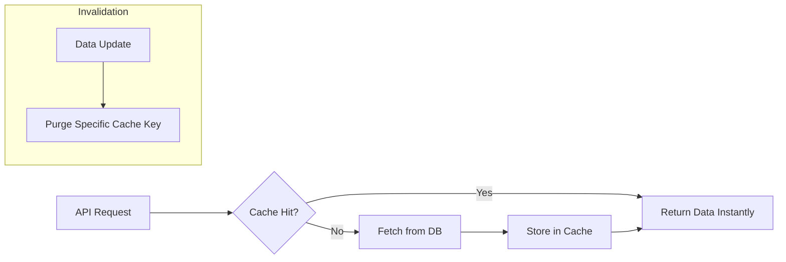

# TASK-00037: Tốc độ & Quy mô: Chiến lược Caching Dữ liệu Thông minh (Speed & Scale: Intelligent Data Caching Strategy)

## 📋 Metadata

- **Task ID**: TASK-00037 (Caching)
- **Độ ưu tiên**: 🔴 CAO (Latency & Performance)
- **Phụ thuộc**: TASK-00021 (Product CRUD), TASK-00020 (Category Tree)
- **Trạng thái**: ✅ Done

---

## 🎯 CHIẾN LƯỢC TỐI ƯU HIỆU NĂNG (Performance Strategy)

### 💡 Tại sao Caching quan trọng?
Trong thương mại điện tử, mỗi 100ms trễ (latency) có thể làm giảm 1% doanh thu. Caching giúp giảm tải cho Database và mang lại trải nghiệm mượt mà tức thì cho khách hàng.
- **Persistence & Resilience**: Giảm thiểu các truy vấn lặp đi lặp lại vào Database chính cho các dữ liệu ít thay đổi.
- **Latency Reduction**: Đưa dữ liệu đến gần người dùng hơn thông qua bộ nhớ đệm (In-memory cache).
- **Proactive Invalidation**: Cơ chế tự động làm mới bộ nhớ đệm để đảm bảo tính nhất quán của dữ liệu (Consistency).

---

## 🏗️ CƠ CHẾ CACHING (Caching Flow)

---

## 📄 QUY TẮC QUẢN TRỊ (Caching Rules)

### 1. Phân loại Dữ liệu (Tiered Caching)
- **Level 1 (Static)**: Danh mục sản phẩm (Category Tree), Cấu hình hệ thống. (TTL: 24h).
- **Level 2 (Dynamic)**: Sản phẩm nổi bật (Featured), Thông tin cơ bản người dùng. (TTL: 1h).
- **Level 3 (Real-time)**: Tồn kho (Stock - Cẩn trọng khi cache), Giá khuyến mãi. (TTL: 5-15 mins).

### 2. Chiến lược Thu hồi (Invalidation Strategy)
- Sử dụng **Cache Aside Pattern**: Khi dữ liệu bị thay đổi thông qua API (Update/Delete), hệ thống phải thực hiện lệnh `DEL` tương ứng trên cache ngay lập tức.

### 3. Phòng chống "Cache Stampede"
- Áp dụng cơ chế khóa (locking) hoặc giới hạn thời gian (jitter) để ngăn chặn hàng ngàn request cùng lúc đổ vào DB khi cache hết hạn.

---

## ✅ TIÊU CHUẨN THÀNH CÔNG (Definition of Success)

- [x] **Sub-100ms Responses**: Đảm bảo các API danh mục và sản phẩm tiêu biểu trả về cực nhanh.
- [x] **Database Offloading**: Giảm ít nhất 50% số lượng truy vấn lặp lại vào PostgreSQL cho các trang Dashboard/Trang chủ.
- [x] **Data Consistency**: Khách hàng không bao giờ thấy thông tin quá cũ sau khi Admin đã cập nhật.

---

## 🧪 TDD PLANNING (Performance Scenarios)

| Kịch bản | Mong đợi |
| :--- | :--- |
| **First Request** | Chưa có cache -> Lấy từ DB -> Lưu vào Cache -> Tổng thời gian ~300ms. |
| **Subsequent Request** | Có cache -> Trả về ngay lập tức từ RAM -> Tổng thời gian < 50ms. |
| **Data Update** | Admin cập nhật giá -> Cache bị xóa -> Lần truy cập tiếp theo sẽ lấy giá mới nhất từ DB. |
