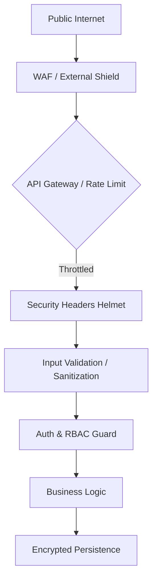

# TASK-00038: Gia cố Hệ thống: Bảo mật Đa lớp & Phòng thủ Chủ động (System Hardening: Multi-Layer Security & Defense)

## 📋 Metadata

- **Task ID**: TASK-00038
- **Độ ưu tiên**: 🔴 NGHIÊM TRỌNG (Governance & Safety)
- **Phụ thuộc**: TASK-00012 (JWT Auth), TASK-00029 (Error Handling)
- **Trạng thái**: ✅ Done

---

## 🎯 CHIẾN LƯỢC BẢO MẬT (Security Strategy)

### 💡 Tại sao Bảo mật Đa lớp quan trọng?
Trong thương mại điện tử, bảo mật không phải là một tính năng, mà là nền tảng của sự sống còn. Một lỗ hổng có thể dẫn đến mất dữ liệu khách hàng và hủy hoại uy tín thương hiệu.
- **Defense in Depth**: Áp dụng nhiều lớp bảo vệ độc lập để nếu một lớp bị phá vỡ, các lớp khác vẫn đảm bảo an toàn.
- **Security by Design**: Tích hợp các quy tắc bảo mật vào ngay trong kiến trúc hệ thống thay vì vá lỗi sau khi triển khai.
- **Proactive Threat Mitigation**: Tự động nhận diện và chặn đứng các cuộc tấn công phổ biến (DDoS, XSS, SQL Injection) trước khi chúng chạm tới logic nghiệp vụ.

---

## 🏗️ LỚP PHÒNG THỦ (Security Shield)

---

## 📄 QUY TẮC QUẢN TRỊ (Hardening Rules)

### 1. Bảo vệ Giao thức (Transport Security)
- **HSTS & SSL**: Bắt buộc sử dụng HTTPS trên toàn bộ hệ thống. Cấu hình tiêu đề HSTS (Strict-Transport-Security) để ngăn chặn các cuộc tấn công hạ cấp.
- **CORS Governance**: Chỉ cho phép các Domain được tin cậy truy cập vào API.

### 2. Kiểm soát Lưu lượng (Rate Limiting)
- Áp dụng **Throttling** trên toàn hệ thống (ví dụ: tối đa 100 requests/phút).
- Siết chặt hơn cho các Endpoint nhạy cảm (Login, Register, Forgot Password) để chống Brute-force.

### 3. Làm sạch Dữ liệu (Sanitization)
- Tự động lọc và làm sạch (sanitize) mọi dữ liệu đầu vào từ người dùng để loại bỏ các đoạn mã độc hại (XSS, Script injection).

---

## ✅ TIÊU CHUẨN THÀNH CÔNG (Definition of Success)

- [x] **OWASP Top 10 Compliance**: Hệ thống được gia cố để chống lại 10 lỗ hổng bảo mật phổ biến nhất.
- [x] **Information Masking**: Tuyệt đối không để lộ thông tin nhạy cảm (Credentials, Stack traces) trong API Response hoặc Logs.
- [x] **Immutable Secrets**: Quản lý các mã bí mật (API Keys, JWT Secrets) thông qua biến môi trường hoặc Secret Manager, không bao giờ lưu trong mã nguồn.

---

## 🧪 TDD PLANNING (Security Scenarios)

| Kịch bản | Mong đợi |
| :--- | :--- |
| **Brute-force Attempt** | User thử Login sai 10 lần liên tiếp -> IP bị chặn tự động trong 15 phút. |
| **XSS Attack Vector** | Truyền đoạn mã `<script>` vào trường Name -> Hệ thống tự động lọc hoặc mã hóa trước khi xử lý. |
| **CORS Violation** | Gọi API từ một domain lạ mặt -> Trình duyệt chặn với lỗi `CORS policy`. |
