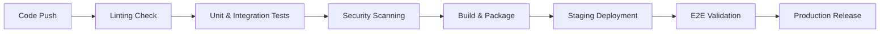

# TASK-00039: Giao hàng Tự động: Hạ tầng Đường ống CI/CD (Automated Delivery: CI/CD Pipeline Infrastructure)

## 📋 Metadata

- **Task ID**: TASK-00039
- **Độ ưu tiên**: 🔴 CAO (Operational Excellence)
- **Phụ thuộc**: TASK-00033 (Unit Tests), TASK-00034 (E2E Tests)
- **Trạng thái**: ✅ Done

---

## 🎯 CHIẾN LƯỢC GIAO HÀNG TỰ ĐỘNG (Delivery Strategy)

### 💡 Tại sao CI/CD quan trọng?
Phần mềm chỉ có giá trị khi nó được chuyển đến tay người dùng một cách ổn định và nhanh chóng. CI/CD loại bỏ các lỗi do thao tác thủ công (Human error) và rút ngắn thời gian phản hồi (Feedback loop).
- **Continuous Quality Gates**: Tự động chạy hàng trăm bài kiểm thử mỗi khi có thay đổi code mới, đảm bảo không có lỗi cũ bị lặp lại (Regression).
- **Automated Build & Package**: Đóng gói ứng dụng thành các Docker image chuẩn hóa, sẵn sàng triển khai trên mọi môi trường.
- **Fast Feedback Loop**: Phát hiện lỗi ngay lập tức sau khi Commit, giúp lập trình viên sửa lỗi nhanh hơn và rẻ hơn.

---

## 🏗️ ĐƯỜNG ỐNG DỮ LIỆU (Pipeline Workflow)

---

## 📄 QUY TẮC QUẢN TRỊ (Pipeline Rules)

### 1. Nguyên tắc "Fail Fast"
- Đường ống phải dừng ngay lập tức nếu bất kỳ bước kiểm tra nào thất bại (Linting, Tests, or Security scan). Code không đạt chuẩn tuyệt đối không được đi tiếp.

### 2. Môi trường Bất biến (Immutable Infrastructure)
- Mọi thành phần từ Build stage phải được đóng gói và tái sử dụng nguyên vẹn từ Staging sang Production để đảm bảo tính đồng nhất.

### 3. Tự động hóa Di trú (Auto-Migration)
- Các thay đổi về cấu trúc Database (Migrations) phải được thực hiện tự động và đồng bộ trong đường ống triển khai, kèm theo cơ chế Rollback an toàn.

---

## ✅ TIÊU CHUẨN THÀNH CÔNG (Definition of Success)

- [x] **Fully Automated Flow**: Việc triển khai từ code lên môi trường Staging/Production không cần sự can thiệp thủ công.
- [x] **Deployment Confidence**: Tỷ lệ triển khai thành công đạt trên 99% nhờ các bước Quality Gates nghiêm ngặt.
- [x] **Security Integration**: Tự động quét các lỗ hổng thư viện (Dependency scanning) trong mỗi lần Build.

---

## 🧪 TDD PLANNING (Delivery Scenarios)

| Kịch bản | Mong đợi |
| :--- | :--- |
| **Commit with failing test** | Đẩy code có lỗi unit test -> Pipeline báo đỏ (Failed) -> Triển khai bị chặn lại. |
| **Successful Merge to Master** | Code chuẩn được Merge -> Tự động Build Docker -> Tự động deploy lên Staging -> Thông báo Slack/Email. |
| **Vulnerable Dependency** | Sử dụng thư viện có lỗ hổng bảo mật -> Bước Security Scan cảnh báo -> Pipeline dừng để yêu cầu nâng cấp. |
