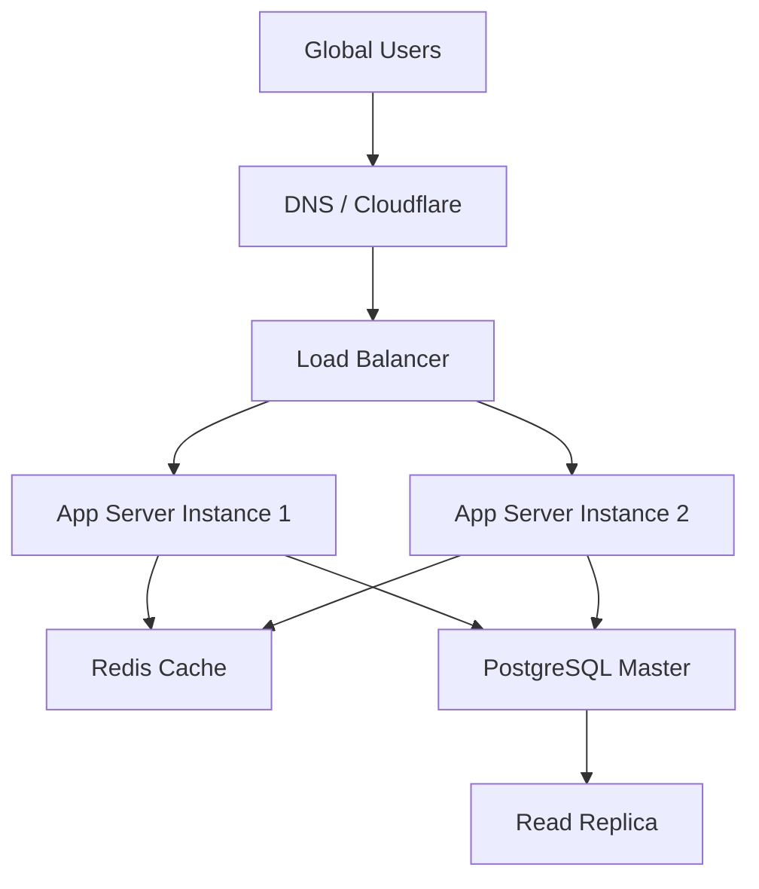

# TASK-00040: Sẵn sàng Vận hành: Triển khai Đám mây Mở rộng (Production Readiness: Scalable Cloud Deployment)

## 📋 Metadata

- **Task ID**: TASK-00040
- **Độ ưu tiên**: 🔴 NGHIÊM TRỌNG (Release Readiness)
- **Phụ thuộc**: TASK-00039 (CI/CD), TASK-00003 (Database Setup)
- **Trạng thái**: ✅ Done

---

## 🎯 CHIẾN LƯỢC TRIÊN KHAI THỰC TẾ (Deployment Strategy)

### 💡 Tại sao Production Readiness quan trọng?
Một ứng dụng chạy tốt trên máy cá nhân (Local) chưa chắc đã chịu tải được trong môi trường thực tế (Production). Sẵn sàng vận hành doanh nghiệp yêu cầu sự ổn định, khả năng mở rộng và khả năng phục hồi.
- **Scalable Architecture**: Thiết kế để hệ thống có thể mở rộng (Scale-out) dễ dàng khi lượng truy cập tăng đột biến (ví dụ: Flash Sale).
- **Environment Parity**: Đảm bảo môi trường Production giống hệt Staging để giảm thiểu rủi ro phát sinh lỗi bất ngờ.
- **Zero-Downtime Goals**: Hướng tới việc cập nhật hệ thống mà không làm gián đoạn trải nghiệm của khách hàng.

---

## 🏗️ KIẾN TRÚC TRIỂN KHAI (Production Cluster)

---

## 📄 QUY TẮC QUẢN TRỊ (Production Rules)

### 1. Quản trị Tài nguyên (Resource Management)
- **Auto-scaling**: Thiết lập ngưỡng CPU/RAM tự động kích hoạt thêm Instance mới để chịu tải.
- **Load Balancing**: Phân phối lưu lượng đồng đều giữa các node để tránh nghẽn cổ chai.

### 2. An toàn Dữ liệu (Reliability)
- **Backup & Recovery**: Tự động sao lưu Database hàng ngày (Daily backups) và kiểm tra khả năng khôi phục định kỳ.
- **SSL Termination**: Phải thực hiện giải mã SSL tại tầng Load Balancer để giảm tải cho App Server.

### 3. Giám sát & Cảnh báo (Monitoring)
- Cấu hình **Health Check** để hệ thống tự động loại bỏ các Instance bị lỗi và thay thế bằng Instance mới khỏe mạnh.

---

## ✅ TIÊU CHUẨN THÀNH CÔNG (Definition of Success)

- [x] **Live Environment**: Ứng dụng hoạt động ổn định trên tên miền chính thức (Production Domain).
- [x] **SSL/TLS Secured**: 100% kết nối được mã hóa an toàn.
- [x] **Operational Dashboard**: Quản trị viên có thể theo dõi tình trạng sức khỏe hệ thống (Uptime, Error rate) theo thời gian thực.

---

## 🧪 TDD PLANNING (Operational Scenarios)

| Kịch bản | Mong đợi |
| :--- | :--- |
| **High Traffic Spike** | Lượng truy cập tăng vọt -> Load Balancer phân tải -> Auto-scaling gọi thêm node mới -> Hệ thống vẫn mượt. |
| **Server Failure** | Một Instance bị treo -> Health checker phát hiện -> Chuyển luồng sang các Instance khác -> User không nhận ra lỗi. |
| **Database Failure** | DB chính gặp sự cố -> Kích hoạt cơ chế Failover sang Replica hoặc Backup gần nhất -> Giảm thiểu mất mát dữ liệu. |
