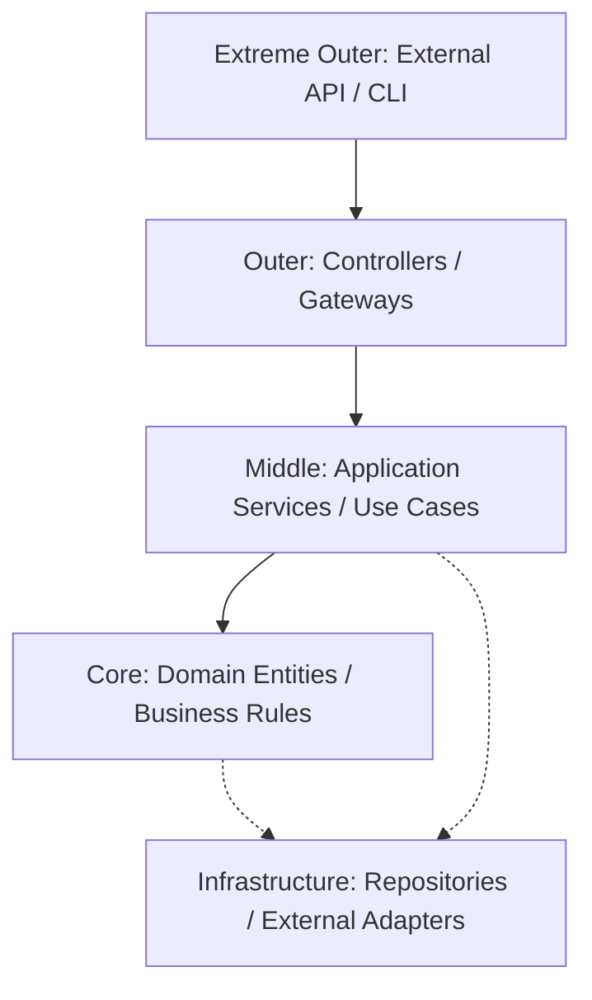

# TASK-00041: Ranh giới Kiến trúc Sạch: Phân tách Trách nhiệm & Mở rộng Team (Clean Architecture Boundaries: Separation of Concerns & Team Scalability)

## 📋 Metadata

- **Task ID**: TASK-00041
- **Độ ưu tiên**: 🔴 CAO (Architectural Integrity)
- **Phụ thuộc**: TASK-00001 (General Architecture)
- **Trạng thái**: ✅ Done

---

## 🎯 CHIẾN LƯỢC KIẾN TRÚC SẠCH (Clean Architecture Strategy)

### 💡 Tại sao Ranh giới Kiến trúc quan trọng?
Khi dự án phình to và số lượng lập trình viên tăng lên, việc giữ cho mã nguồn có tổ chức trở thành yếu tố sống còn. Thiếu ranh giới rõ ràng sẽ dẫn đến "Big Ball of Mud" - nơi mọi thứ phụ thuộc lẫn nhau và việc thay đổi một tính năng nhỏ cũng gây lỗi dây chuyền.
- **Independence of Frameworks**: Logic nghiệp vụ không phụ thuộc vào thư viện bên ngoài hoặc database cụ thể.
- **Testability**: Dễ dàng kiểm thử logic cốt lõi mà không cần quan tâm đến UI, Database hay Server.
- **Team Isolation**: Cho phép nhiều sub-team làm việc trên các module khác nhau mà không gây xung đột chéo.

---

## 🏗️ LỚP LUỒNG DỮ LIỆU (Layered Data Flow)

---

## 📄 QUY TẮC QUẢN TRỊ (Architectural Rules)

### 1. Quy tắc phụ thuộc (Dependency Rule)
- Các phụ thuộc chỉ được phép hướng vào bên trong (chỉ vào Core). Các lớp bên trong tuyệt đối không được biết về các lớp bên ngoài (ví dụ: Domain không được chứa code liên quan đến TypeORM hay Express).

### 2. Phân chia trách nhiệm (Responsibility)
- **Controllers**: Chịu trách nhiệm nhận yêu cầu và chuyển đổi dữ liệu đầu vào. Không chứa logic nghiệp vụ.
- **Services (Use Cases)**: Điều phối các thực thể để thực hiện một hành động nghiệp vụ cụ thể.
- **Entities**: Trái tim của hệ thống, chứa các quy tắc nghiệp vụ bất biến (Business Rules).

### 3. Thực thi Ranh giới (Enforcement)
- Sử dụng các công cụ linting (ESLint boundaries) để tự động ngăn chặn việc import sai lớp (ví dụ: Service import Repository trực tiếp mà không qua Interface).

---

## ✅ TIÊU CHUẨN THÀNH CÔNG (Definition of Success)

- [x] **Strict Layering**: Không có logic nghiệp vụ (IF/ELSE nghiệp vụ) nằm trong Controllers.
- [x] **Mockability**: Mọi Use Case đều có thể chạy với Mock Data mà không cần kết nối DB thật.
- [x] **Maintainability**: Thời gian để một dev mới hiểu luồng của một module mới không quá 30 phút nhờ cấu trúc chuẩn hóa.

---

## 🧪 TDD PLANNING (Architectural Scenarios)

| Kịch bản | Mong đợi |
| :--- | :--- |
| **New Use Case** | Tạo file `create-order.use-case.ts` -> Chỉ chứa logic nghiệp vụ thuần túy -> Không chứa SQL hay HTTP codes. |
| **Switch Database** | Thay đổi từ PostgreSQL sang MongoDB -> Chỉ cần cập nhật lớp Repository -> Logic nghiệp vụ (Service/Domain) không đổi. |
| **Testing Core Logic** | Viết Unit Test cho Domain Rules -> Không cần khởi tạo NestJS context -> Chạy cực nhanh (< 1s). |
