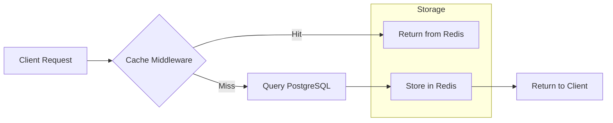

# TASK-00050: Chiến lược Tăng tốc: Caching Nâng cao & Redis (Speed Strategy: Advanced Caching & Redis)

## 📋 Metadata

- **Task ID**: TASK-00050
- **Độ ưu tiên**: 🔴 CAO (Performance & Scale)
- **Phụ thuộc**: TASK-00003 (PostgreSQL), TASK-00037 (Basic Caching)
- **Trạng thái**: ✅ Done

---

## 🎯 CHIẾN LƯỢC TỐI ƯU HIỆU NĂNG (Performance Strategy)

### 💡 Tại sao Caching nâng cao quan trọng?
Khi lượng người dùng tăng lên, việc truy vấn trực tiếp vào Database cho mọi yêu cầu sẽ trở thành nút thắt cổ chai. Caching không chỉ giúp giảm tải cho DB mà còn mang lại trải nghiệm "tức thì" cho khách hàng. Tuy nhiên, caching sai cách sẽ dẫn đến dữ liệu bị sai lệch (Stale data).
- **Database Relief**: Giảm đến 80% gánh nặng truy vấn cho các dữ liệu ít thay đổi.
- **Sub-millisecond Latency**: Phản hồi các yêu cầu phổ biến (như danh mục sản phẩm) trong vài mili giây.
- **Scalability**: Giúp hệ thống chịu được các đợt Flash Sale hoặc lượng truy cập tăng đột biến mà không cần nâng cấp server đắt tiền.

---

## 🏗️ KIẾN TRÚC CACHING PHÂN TÁN (Distributed Caching Architecture)

---

## 📄 QUY TẮC QUẢN TRỊ (Caching Rules)

### 1. Phân tầng Caching (Tiered Caching)
- **Static Assets**: Cache vĩnh viễn hoặc dài hạn (Categorires tree).
- **Semi-Dynamic**: Cache ngắn hạn (Featured Products, User Profile).
- **Strictly Dynamic**: Không cache (Giỏ hàng, Thông tin thanh toán).

### 2. Chiến lược Thu hồi (Invalidation Strategy)
- Sử dụng cơ chế `Cache-Aside`: Khi dữ liệu trong DB thay đổi (Update/Delete), hệ thống phải chủ động xóa hoặc cập nhật lại key tương ứng trong Redis (Cache Eviction) để đảm bảo tính nhất quán.

### 3. Làm ấm Cache (Cache Warming)
- Khi hệ thống khởi động hoặc trước các chiến dịch lớn, các dữ liệu "nóng" (Sản phẩm khuyến mãi, Menu chính) sẽ được nạp sẵn vào Redis để khách hàng đầu tiên không phải đợi lâu.

---

## ✅ TIÊU CHUẨN THÀNH CÔNG (Definition of Success)

- [x] **Zero Stale Data**: Khách hàng luôn thấy thông tin mới nhất ngay khi Admin thay đổi (nhờ cơ chế Eviction chuẩn).
- [x] **Significant Speedup**: Thời gian phản hồi cho các trang danh mục giảm từ ~500ms xuống < 50ms.
- [x] **High Availability**: Nếu Redis gặp sự cố, hệ thống vẫn hoạt động bình thường bằng cách truy vấn trực tiếp DB (Fail-safe).

---

## 🧪 TDD PLANNING (Performance Scenarios)

| Kịch bản | Mong đợi |
| :--- | :--- |
| **First Request** | Truy vấn DB -> Lưu Redis -> Trả về kết quả. |
| **Subsequent Request** | Trả về từ Redis ngay lập tức -> Không phát sinh câu lệnh SQL trong log. |
| **Data Update** | Admin cập nhật tên sản phẩm -> Key trong Redis bị xóa -> Lần truy cập tiếp theo sẽ lấy dữ liệu mới từ DB. |
