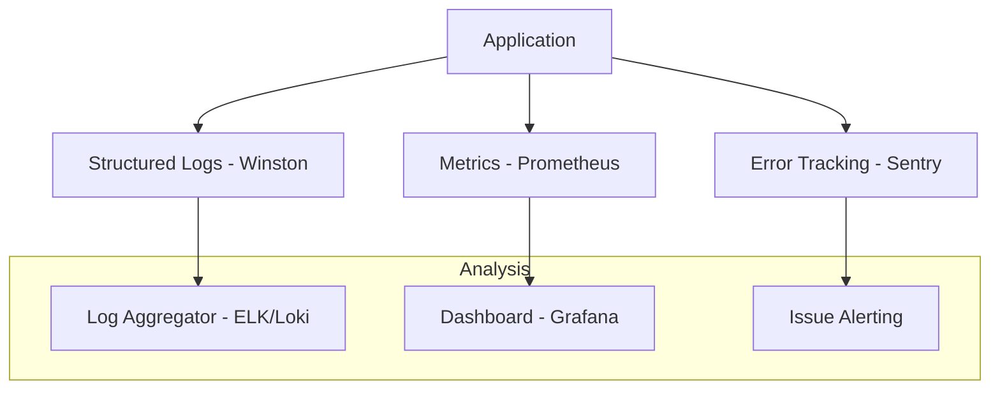

# TASK-00051: Hệ thống Quan sát: Logging, Giám sát & Truy vết (Observability: Logging, Monitoring & Tracing)

## 📋 Metadata

- **Task ID**: TASK-00051
- **Độ ưu tiên**: 🔴 CAO (Production Reliability)
- **Phụ thuộc**: TASK-00030 (Logging Interceptor), TASK-00040 (Production Deployment)
- **Trạng thái**: ✅ Done

---

## 🎯 CHIẾN LƯỢC QUAN SÁT (Observability Strategy)

### 💡 Tại sao Hệ thống quan sát quan trọng?
Khi ứng dụng chạy trên Pipeline Production, chúng ta không thể sử dụng `console.log` để gỡ lỗi. Một hệ thống quan sát mạnh mẽ giúp đội ngũ kỹ thuật "nhìn thấu" bên trong hệ thống đang chạy, phát hiện sớm các vấn đề trước khi khách hàng phàn nàn và rút ngắn thời gian xử lý sự cố (MTTR).
- **Structured Logging**: Biến các dòng log vô nghĩa thành dữ liệu có cấu trúc (JSON), dễ dàng tìm kiếm và phân tích.
- **Proactive Monitoring**: Theo dõi sức khỏe hệ thống (CPU, RAM, DB connection) và gửi cảnh báo (Alert) ngay khi có dấu hiệu bất thường.
- **Distributed Tracing**: Theo dõi hành trình của một yêu cầu đi qua nhiều lớp và dịch vụ khác nhau thông qua `Correlation ID`.

---

## 🏗️ MÔ HÌNH QUAN SÁT (Observability Model)

---

## 📄 QUY TẮC QUẢN TRỊ (Observability Rules)

### 1. Định danh tương quan (Correlation IDs)
- Mọi yêu cầu API khi đi vào hệ thống phải được gán một mã định danh duy nhất (`X-Correlation-ID`). Mã này phải được đính kèm trong mọi dòng log phát sinh từ yêu cầu đó để có thể truy vết toàn bộ quá trình xử lý.

### 2. Phân loại mức độ (Log Levels)
- **ERROR**: Các lỗi nghiêm trọng cần can thiệp ngay (Hệ thống chết, mất kết nối DB).
- **WARN**: Các tình huống bất thường nhưng hệ thống vẫn chạy được (API bên thứ ba phản hồi chậm).
- **INFO**: Các mốc sự kiện quan trọng (Đơn hàng được đặt, User đăng nhập).
- **DEBUG**: Chỉ dùng trong môi trường phát triển để xem chi tiết luồng xử lý.

### 3. Kiểm tra Sức khỏe (Health Checks)
- Cung cấp endpoint `/health` trả về trạng thái của các thành phần cốt lõi (Database, Redis, Disk space). Endpoint này được dùng cho các công cụ cân bằng tải (Load Balancer) hoặc Kubernetes để tự động khởi động lại dịch vụ nếu cần.

---

## ✅ TIÊU CHUẨN THÀNH CÔNG (Definition of Success)

- [x] **Full Traceability**: Dễ dàng tìm thấy toàn bộ ngữ cảnh lỗi chỉ bằng một mã ID cung cấp bởi khách hàng.
- [x] **Zero-Blind Production**: Không có lỗi nào xảy ra mà đội ngũ kỹ thuật không biết (thông qua Alerting).
- [x] **Metric-Driven Decisions**: Có dữ liệu chính xác về thời gian phản hồi trung bình (P95, P99) để kế hoạch tối ưu hóa mã nguồn.

---

## 🧪 TDD PLANNING (Observability Scenarios)

| Kịch bản | Mong đợi |
| :--- | :--- |
| **API Error occurs** | Hệ thống tự động đẩy thông báo về Slack/Email kèm theo thông tin User và Stack trace. |
| **Search by Correlation ID** | Nhập ID vào hệ thống quản lý Log -> Hiển thị từ lúc bắt đầu Request đến lúc kết thúc với đầy đủ các câu lệnh SQL đã chạy. |
| **Database Down** | Endpoint `/health` chuyển từ `status: ok` sang `err` -> Load Balancer tự động ngắt traffic vào node đó. |
