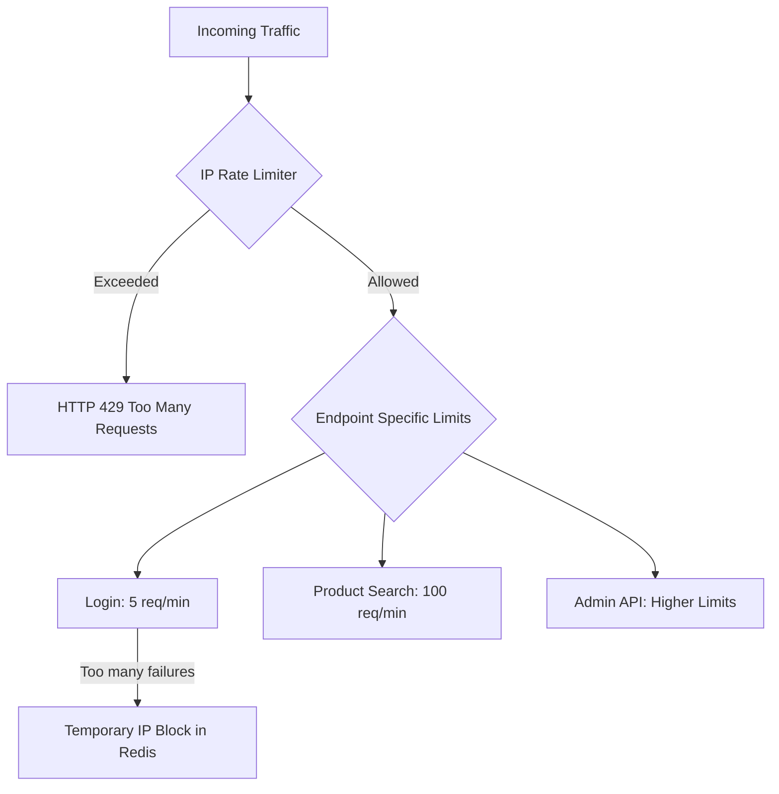

# TASK-00052: Hệ thống Phòng thủ: Giới hạn Tốc độ & Chống lạm dụng (System Defense: Rate Limiting & Abuse Protection)

## 📋 Metadata

- **Task ID**: TASK-00052
- **Độ ưu tiên**: 🔴 CAO (Security & Availability)
- **Phụ thuộc**: TASK-00038 (Security Enhancements), TASK-00050 (Redis)
- **Trạng thái**: ✅ Done

---

## 🎯 CHIẾN LƯỢC PHÒNG THỦ (Defense Strategy)

### 💡 Tại sao Chống lạm dụng quan trọng?
API công khai luôn là mục tiêu của các cuộc tấn công Brute-force (dò mật khẩu), Scraping (quét dữ liệu), hoặc tấn công từ chối dịch vụ (DoS). Nếu không có rào chắn, một kẻ tấn công có thể làm tê liệt hệ thống chỉ với một vài đoạn mã đơn giản.
- **Service Availability**: Đảm bảo tài nguyên hệ thống luôn sẵn sàng cho người dùng thực thụ thay vì bị chiếm dụng bởi Bot.
- **Account Security**: Ngăn chặn kẻ xấu dò tìm mật khẩu bằng cách giới hạn số lần thử đăng nhập.
- **Cost Optimization**: Giảm thiểu chi phí hạ tầng (băng thông, CPU) bằng cách loại bỏ các yêu cầu vô nghĩa.

---

## 🏗️ CƠ CHẾ BẢO VỆ ĐA TẦNG (Multi-Layer Protection)

---

## 📄 QUY TẮC QUẢN TRỊ (Defense Rules)

### 1. Phân cấp giới hạn (Granular Throttling)
- Không áp dụng một giới hạn chung cho toàn bộ ứng dụng. Mỗi loại Endpoint cần có quy tắc riêng:
    - **Nhạy cảm (Login, Register, Forgot Password)**: Giới hạn cực thấp (3-5 lần/phút).
    - **Tìm kiếm & Xem sản phẩm**: Giới hạn trung bình (50-100 lần/phút).
    - **Tải tệp tin**: Giới hạn dựa trên dung lượng.

### 2. Định danh Nguồn truy cập (Identity Tracking)
- Hệ thống sử dụng kết hợp IP Address và User ID (nếu đã đăng nhập) để tính toán giới hạn. Điều này ngăn chặn việc một User sử dụng nhiều IP khác nhau hoặc nhiều User từ cùng một IP (trong quán cafe, văn phòng) bị ảnh hưởng chéo.

### 3. Cơ chế Khóa tự động (Auto-Banning)
- Nếu một IP vượt quá giới hạn hoặc có hành vi thử đăng nhập sai liên tục, hệ thống sẽ tự động đưa IP đó vào danh sách đen (Blacklist) trong Redis với thời gian hết hạn tăng dần (ví dụ: 15 phút -> 1 giờ -> 24 giờ).

---

## ✅ TIÊU CHUẨN THÀNH CÔNG (Definition of Success)

- [x] **Brute-Force Resilience**: Kẻ tấn công không thể thử quá 5 mật khẩu trong một phút trên cùng một tài khoản.
- [x] **Fair Usage**: Những người dùng bình thường không bao giờ cảm nhận thấy sự tồn tại của Rate Limiter.
- [x] **Performance Minimal Impact**: Việc kiểm tra giới hạn (thông qua Redis) phải diễn ra cực nhanh (< 2ms) để không làm chậm yêu cầu chính.

---

## 🧪 TDD PLANNING (Defense Scenarios)

| Kịch bản | Mong đợi |
| :--- | :--- |
| **Normal Browsing** | User lướt xem sản phẩm liên tục -> Mọi thứ diễn ra bình thường. |
| **Flood Attack** | Script quét 200 yêu cầu/giây -> Hệ thống trả về lỗi 429 sau yêu cầu thứ 50 (tùy cấu hình). |
| **Login Brute-force** | Thử sai 5 lần -> IP bị khóa tạm thời -> Thử lại lần thứ 6 sẽ nhận lỗi "Too many attempts" ngay cả khi mật khẩu đúng. |
