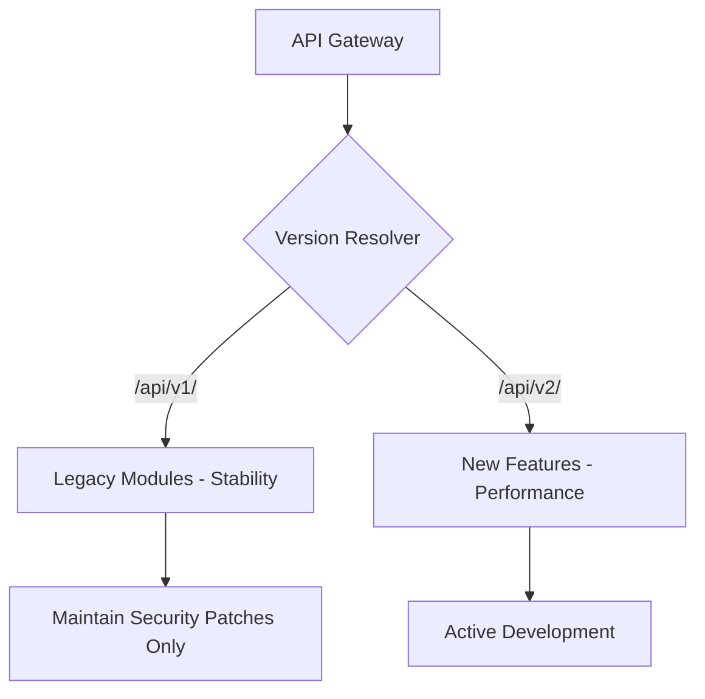

# TASK-00053: Thiết kế Tiến hóa: Chiến lược Phiên bản hóa API (Evolutionary Design: API Versioning & Compatibility Strategy)

## 📋 Metadata

- **Task ID**: TASK-00053
- **Độ ưu tiêu**: 🔵 TRUNG BÌNH (Maintenance & Scalability)
- **Phụ thuộc**: TASK-00032 (Swagger Documentation)
- **Trạng thái**: ✅ Done

---

## 🎯 CHIẾN LƯỢC TIẾN HÓA (Evolutionary Strategy)

### 💡 Tại sao Phiên bản hóa API quan trọng?
Trong một hệ sinh thái thương mại điện tử, API không chỉ phục vụ Website mà còn phục vụ Mobile App và các đối tác bên thứ ba. Việc thay đổi cấu trúc dữ liệu (Breaking Change) mà không có lộ trình phiên bản rõ ràng sẽ làm hỏng hàng loạt ứng dụng đang hoạt động. Phiên bản hóa là "bảo hiểm" cho sự ổn định lâu dài.
- **Backward Compatibility**: Đảm bảo các phiên bản cũ vẫn hoạt động bình thường khi hệ thống nâng cấp tính năng mới.
- **Controlled Migration**: Cung cấp khoảng thời gian chuyển tiếp cho khách hàng và đối tác để cập nhật lên phiên bản mới.
- **Independent Evolution**: Cho phép thử nghiệm các công nghệ hoặc cấu trúc dữ liệu mới mạnh dạn hơn ở phiên bản kế tiếp mà không lo ngại ảnh hưởng đến hiện tại.

---

## 🏗️ MÔ HÌNH PHIÊN BẢN (Versioning Model)

---

## 📄 QUY TẮC QUẢN TRỊ (Versioning Rules)

### 1. Phương pháp Phiên bản (Versioning Type)
- Sử dụng **URI Versioning** làm tiêu chuẩn (ví dụ: `domain.com/api/v1/...`). Đây là cách dễ quan sát, dễ debug và thân thiện nhất với các công cụ Cache/Proxy.

### 2. Định nghĩa Breaking Changes
- Bất kỳ thay đổi nào làm giảm tính tương thích (Xóa trường dữ liệu, Thay đổi kiểu dữ liệu, Đổi tên Endpoint) đều bắt buộc phải tăng số phiên bản (từ `v1` lên `v2`).
- Các thay đổi bổ sung (Thêm trường mới, Thêm Endpoint mới) được coi là **Non-breaking** và có thể triển khai ngay trên phiên bản hiện tại.

### 3. Quy trình Ngừng hỗ trợ (Deprecation Policy)
- Khi một phiên bản mới ra mắt, phiên bản cũ sẽ được đánh dấu là `Deprecated`.
- Hệ thống gửi cảnh báo thông qua các Header HTTP (ví dụ: `X-API-Deprecation-Date`) để thông báo cho nhà phát triển về ngày ngừng hỗ trợ chính thức (Sunset).

---

## ✅ TIÊU CHUẨN THÀNH CÔNG (Definition of Success)

- [x] **Zero Breaking Impact**: Không có ứng dụng khách nào bị "sập" do thay đổi mã nguồn trên Server.
- [x] **Clear Lifecycle**: Có tài liệu hướng dẫn chuyển đổi (Migration Guide) rõ ràng giữa các phiên bản.
- [x] **Multiple Version Support**: Hệ thống có khả năng chạy song song nhiều phiên bản API cùng một lúc trên cùng bộ mã nguồn.

---

## 🧪 TDD PLANNING (Evolution Scenarios)

| Kịch bản | Mong đợi |
| :--- | :--- |
| **Call v1 Endpoint** | Nhận kết quả theo cấu trúc cũ -> Đảm bảo App cũ vẫn chạy tốt. |
| **Call v2 Endpoint** | Nhận kết quả theo cấu trúc mới, tối ưu hơn -> Thử nghiệm tính năng mới. |
| **Access Deprecated Version** | Nhận được Header `X-API-Deprecated: true` -> Cảnh báo nhà phát triển cần nâng cấp ứng dụng. |
