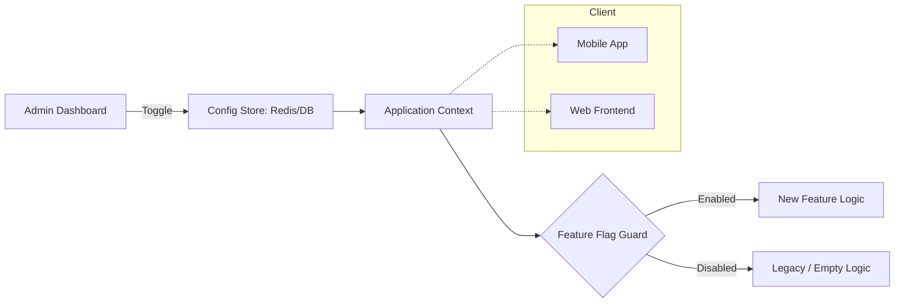

# TASK-00054: Cấu hình Linh hoạt: Feature Flags & Bật/Tắt Tính năng (Ops Flexibility: Feature Flags & Config Toggle)

## 📋 Metadata

- **Task ID**: TASK-00054
- **Độ ưu tiên**: 🔵 TRUNG BÌNH (Operational Excellence)
- **Phụ thuộc**: TASK-00002 (Environment Config)
- **Trạng thái**: ✅ Done

---

## 🎯 CHIẾN LƯỢC TRIỂN KHAI LINH HOẠT (Deployment Strategy)

### 💡 Tại sao Feature Flags quan trọng?
Trong một hệ thống lớn, việc triển khai mã nguồn mới lên Production luôn tiềm ẩn rủi ro. Feature Flags cho phép chúng ta tách biệt việc "Deploy code" khỏi việc "Release tính năng". Chúng ta có thể đẩy code lên server nhưng chỉ bật tính năng cho một nhóm nhỏ người dùng hoặc tắt ngay lập tức nếu phát hiện lỗi mà không cần rollback toàn bộ hệ thống.
- **Dark Launching**: Triển khai tính năng mới ngầm định để kiểm tra hiệu năng trước khi công bố.
- **Gradual Rollout**: Bật tính năng cho 5%, 10%, rồi 100% người dùng để giảm thiểu rủi ro.
- **Safe Hotfix**: Tắt tính năng đang lỗi ngay lập tức bằng một cú click chuột (Kill Switch).

---

## 🏗️ LUỒNG ĐIỀU KHIỂN TÍNH NĂNG (Feature Control Flow)

---

## 📄 QUY TẮC QUẢN TRỊ (Flag Rules)

### 1. Phân loại Cờ tính năng (Flag Categories)
- **Release Flags**: Dùng để triển khai tính năng mới (Tạm thời).
- **Operational Flags**: Dùng để kiểm soát các cấu hình kỹ thuật (Ví dụ: Bật/Tắt Caching, Chế độ Bảo trì).
- **Permission Flags**: Dùng để mở khóa tính năng Premium cho một nhóm khách hàng cụ thể.

### 2. Quản trị Vòng đời (Flag Lifecycle)
- Feature Flags không được phép tồn tại vĩnh viễn. Sau khi tính năng đã ổn định 100%, code liên quan đến Flag phải được dọn dẹp để tránh gây rối rắm mã nguồn (Technical Debt).

### 3. Ưu tiên Cấu hình (Precedence)
- Các giá trị Flag được ưu tiên lấy từ Cloud Config (Redis) để có hiệu lực ngay lập tức. Nếu không có, hệ thống sẽ sử dụng giá trị mặc định trong Environment Variables hoặc Code.

---

## ✅ TIÊU CHUẨN THÀNH CÔNG (Definition of Success)

- [x] **Zero-Downtime Release**: Triển khai tính năng lớn mà không gây gián đoạn dịch vụ.
- [x] **Instant Rollback**: Tắt tính năng lỗi trong vòng < 5 giây mà không cần deploy lại code.
- [x] **A/B Testing Ready**: Sẵn sàng cho việc thử nghiệm các giao diện hoặc logic khác nhau cho từng nhóm khách hàng.

---

## 🧪 TDD PLANNING (Operational Scenarios)

| Kịch bản | Mong đợi |
| :--- | :--- |
| **Feature Disabled** | Flag `NEW_PAYMENT` tắt -> Gọi API thanh toán mới -> Trả về lỗi 403 hoặc sử dụng phương thức cũ. |
| **Dynamic Toggle** | Admin bật Flag trên Dashboard -> User F5 trang web -> Tính năng mới xuất hiện ngay lập tức mà không cần restart server. |
| **Emergency Kill-switch** | Tính năng Reviews bị spam hàng loạt -> Admin tắt Flag -> Mọi form đánh giá đều bị ẩn ngay lập tức. |
