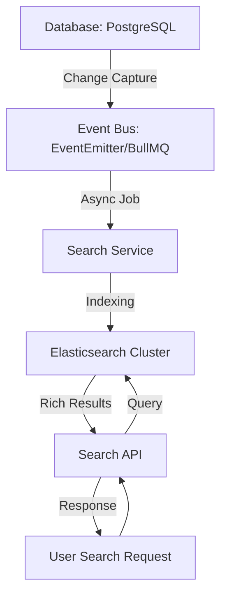

# TASK-00060: Công cụ Khám phá: Tìm kiếm Hiệu năng cao & Elasticsearch (Discovery Engine: High-Performance Search & Elasticsearch)

## 📋 Metadata

- **Task ID**: TASK-00060
- **Độ ưu tiên**: 🔴 SIÊU CAO (Business Core)
- **Phụ thuộc**: TASK-00021 (Product CRUD), TASK-00049 (Event Handling)
- **Trạng thái**: ✅ Done

---

## 🎯 CHIẾN LƯỢC TÌM KIẾM (Search Strategy)

### 💡 Tại sao Elasticsearch quan trọng?
Đối với một hệ thống thương mại điện tử, khả năng tìm kiếm sản phẩm nhanh và chính xác là "linh hồn". Khi dữ liệu sản phẩm lên tới hàng trăm ngàn hoặc triệu bản ghi, việc sử dụng lệnh `LIKE` trong SQL truyền thống sẽ cực kỳ chậm và không hỗ trợ các tính năng tìm kiếm thông minh. Elasticsearch cung cấp tốc độ phản hồi tính bằng mili giây cùng khả năng hiểu ngôn ngữ tự nhiên.
- **Lightning Speed Search**: Phản hồi kết quả tìm kiếm dường như tức thì, ngay cả với tập dữ liệu khổng lồ.
- **Fuzzy Search**: "Sửa lỗi" giúp khách hàng khi họ gõ sai (Ví dụ: Gõ "Samsum" vẫn ra kết quả "Samsung").
- **Smart Filtering (Aggregate)**: Phân loại kết quả theo thuộc tính (Category, Price range, Brand) chỉ trong một yêu cầu duy nhất.

---

## 🏗️ KIẾN TRÚC ĐỒNG BỘ DỮ LIỆU (Data Sync Architecture)

---

## 📄 QUY TẮC QUẢN TRỊ (Search Rules)

### 1. Chiến lược Chỉ mục (Indexing Strategy)
- Không lưu toàn bộ các trường của Database vào Elasticsearch. Chỉ lưu các trường phục vụ tìm kiếm và hiển thị nhanh (ID, Tên, Giá, Thumbnail, Rating, Category). Điều này giúp tối ưu hóa bộ nhớ và tốc độ truy vấn.

### 2. Đồng bộ hóa Phi tập trung (Asynchronous Sync)
- Việc cập nhật dữ liệu vào Elasticsearch phải được thực hiện bất đồng bộ (Asynchronously). Khi một sản phẩm được lưu vào DB, một sự kiện (Event) sẽ được bắn ra để hệ thống ngầm tự động cập nhật lại chỉ mục. Điều này đảm bảo API phản hồi cho người dùng không bị chậm lại bởi tiến trình của Elasticsearch.

### 3. Tìm kiếm Thông minh (Intelligence Rules)
- **Boosting**: Ưu tiên hiển thị các sản phẩm có tiêu đề trùng khớp trước, sau đó mới đến phần mô tả.
- **Autocomplete**: Gợi ý ngay khi người dùng đang gõ phím đầu tiên để tăng tốc hành vi mua hàng.

---

## ✅ TIÊU CHUẨN THÀNH CÔNG (Definition of Success)

- [x] **Sub-second Response**: Thời gian phản hồi cho mọi yêu cầu tìm kiếm phức tạp luôn < 100ms.
- [x] **High Relevance**: Kết quả trả về luôn đúng với ý định của khách hàng nhất.
- [x] **Elastic Fallback**: Trong trường hợp hiếm hoi Elasticsearch gặp sự cố, hệ thống sẽ tự động chuyển sang tìm kiếm tại DB (Graceful Degradation).

---

## 🧪 TDD PLANNING (Discovery Scenarios)

| Kịch bản | Mong đợi |
| :--- | :--- |
| **Typo Handling** | Tìm "IPone" -> Trả về kết quả cho "iPhone". |
| **Instant Sync** | Admin sửa tên sản phẩm -> Tìm kiếm tên mới ngay lập tức -> Hiển thị kết quả đúng. |
| **Multi-filter** | Tìm "Laptop" + "Hãng Dell" + "Giá 10tr-20tr" -> Kết quả trả về chính xác trong chớp mắt. |
