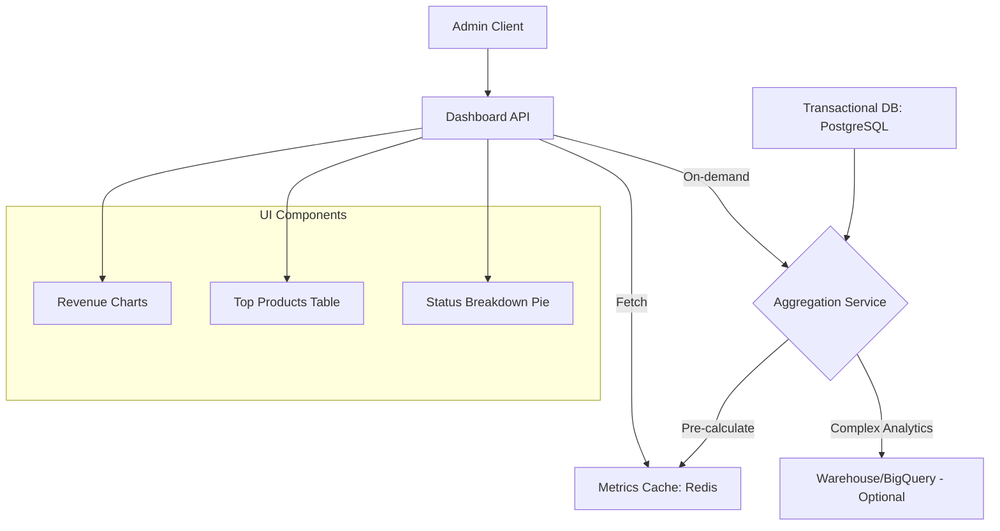

# TASK-00061: Trung tâm Điều hành: Dashboard Quản trị & Thống kê (Operational Center: Admin Dashboard & Statistics)

## 📋 Metadata

- **Task ID**: TASK-00061
- **Độ ưu tiên**: 🔴 SIÊU CAO (Business Intelligence)
- **Phụ thuộc**: TASK-00028 (Order Statistics)
- **Trạng thái**: ✅ Done

---

## 🎯 CHIẾN LƯỢC QUẢN TRỊ KINH DOANH (Business Strategy)

### 💡 Tại sao Dashboard thống kê quan trọng?
Đối với người quản trị, dữ liệu thô (Raw data) trong database là vô nghĩa nếu không được tổng hợp thành những chỉ số kinh doanh cốt lõi. Dashboard quản trị đóng vai trò là "buồng lái", giúp doanh nghiệp theo dõi sức khỏe hệ thống, nhận diện xu hướng mua hàng và đưa ra các quyết định kinh doanh dựa trên dữ liệu thực tế thay vì cảm tính.
- **Real-time Insights**: Theo dõi doanh thu, số lượng đơn hàng và tăng trưởng khách hàng theo thời gian thực.
- **Inventory Awareness**: Cảnh báo sớm các mặt hàng sắp hết hoặc các sản phẩm tồn kho lâu ngày.
- **Performance Benchmarking**: So sánh hiệu quả kinh doanh giữa các khoảng thời gian (ngày, tuần, tháng, năm).

---

## 🏗️ KIẾN TRÚC TỔNG HỢP DỮ LIỆU (Data Aggregation Architecture)

---

## 📄 QUY TẮC QUẢN TRỊ (Business Rules)

### 1. Chỉ số Cốt lõi (Key Performance Indicators - KPIs)
- **Doanh thu (Revenue)**: Tổng giá trị đơn hàng đã thanh toán (trừ đi phần hoàn tiền).
- **Tỷ lệ Chuyển đổi (Conversion Rate)**: Số đơn hàng thành công / Tổng số lượt truy cập.
- **Giá trị Đơn hàng Trung bình (AOV)**: Tổng doanh thu / Tổng số đơn hàng.

### 2. Quản trị Hiệu năng Truy vấn (Query Efficiency)
- Tuyệt đối không chạy các câu lệnh `SUM` hoặc `COUNT` trực tiếp trên toàn bộ Database mỗi khi Admin tải trang. Hệ thống phải sử dụng các bảng tổng hợp (Materialized Views) hoặc cơ chế Caching với thời gian hết hạn (TTL) khoảng 5-15 phút để đảm bảo trải nghiệm mượt mà.

### 3. Phân quyền Dữ liệu (Data Access Control)
- Chỉ những người dùng có Role `ADMIN` hoặc `MANAGER` mới được phép truy cập vào các API thống kê này. Dữ liệu nhạy cảm (như thông tin cá nhân của khách hàng) phải được ẩn danh trong các báo cáo tổng quát.

---

## ✅ TIÊU CHUẨN THÀNH CÔNG (Definition of Success)

- [x] **Data Accuracy**: Các con số trên Dashboard phải khớp 100% với dữ liệu tài chính trong Database.
- [x] **Sub-second Loading**: Trang Dashboard phải tải xong trong vòng < 2 giây.
- [x] **Actionable Dashboards**: Admin có thể từ Dashboard click thẳng sang danh sách đơn hàng hoặc sản phẩm cần xử lý.

---

## 🧪 TDD PLANNING (Business Scenarios)

| Kịch bản | Mong đợi |
| :--- | :--- |
| **Daily Sales Update** | Một đơn hàng vừa được giao thành công -> Chỉ số "Doanh thu hôm nay" tự động tăng lên trên Dashboard. |
| **Top Sellers** | Hệ thống tự động liệt kê 5 sản phẩm bán chạy nhất trong 30 ngày qua dựa trên số lượng đã bán. |
| **Export Report** | Admin yêu cầu xuất file Excel báo cáo tháng -> Hệ thống tạo file và gửi link tải về trong vòng < 30 giây. |
