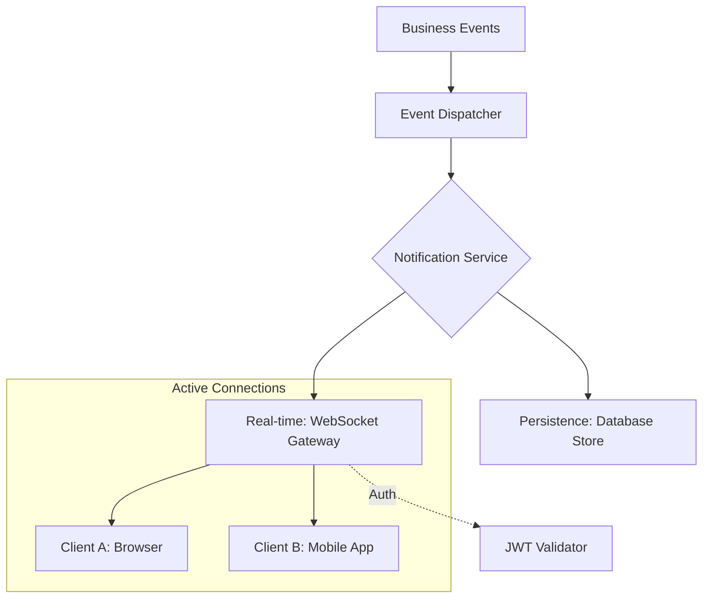

# TASK-00062: Tương tác Tức thời: Thông báo Real-time & WebSockets (Instant Engagement: Real-time Notifications & WebSockets)

## 📋 Metadata

- **Task ID**: TASK-00062
- **Độ ưu tiên**: 🔴 SIÊU CAO (User Engagement)
- **Phụ thuộc**: TASK-00049 (Event Handling), TASK-00012 (JWT Auth)
- **Trạng thái**: ✅ Done

---

## 🎯 CHIẾN LƯỢC TƯƠNG TÁC (Engagement Strategy)

### 💡 Tại sao Thông báo thời gian thực quan trọng?
Trong thương mại điện tử hiện đại, việc người dùng phải "F5" trình duyệt để xem trạng thái đơn hàng là một trải nghiệm tồi tệ. WebSockets cho phép hệ thống chủ động đẩy (Push) thông tin đến người dùng ngay khi có sự kiện xảy ra. Điều này tạo ra cảm giác hệ thống luôn "sống" và phản hồi tức thì với mọi hành động của khách hàng.
- **Improved UX**: Cập nhật trạng thái đơn hàng, tin nhắn hỗ trợ hoặc mã giảm giá mới ngay lập tức mà không cần tải lại trang.
- **Operational Efficiency**: Admin nhận được thông báo ngay khi có đơn hàng mới hoặc khi kho hàng chạm ngưỡng tối thiểu để xử lý kịp thời.
- **Reduced Latency**: Loại bỏ gánh nặng của việc kiểm tra trạng thái liên tục (Polling) từ phía Client, giúp tiết kiệm tài nguyên cho cả Server và thiết bị người dùng.

---

## 🏗️ KIẾN TRÚC THÔNG BÁO TỨC THỜI (Real-time Hub Architecture)

---

## 📄 QUY TẮC QUẢN TRỊ (Engagement Rules)

### 1. Phân loại Thông báo (Notification Types)
- **Transactional**: Trạng thái đơn hàng, xác nhận thanh toán (Ưu tiên cao nhất).
- **System/Admin**: Cảnh báo kho hàng, thông báo bảo trì.
- **Marketing**: Ưu đãi cá nhân hóa, nhắc nhở giỏ hàng bỏ quên.

### 2. Quản trị Kết nối (Connection Management)
- **Security First**: Mọi kết nối WebSocket phải được xác thực bằng JWT ngay khi bắt đầu (Handshake). Chỉ cho phép người dùng đăng nhập mới được tham gia vào các "phòng" (Rooms) cụ thể để nhận thông tin cá nhân.
- **Scalability**: Khi hệ thống mở rộng đa node, sử dụng **Redis Adapter** để đảm bảo thông báo được gửi đến người dùng ngay cả khi họ đang kết nối ở các server khác nhau.

### 3. Cơ chế Lưu trữ & Tin cậy (Reliability Strategy)
- Mọi thông báo real-time đều phải được lưu vào Database trước khi gửi. Nếu người dùng đang ngoại tuyến (Offline), thông báo sẽ được đánh dấu là "Chưa đọc" và hiển thị lại ngay khi họ đăng nhập.

---

## ✅ TIÊU CHUẨN THÀNH CÔNG (Definition of Success)

- [x] **Sub-second Delivery**: Thông báo chuyển từ Server đến Client trong vòng < 200ms.
- [x] **Seamless Sync**: Trạng thái "Đã đọc" được đồng bộ ngay lập tức trên tất cả thiết bị của người dùng.
- [x] **Connection Stability**: Tự động kết nối lại (Auto-reconnect) nếu mạng bị chập chờn mà không làm mất dữ liệu.

---

## 🧪 TDD PLANNING (Engagement Scenarios)

| Kịch bản | Mong đợi |
| :--- | :--- |
| **New Order Received** | Admin đang mở dashboard -> Popup thông báo đơn hàng mới hiện lên ngay lập tức kèm âm thanh báo hiệu. |
| **Order Status Change** | Nhân viên kho tích "Đã giao hàng" -> Ứng dụng của khách hàng tự động cập nhật trạng thái "Sản phẩm đang được giao". |
| **Cross-device Read** | User đọc thông báo trên Điện thoại -> Biểu tượng quả chuông trên Laptop tự động biến mất số lượng thông báo chưa đọc. |
