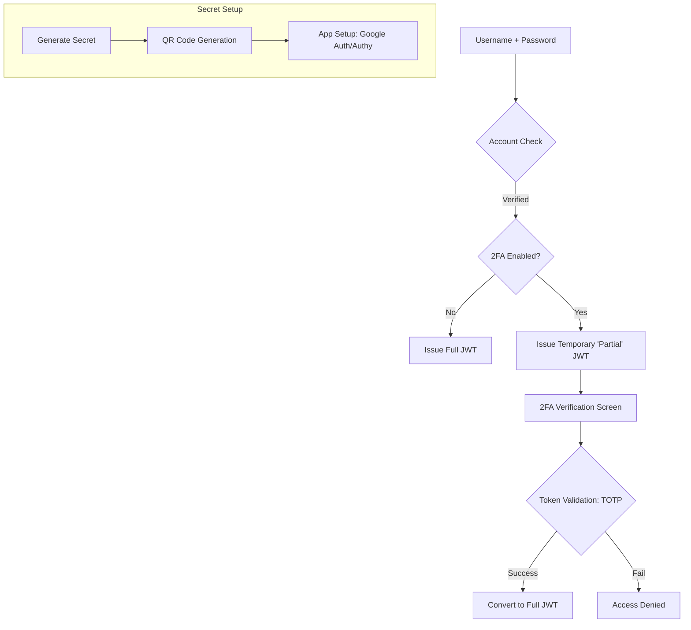

# TASK-00063: Bảo mật Cấp độ 1: Quản trị Xác thực 2 Lớp (Tier-1 Security: Two-Factor Authentication Governance)

## 📋 Metadata

- **Task ID**: TASK-00063
- **Độ ưu tiên**: 🔴 SIÊU CAO (Account Security)
- **Phụ thuộc**: TASK-00012 (JWT Auth), TASK-00044 (Identity Recovery)
- **Trạng thái**: ✅ Done

---

## 🎯 CHIẾN LƯỢC BẢO VỆ TÀI KHOẢN (Security Strategy)

### 💡 Tại sao Xác thực 2 lớp (2FA) quan trọng?
Mật khẩu dù phức tạp đến đâu vẫn có nguy cơ bị rò rỉ hoặc bị đánh cắp thông qua các cuộc tấn công Phishing. Xác thực 2 lớp (2FA) bổ sung một lớp bảo vệ vật lý vào quá trình đăng nhập. Ngay cả khi kẻ xấu có mật khẩu, chúng vẫn không thể truy cập vào tài khoản nếu không có mã xác thực từ thiết bị di động của người dùng. Đây là tiêu chuẩn vàng để bảo vệ tài sản và dữ liệu khách hàng.
- **Phishing Defense**: Vô hiệu hóa hầu hết các cuộc tấn công đánh cắp mật khẩu từ xa.
- **Trust Building**: Khách hàng cảm thấy an tâm hơn khi biết tài khoản và ví tiền của mình được bảo vệ bởi các công nghệ bảo mật hiện đại.
- **Admin Enforcement**: Bắt buộc đối với các tài khoản quản trị để ngăn chặn việc chiếm quyền điều khiển toàn bộ hệ thống (System Takeover).

---

## 🏗️ LUỒNG XÁC THỰC 2 LỚP (2FA Security Flow)

---

## 📄 QUY TẮC QUẢN TRỊ (Security Rules)

### 1. Chuẩn thuật toán (Algorithm Standard)
- Sử dụng thuật toán **TOTP (Time-based One-Time Password)** - chuẩn công nghiệp được hỗ trợ rộng rãi bởi Google Authenticator, Microsoft Authenticator và Authy. Mã này sẽ thay đổi mỗi 30 giây để đảm bảo tính duy nhất và không thể tái sử dụng.

### 2. Quản trị Mã dự phòng (Backup Codes)
- Khi bật 2FA, hệ thống phải cung cấp một bộ **10 mã dự phòng (One-time Recovery Codes)**. Đây là "chìa khóa cuối cùng" giúp khách hàng lấy lại tài khoản nếu họ bị mất điện thoại. Mỗi mã này chỉ có thể sử dụng một lần duy nhất và phải được lưu trữ cực kỳ bảo mật (Hashed trong DB).

### 3. Quy tắc Cưỡng chế (Enforcement Policy)
- **Optional for Users**: Khách hàng có quyền tự chọn bật/tắt để linh hoạt trong trải nghiệm.
- **Mandatory for Admins**: Mọi tài khoản có quyền truy cập vào dữ liệu khách hàng hoặc cấu hình hệ thống BẮT BUỘC phải bật 2FA để bảo vệ hạ tầng cốt lõi.

---

## ✅ TIÊU CHUẨN THÀNH CÔNG (Definition of Success)

- [x] **Unbreakable Login**: Đảm bảo tài khoản không thể bị xâm nhập nếu chỉ có mật khẩu đơn thuần.
- [x] **Seamless UX**: Quá trình quét mã QR và nhập mã OTP diễn ra nhanh chóng, dễ hiểu cho cả người dùng không rành công nghệ.
- [x] **Secure Recovery**: Có quy trình xác minh danh tính rõ ràng nếu người dùng mất cả điện thoại và mã dự phòng.

---

## 🧪 TDD PLANNING (Security Scenarios)

| Kịch bản | Mong đợi |
| :--- | :--- |
| **Login with 2FA** | Đăng nhập đúng mật khẩu -> Hệ thống chưa cho vào trang chủ ngay mà yêu cầu nhập mã OTP -> Nhập mã OTP đúng -> Thành công. |
| **Invalid OTP** | Cố tình nhập mã OTP sai hoặc đã hết hạn -> Hệ thống từ chối và yêu cầu nhập lại. |
| **Recovery Mode** | Nhập mã dự phòng thay cho OTP -> Đăng nhập thành công -> Mã dự phòng đó bị vô hiệu hóa mãi mãi. |
