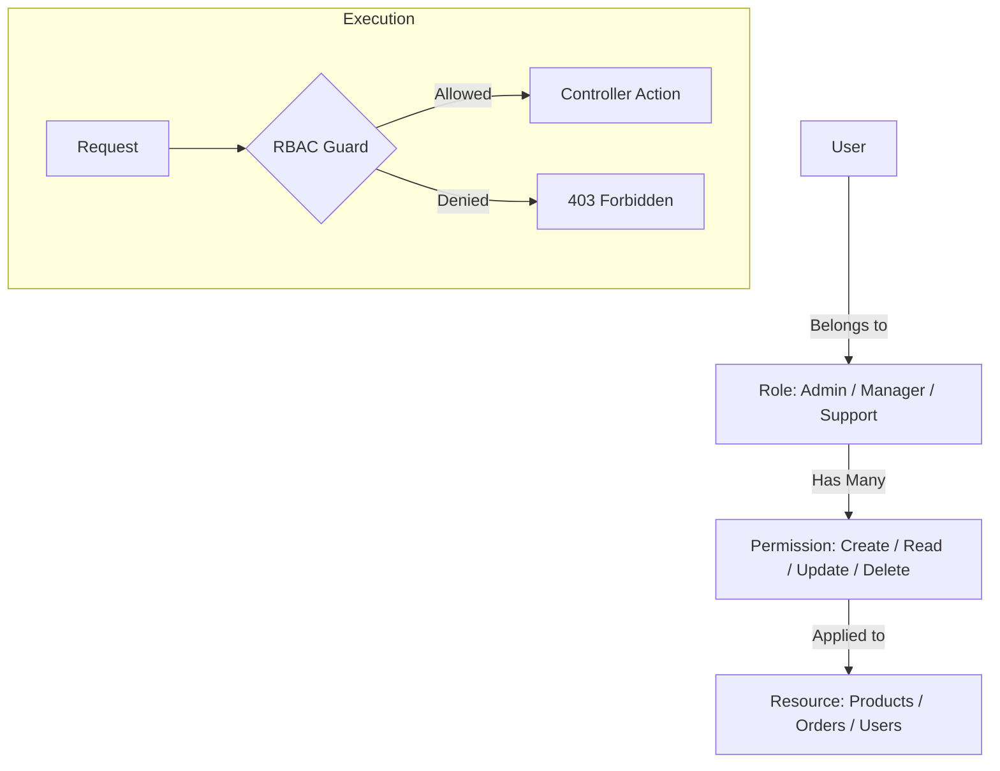

# TASK-00064: Quản trị Quyền hạn: Kiểm soát Truy cập Dựa trên Vai trò (Governance Core: Role-Based Access Control - RBAC)

## 📋 Metadata

- **Task ID**: TASK-00064
- **Độ ưu tiên**: 🔴 SIÊU CAO (Enterprise Security)
- **Phụ thuộc**: TASK-00015 (Guards & Decorators)
- **Trạng thái**: ✅ Done

---

## 🎯 CHIẾN LƯỢC QUẢN TRỊ QUYỀN HẠN (Permission Strategy)

### 💡 Tại sao RBAC quan trọng?
Khi một doanh nghiệp lớn mạnh, số lượng nhân viên và bộ phận tham gia vận hành hệ thống sẽ tăng lên. Việc cho phép tất cả mọi người có quyền hạn như nhau là một rủi ro bảo mật cực lớn. RBAC cung cấp một giải pháp quản trị quyền hạn theo chiều sâu, đảm bảo mỗi người chỉ được phép thực hiện những hành động và truy cập những dữ liệu cần thiết cho công việc của họ (Nguyên tắc Đặc quyền tối thiểu - Principle of Least Privilege).
- **Data Security**: Ngăn chặn nhân viên kho sửa đổi báo cáo tài chính hoặc nhân viên hỗ trợ khách hàng xóa dữ liệu sản phẩm.
- **Accountability**: Dễ dàng truy vết ai đã thực hiện hành động gì thông qua việc gán vai trò cụ thể.
- **Organizational Scale**: Linh hoạt trong việc mở rộng đội ngũ bằng cách định nghĩa các bộ quyền chuẩn cho từng vị trí công việc.

---

## 🏗️ MÔ HÌNH PHÂN QUYỀN (Permission Model)

---

## 📄 QUY TẮC QUẢN TRỊ (Governance Rules)

### 1. Phân cấp Vai trò (Role Hierarchy)
- **ADMIN**: Quyền toàn năng, quản lý toàn bộ hệ thống và cấu hình nhạy cảm.
- **MANAGER**: Quản lý danh mục sản phẩm, đơn hàng và xem báo cáo.
- **SUPPORT**: Chỉ xem thông tin đơn hàng và phản hồi đánh giá của khách hàng.
- **WAREHOUSE**: Chỉ cập nhật số lượng tồn kho và trạng thái vận chuyển.

### 2. Định nghĩa Quyền hạn (Permission Naming)
- Sử dụng cấu trúc `resource:action` để định nghĩa quyền hạn (Ví dụ: `products:delete`, `orders:update`). Điều này giúp mã nguồn dễ đọc và dễ dàng mở rộng khi có thêm tài nguyên mới.

### 3. Cưỡng chế Bảo mật (Guard Enforcement)
- Mọi API có tác động thay đổi dữ liệu (POST, PATCH, DELETE) bắt buộc phải được bảo vệ bởi **PermissionsGuard**. Hệ thống sẽ kiểm tra xem User hiện tại có sở hữu Role chứa Permission tương ứng hay không trước khi thực thi logic nghiệp vụ.

---

## ✅ TIÊU CHUẨN THÀNH CÔNG (Definition of Success)

- [x] **Granular Control**: Admin có thể tạo một Role mới và gán chính xác những quyền hạn mong muốn mà không cần sửa code.
- [x] **Zero Permission Leak**: Đảm bảo không có lỗ hổng nào cho phép người dùng bình thường thực hiện các hành động của Admin (ví dụ qua việc thay đổi ID trong URL).
- [x] **Audit Ready**: Mọi thay đổi về quyền hạn của User đều được ghi lại trong log để phục vụ công tác kiểm tra.

---

## 🧪 TDD PLANNING (Security Scenarios)

| Kịch bản | Mong đợi |
| :--- | :--- |
| **Unauthorized Action** | Nhân viên kho cố gắng xóa một sản phẩm -> Hệ thống chặn lại và trả về lỗi 403 Forbidden. |
| **Role Assignment** | Admin gán Role "Manager" cho một User mới -> User đó ngay lập tức có quyền chỉnh sửa đơn hàng. |
| **Permission Revocation** | Admin xóa quyền "orders:delete" của Role Manager -> Tất cả Managers ngay lập tức không thể xóa đơn hàng. |
