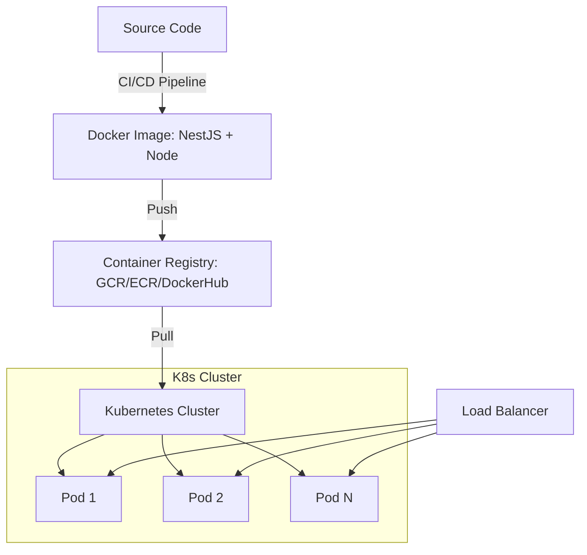

# TASK-00065: Hạ tầng Đám mây: Đóng gói Container & Điều phối (Cloud Infrastructure: Containerization & Orchestration)

## 📋 Metadata

- **Task ID**: TASK-00065
- **Độ ưu tiên**: 🔴 SIÊU CAO (Scalability & DevOps)
- **Phụ thuộc**: TASK-00040 (Production Deployment), TASK-00039 (CI/CD)
- **Trạng thái**: ✅ Done

---

## 🎯 CHIẾN LƯỢC TRIỂN KHAI ĐÁM MÂY (Cloud Strategy)

### 💡 Tại sao Docker & Kubernetes quan trọng?
Trong kỷ nguyên đám mây, việc cài đặt thủ công từng phần mềm lên server là một phương pháp lỗi thời và dễ gây sai sót. Container hóa (Docker) giúp đóng gói toàn bộ ứng dụng và môi trường chạy vào một đơn vị thống nhất, đảm bảo ứng dụng chạy giống hệt nhau trên máy lập trình viên và trên server Production. Kubernetes (K8s) đóng vai trò là "nhạc trưởng", tự động quản lý hàng ngàn container, đảm bảo hệ thống luôn sẵn sàng và có thể tự động mở rộng (Auto-scaling) khi truy cập tăng cao.
- **Environment Consistency**: Loại bỏ hoàn toàn lỗi "chạy trên máy tôi được nhưng trên server bị lỗi".
- **High Availability**: Tự động phát hiện và khởi động lại các container bị lỗi, đảm bảo hệ thống không bao giờ bị gián đoạn.
- **Seamless Scalability**: Tự động tăng số lượng server trong các đợt Flash Sale và giảm xuống khi vắng khách để tiết kiệm chi phí.

---

## 🏗️ MÔ HÌNH VẬN HÀNH CONTAINER (Container Ops Model)

---

## 📄 QUY TẮC QUẢN TRỊ (Cloud Rules)

### 1. Chuẩn hóa Dockerfile (Immutable Artifacts)
- Sử dụng **Multi-stage Build** để tối ưu dung lượng Image (chỉ chứa những file cần thiết để chạy ứng dụng, không chứa mã nguồn gốc hoặc các công cụ build). Điều này giúp tăng tốc độ triển khai và giảm thiểu rủi ro bảo mật.
- Image phải được gắn phiên bản (Tag) rõ ràng, tuyệt đối không sử dụng tag `:latest` cho môi trường Production để dễ dàng rollback khi cần.

### 2. Quản trị Tài nguyên (Resource Governance)
- Mọi dịch vụ trong Kubernetes phải được giới hạn RAM và CPU (Requests & Limits). Điều này ngăn chặn việc một phần mềm bị rò rỉ bộ nhớ làm ảnh hưởng đến toàn bộ các dịch vụ khác trên cùng hệ thống.

### 3. Tự động Phục hồi (Self-healing)
- Tận dụng cơ chế **Liveness** và **Readiness Probes**. Kubernetes sẽ liên tục kiểm tra xem ứng dụng có đang "sống" hay không. Nếu ứng dụng bị treo, K8s sẽ tự động khai tử và tạo mới một bản sao khác mà không cần sự can thiệp của con người.

---

## ✅ TIÊU CHUẨN THÀNH CÔNG (Definition of Success)

- [x] **Zero Manual Setup**: Toàn bộ hạ tầng được định nghĩa bằng mã nguồn (Infrastructure as Code).
- [x] **Fast Deployment**: Quá trình từ khi đẩy đổi mã nguồn đến khi ứng dụng mới chạy trên K8s chỉ mất < 5 phút.
- [x] **Auto-scaling Efficiency**: Hệ thống tự động mở rộng theo tải thực tế mà không gây gián đoạn cho người dùng hiện tại.

---

## 🧪 TDD PLANNING (Cloud Scenarios)

| Kịch bản | Mong đợi |
| :--- | :--- |
| **Container Crash** | Xóa thủ công một container đang chạy -> Kubernetes phát hiện và tự động tạo lại container mới ngay lập tức. |
| **High Traffic Load** | Giả lập 5000 CCU -> Kubernetes tự động tăng số lượng Pod từ 3 lên 10 để chia sẻ tải. |
| **Rolling Update** | Triển khai phiên bản mới -> K8s thay thế dần từng container cũ bằng container mới -> Người dùng không cảm nhận thấy sự gián đoạn (Zero Downtime). |
