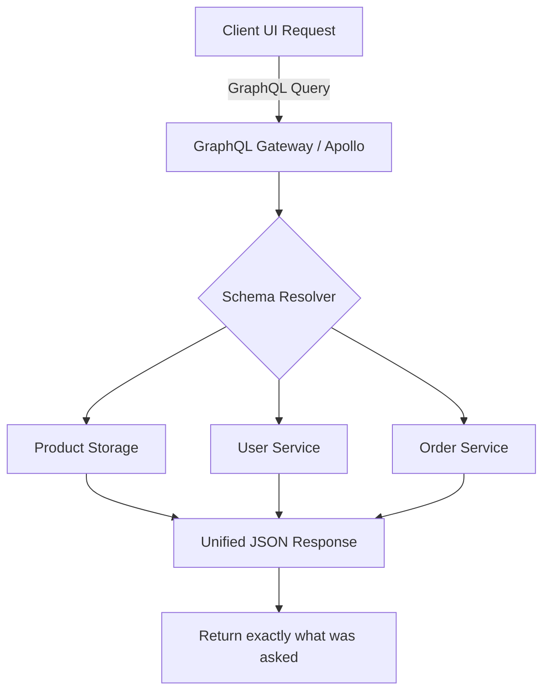

# TASK-00066: Giao diện Truy vấn: Hệ thống GraphQL Linh hoạt (Modern Data Delivery: Flexible GraphQL API)

## 📋 Metadata

- **Task ID**: TASK-00066
- **Độ ưu tiên**: 🟡 TRUNG BÌNH (Advanced API)
- **Phụ thuộc**: TASK-00021 (Product CRUD), TASK-00027 (Order Management)
- **Trạng thái**: ✅ Done

---

## 🎯 CHIẾN LƯỢC TRUYỀN TẢI DỮ LIỆU (Data Delivery Strategy)

### 💡 Tại sao GraphQL quan trọng?
Mặc dù REST API là tiêu chuần phổ biến, nhưng nó thường gặp vấn đề về Over-fetching (trả về quá nhiều dữ liệu không cần thiết) hoặc Under-fetching (phải gọi nhiều API mới đủ dữ liệu hiển thị một màn hình). GraphQL giải quyết vấn đề này bằng cách cho phép Client tự quyết định cấu trúc dữ liệu muốn nhận về. Điều này cực kỳ quan trọng đối với các ứng dụng di động cần tối ưu băng thông và giảm độ trễ (Latency).
- **Client-Centric**: Frontend chỉ yêu cầu những trường dữ liệu thực sự cần thiết cho UI hiện tại.
- **Single Request Efficiency**: Lấy dữ liệu từ nhiều nguồn (Sản phẩm, Đánh giá, Người bán) chỉ trong một yêu cầu duy nhất.
- **Strongly Typed Schema**: Tự động sinh ra bộ tài liệu (Documentation) chuẩn xác và hỗ trợ kiểm tra kiểu dữ liệu ngay từ lúc viết code.

---

## 🏗️ MÔ HÌNH TRUY VẤN LINH HOẠT (Query Resolution Model)

---

## 📄 QUY TẮC QUẢN TRỊ (API Rules)

### 1. Sự tồn tại song song (Dual API Strategy)
- GraphQL không thay thế hoàn toàn REST. Hệ thống sử dụng REST cho các tác vụ đơn giản và tiêu chuẩn, trong khi GraphQL được ưu tiên cho các màn hình phức tạp có dữ liệu lồng nhau (Nested data) hoặc các trang Dashboard đòi hỏi sự linh hoạt cao.

### 2. Tối ưu hóa Hiệu năng (Performance Guardrails)
- **DataLoader Pattern**: Bắt buộc sử dụng DataLoader để giải quyết vấn đề "N+1 Query". Điều này đảm bảo hệ thống không thực hiện hàng trăm câu lệnh SQL riêng lẻ cho một danh sách sản phẩm lồng nhau.
- **Complexity Limit**: Giới hạn độ sâu (Depth) của truy vấn để ngăn chặn việc kẻ xấu cố tình tạo ra các truy vấn vô tận làm treo Server.

### 3. Bảo mật & Xác thực (Security Integration)
- GraphQL sử dụng chung hạ tầng xác thực JWT của hệ thống. Logic phân quyền (RBAC) được áp dụng trực tiếp tại các lớp **Resolvers**, đảm bảo người dùng không thể lấy trộm dữ liệu nhạy cảm thông qua các truy vấn GraphQL phức tạp.

---

## ✅ TIÊU CHUẨN THÀNH CÔNG (Definition of Success)

- [x] **Zero Over-fetching**: Kích thước gói tin trả về giảm đến 50-70% so với REST truyền thống cho các màn hình xem chi tiết.
- [x] **Self-documenting API**: Các lây trình viên Frontend có thể tự khám phá và thử nghiệm API thông qua công cụ **GraphQL Playground** mà không cần tài liệu viết tay.
- [x] **Type Safety**: Toàn bộ hệ thống được bảo vệ bởi một Schema chặt chẽ, giảm thiểu lỗi runtime do sai lệch kiểu dữ liệu.

---

## 🧪 TDD PLANNING (Data Scenarios)

| Kịch bản | Mong đợi |
| :--- | :--- |
| **Fetch Specific Fields** | Chỉ yêu cầu `name` và `price` -> API chỉ trả về đúng 2 trường này (Không có `description`, `stock`). |
| **Nested Resource** | Yêu cầu `Order` kèm theo danh sách `OrderItems` và `Product` tương ứng -> Toàn bộ dữ liệu trả về trong 1 kết quả JSON. |
| **Deep Query Attack** | Cố tình lồng truy vấn quá 10 cấp (User -> Orders -> Items -> Product -> Category -> ...) -> Hệ thống báo lỗi và từ chối xử lý. |
